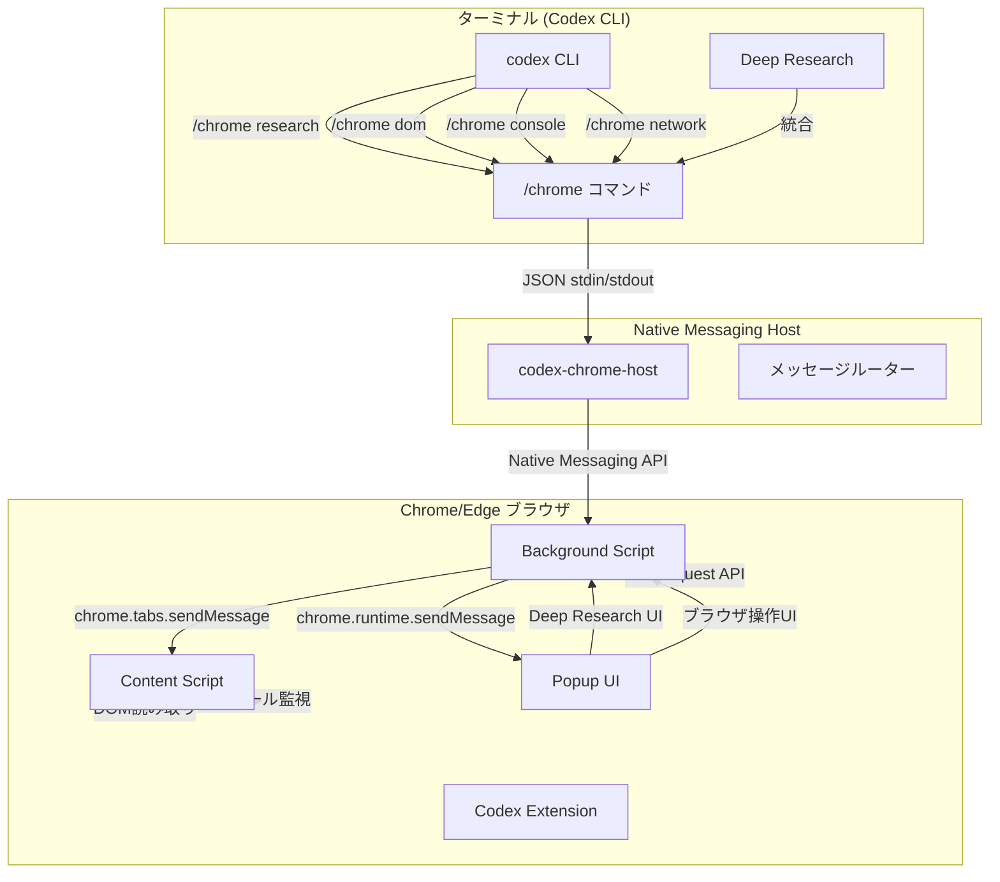

# Codex for Chrome完全実装計画

## 背景

Claude CodeがClaude for Chrome拡張機能と統合し、ターミナルでコードを書き、ブラウザでテスト・デバッグできるワークフローを実現している。同様に、Codex CLIとChrome/Edge拡張機能を完全統合し、以下の機能を実現する：

- ターミナルとブラウザのシームレスな連携
- Deep Research統合
- ブラウザ操作（DOM読み取り、コンソールログ、ネットワークリクエスト）
- コード生成・実行・デバッグ支援

## 既存実装状況

### 実装済み

- Chrome拡張機能の基本構造（`extensions/chrome-codex/`）
  - `manifest.json`、`background.js`、`content.js`、`popup.html/js`
  - Native Messaging API接続機能
  - DOM読み取り、コンソール監視、ネットワーク監視機能
- Codex CLI `/chrome`コマンド（`codex-rs/cli/src/chrome_cmd.rs`）
  - `parse`サブコマンド（自然言語コマンドパース）
- Chrome操作モジュール（`codex-rs/core/src/chrome/mod.rs`）
  - `ChromeOrigin`、`ChromeNlRequest`、`ChromeNlResponse`、`parse_nl_command`
- Deep Research機能（`codex-rs/deep-research/`）
  - `DeepResearcher`、`ResearchPlanner`、各種プロバイダー

### 不足している実装

- Native Messaging Host (`codex-chrome-host`)の実装
- Deep Research統合（メッセージ処理）
- `/chrome`コマンドの拡張（`research`、`dom`、`console`、`network`サブコマンド）
- ターミナルとブラウザの連携機能

## アーキテクチャ



## 実装ファイル

### 1. Native Messaging Host（新規作成）

**`codex-rs/chrome-host/Cargo.toml`**

- Rustプロジェクト設定
- `codex-cli`、`codex-deep-research`、`codex-core`への依存

**`codex-rs/chrome-host/src/main.rs`**

- stdin/stdout経由のJSONメッセージ処理
- メッセージルーティング
- Codex CLIコマンド実行

**`codex-rs/chrome-host/src/message.rs`**

- メッセージ型定義
- リクエスト/レスポンス処理
- エラーハンドリング

**`codex-rs/chrome-host/src/cli_bridge.rs`**

- Codex CLIコマンド実行
- Deep Research統合
- レスポンスのJSON化

### 2. Codex CLI拡張（修正・追加）

**`codex-rs/cli/src/chrome_cmd.rs`**（拡張）

- `Research`サブコマンド追加
- `Dom`サブコマンド追加
- `Console`サブコマンド追加
- `Network`サブコマンド追加

**`codex-rs/cli/src/main.rs`**（修正）

- `/chrome`コマンドの登録確認
- `ChromeCli`の統合確認

### 3. Chrome拡張機能（修正・拡張）

**`extensions/chrome-codex/background/background.js`**（拡張）

- Deep Researchメッセージ処理の実装
- エラーハンドリングの改善

**`extensions/chrome-codex/popup/popup.js`**（拡張）

- Deep Research結果の表示改善
- ターミナル連携UIの追加

### 4. 設定ファイル（確認・更新）

**`codex-rs/Cargo.toml`**（修正）

- `chrome-host`をworkspace membersに追加

**`extensions/chrome-codex/install-host.ps1`**（確認）

- 既存のインストールスクリプト確認

**`extensions/chrome-codex/install-host.sh`**（確認）

- 既存のインストールスクリプト確認

## 実装ステップ

### Phase 1: Native Messaging Host実装

1. **`codex-rs/chrome-host`プロジェクト作成**

   - `Cargo.toml`作成
   - `main.rs`でstdin/stdout JSONメッセージ処理
   - メッセージルーティング実装

2. **メッセージプロトコル実装**

   - `message.rs`でメッセージ型定義
   - リクエスト/レスポンス形式定義
   - エラーハンドリング仕様

3. **Codex CLIブリッジ実装**

   - `cli_bridge.rs`でCodex CLIコマンド実行
   - Deep Research統合
   - レスポンスのJSON化

### Phase 2: Deep Research統合

4. **Deep Researchメッセージ処理**

   - `deep_research.request`メッセージ処理
   - `codex-deep-research`クレートの統合
   - 結果のJSON化と返却

5. **UI改善**

   - `popup.js`でDeep Research結果の表示改善
   - プログレス表示
   - エラーハンドリング

### Phase 3: `/chrome`コマンド拡張

6. **`Research`サブコマンド実装**

   - `chrome_cmd.rs`に`Research`サブコマンド追加
   - Deep Research呼び出し
   - 結果の表示

7. **`Dom`サブコマンド実装**

   - DOM読み取りコマンド
   - セレクター指定
   - 結果の表示

8. **`Console`サブコマンド実装**

   - コンソールログ取得コマンド
   - フィルタリング機能
   - 結果の表示

9. **`Network`サブコマンド実装**

   - ネットワークリクエスト監視コマンド
   - フィルタリング機能
   - 結果の表示

### Phase 4: ターミナルとブラウザの連携

10. **統合ワークフロー実装**

    - ターミナルからブラウザ操作
    - ブラウザからターミナルへのフィードバック
    - デバッグ支援機能

11. **エラーハンドリング改善**

    - 接続エラー処理
    - タイムアウト処理
    - エラーメッセージの改善

## 技術詳細

### Native Messaging Host仕様

**メッセージ形式:**

```json
{
  "version": "1.0",
  "id": "uuid",
  "type": "deep_research.request",
  "origin": {
    "tab_id": 123,
    "url": "https://example.com"
  },
  "payload": {
    "query": "Rust async best practices",
    "options": {
      "depth": 3,
      "breadth": 10
    }
  }
}
```

**レスポンス形式:**

```json
{
  "version": "1.0",
  "id": "uuid",
  "type": "deep_research.response",
  "success": true,
  "data": {
    "summary": "...",
    "sources": [...],
    "report_path": "/path/to/report.md"
  },
  "error": null
}
```

### Codex CLI `/chrome`コマンド拡張

```bash
# Deep Research実行
codex chrome research "query" --depth 3

# DOM読み取り
codex chrome dom --selector "#main-content"

# コンソールログ取得
codex chrome console --filter "error"

# ネットワークリクエスト監視
codex chrome network --filter "api"
```

### ターミナルとブラウザの連携

Claude CodeとClaude for Chromeの統合方式を参考に：

1. **ターミナルでコード生成**
   ```bash
   codex "Create a React component for user login"
   ```

2. **ブラウザでテスト**

   - 拡張機能がコンソールエラーを監視
   - ネットワークリクエストを監視
   - DOM状態を読み取り

3. **デバッグ支援**
   ```bash
   codex chrome console --filter "error"
   codex chrome network --filter "api"
   codex chrome dom --selector "#login-form"
   ```


## セキュリティ考慮事項

- Native Messaging Hostのパス検証
- メッセージの署名・検証（将来実装）
- 権限の最小化
- サンドボックス化
- 高リスクアクションの確認要求

## 参考実装

- Claude for Chrome: Chrome Native Messaging API使用
- Codex VS Code拡張機能: 既存の拡張機能実装パターン
- Codex Deep Research: 既存のDeep Research実装

## 依存関係

- Chrome/Edge拡張機能: Manifest V3
- Native Messaging Host: Rust (既存Codex CLIと統合)
- Codex CLI: 既存実装を拡張
- Deep Research: 既存実装を統合

## テスト戦略

- 単体テスト: Native Messaging Host
- 統合テスト: 拡張機能 ↔ Host ↔ CLI
- E2Eテスト: ブラウザ操作フロー
- クロスプラットフォームテスト: Windows/macOS/Linux