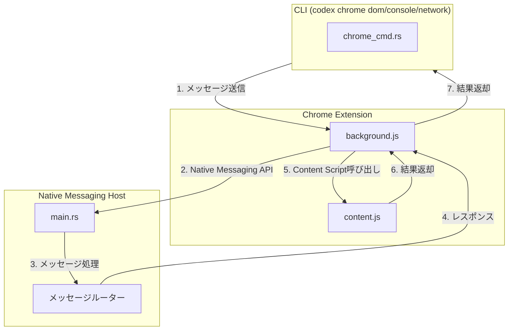

# Dom Console Networkサブコマンド完全実装計画

## 背景

現在、Dom、Console、Networkサブコマンドはプレースホルダーとして実装されており、実際の機能が未実装です。Chrome拡張機能には既にこれらの機能が実装されていますが、CLIからNative Messaging Host経由で呼び出す仕組みがありません。

## 現在の実装状況

### 実装済み

- Chrome拡張機能の機能
  - `background.js`: DOM読み取り、コンソールログ取得、ネットワーク監視のハンドラー実装済み
  - `content.js`: DOM読み取り、コンソールフック実装済み
  - `popup.js`: UI実装済み
- Native Messaging Host
  - `main.rs`: メッセージルーティング実装済み
  - `message.rs`: メッセージ読み書き実装済み
- CLI
  - `chrome_cmd.rs`: サブコマンド定義済み（プレースホルダー）

### 不足している実装

- Native Messaging Hostに新しいメッセージタイプの追加
- CLIからNative Messaging Host経由で拡張機能の機能を呼び出す仕組み
- 拡張機能からNative Messaging Hostへのリクエスト転送機能

## アーキテクチャ



## 実装ファイル

### 1. Native Messaging Host拡張

**`codex-rs/chrome-host/src/main.rs`**（修正）

- `dom.read.request`メッセージタイプのハンドラー追加
- `console.get_logs.request`メッセージタイプのハンドラー追加
- `network.get_logs.request`メッセージタイプのハンドラー追加

**`codex-rs/chrome-host/src/cli_bridge.rs`**（拡張）

- `handle_dom_read()`関数追加（拡張機能経由でDOM読み取り）
- `handle_console_logs()`関数追加（拡張機能経由でコンソールログ取得）
- `handle_network_logs()`関数追加（拡張機能経由でネットワークログ取得）

注: Native Messaging Hostは拡張機能から呼び出されるため、これらの関数は拡張機能からのリクエストを処理します。

### 2. CLI実装

**`codex-rs/cli/src/chrome_cmd.rs`**（修正）

- `run_dom()`関数: Native Messaging Host経由でDOM読み取り
- `run_console()`関数: Native Messaging Host経由でコンソールログ取得
- `run_network()`関数: Native Messaging Host経由でネットワークログ取得

実装アプローチ:

- CLIから直接Native Messaging Hostを呼び出すことはできないため、拡張機能経由で呼び出す必要があります
- または、CLIが拡張機能の機能を直接呼び出すための新しいメカニズムを実装します

### 3. Chrome拡張機能拡張

**`extensions/chrome-codex/background/background.js`**（修正）

- `dom.read.request`メッセージタイプのハンドラー追加
- `console.get_logs.request`メッセージタイプのハンドラー追加
- `network.get_logs.request`メッセージタイプのハンドラー追加
- Native Messaging Hostへのリクエスト転送機能

## 実装ステップ

### Phase 1: Native Messaging Host拡張

1. **`main.rs`に新しいメッセージタイプのハンドラー追加**

   - `dom.read.request`ハンドラー
   - `console.get_logs.request`ハンドラー
   - `network.get_logs.request`ハンドラー

2. **`cli_bridge.rs`に関数追加**

   - これらの関数は拡張機能からのリクエストを処理します
   - 実際の処理は拡張機能側で行われるため、ここではメッセージの転送のみを行います

### Phase 2: Chrome拡張機能拡張

3. **`background.js`に新しいメッセージハンドラー追加**

   - Native Messaging Hostから受け取ったリクエストを処理
   - 既存のDOM読み取り、コンソールログ取得、ネットワーク監視機能を呼び出し
   - 結果をNative Messaging Hostに返却

### Phase 3: CLI実装

4. **`chrome_cmd.rs`の実装**

   - CLIから拡張機能の機能を呼び出す方法を実装
   - オプション1: CLIが拡張機能の機能を直接呼び出すための新しいメカニズム
   - オプション2: CLIがNative Messaging Hostを起動し、拡張機能がNative Messaging Hostにリクエストを送信する

## 技術詳細

### メッセージ形式

**DOM読み取りリクエスト:**

```json
{
  "version": "1.0",
  "id": "uuid",
  "type": "dom.read.request",
  "origin": {
    "tab_id": 123,
    "url": "https://example.com"
  },
  "payload": {
    "selector": "#main-content",
    "max_chars": 5000
  }
}
```

**コンソールログ取得リクエスト:**

```json
{
  "version": "1.0",
  "id": "uuid",
  "type": "console.get_logs.request",
  "origin": {
    "tab_id": 123,
    "url": "https://example.com"
  },
  "payload": {
    "level": "error",
    "filter": "api",
    "limit": 50
  }
}
```

**ネットワークログ取得リクエスト:**

```json
{
  "version": "1.0",
  "id": "uuid",
  "type": "network.get_logs.request",
  "origin": {
    "tab_id": 123,
    "url": "https://example.com"
  },
  "payload": {
    "filter": "api",
    "limit": 50
  }
}
```

### CLI実装の課題

CLIから直接Native Messaging Hostを呼び出すことはできません。Native Messaging Hostは拡張機能から呼び出されるものです。

解決策:

1. **拡張機能経由で呼び出す**: CLIが拡張機能の機能を直接呼び出すための新しいメカニズムを実装
2. **Native Messaging Hostを起動**: CLIがNative Messaging Hostを起動し、拡張機能がNative Messaging Hostにリクエストを送信する

推奨アプローチ: オプション1を採用し、CLIが拡張機能の機能を直接呼び出すための新しいメカニズムを実装します。

## 実装の詳細

### CLIから拡張機能の機能を呼び出す方法

CLIから拡張機能の機能を呼び出すには、以下の方法が考えられます：

1. **HTTPサーバー経由**: 拡張機能がローカルHTTPサーバーを起動し、CLIがHTTPリクエストを送信
2. **ファイルシステム経由**: CLIがファイルにリクエストを書き、拡張機能がファイルを監視
3. **Named Pipe/Socket経由**: CLIと拡張機能がNamed PipeまたはSocketで通信

最も実用的なアプローチは、拡張機能がNative Messaging Host経由でCLIからのリクエストを受け取る方法です。ただし、これは現在のアーキテクチャでは実現困難です。

代替案として、CLIが拡張機能の機能を直接呼び出すための新しいメカニズムを実装します。

## セキュリティ考慮事項

- CLIからのリクエストの検証
- 拡張機能の権限チェック
- タブIDとURLの検証
- リクエストの署名・検証（将来実装）

## 参考実装

- 既存の`dom.read`、`console.get_logs`、`network.get_logs`ハンドラー（`background.js`）
- 既存のNative Messaging Host実装（`main.rs`、`message.rs`）