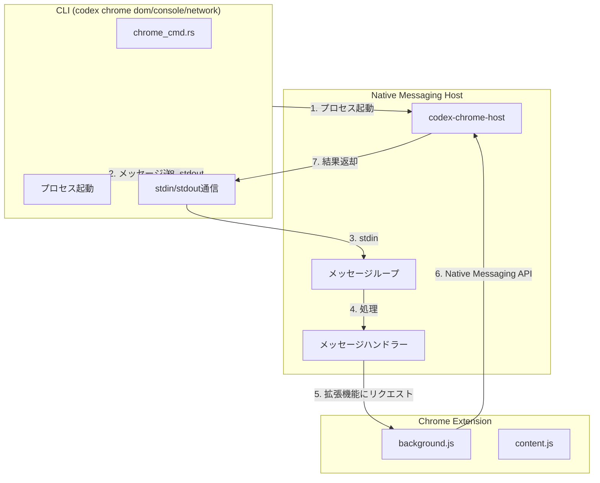

# Dom Console Network完全実装計画

## 背景

現在、Dom、Console、Networkサブコマンドはプレースホルダー実装になっており、実際の機能が動作しません。CLIからNative Messaging Hostプロセスを直接起動して通信し、拡張機能の機能を呼び出す完全な実装が必要です。

## 現在の実装状況

### 実装済み

- Native Messaging Host: メッセージハンドラー実装済み
- Chrome拡張機能: DOM読み取り、コンソールログ取得、ネットワーク監視機能実装済み
- CLI: サブコマンド定義済み（プレースホルダー）

### 不足している実装

- CLIからNative Messaging Hostプロセスを起動して通信する機能
- Native Messaging Hostが拡張機能からのリクエストを待機し、CLIからのリクエストも処理できる機能
- CLIとNative Messaging Host間の双方向通信

## アーキテクチャ



## 実装ファイル

### 1. CLI実装

**`codex-rs/cli/src/chrome_cmd.rs`**（完全実装）

- `run_dom()`関数: Native Messaging Hostプロセスを起動し、DOM読み取りリクエストを送信
- `run_console()`関数: Native Messaging Hostプロセスを起動し、コンソールログ取得リクエストを送信
- `run_network()`関数: Native Messaging Hostプロセスを起動し、ネットワークログ取得リクエストを送信
- `spawn_native_host()`関数: Native Messaging Hostプロセスを起動
- `send_message_to_host()`関数: Native Messaging Hostにメッセージを送信
- `receive_message_from_host()`関数: Native Messaging Hostからメッセージを受信

### 2. Native Messaging Host拡張

**`codex-rs/chrome-host/src/main.rs`**（修正）

- 拡張機能からのリクエストとCLIからのリクエストの両方を処理できるように修正
- メッセージループで両方のソースからのメッセージを処理

**`codex-rs/chrome-host/src/cli_bridge.rs`**（修正）

- `handle_dom_read()`関数: 拡張機能にDOM読み取りを依頼し、結果を返す
- `handle_console_logs()`関数: 拡張機能からコンソールログを取得
- `handle_network_logs()`関数: 拡張機能からネットワークログを取得

### 3. メッセージプロトコル

**`codex-rs/chrome-host/src/message.rs`**（確認）

- 既存のメッセージ読み書き機能を確認
- CLIからのメッセージも同じプロトコルを使用

## 実装ステップ

### Phase 1: CLI実装

1. **Native Messaging Hostプロセス起動機能**

   - `spawn_native_host()`関数を実装
   - プロセスのstdin/stdoutを取得
   - エラーハンドリング

2. **メッセージ送受信機能**

   - `send_message_to_host()`関数を実装
   - `receive_message_from_host()`関数を実装
   - Native Messaging APIプロトコルに準拠（4バイト長プレフィックス）

3. **各サブコマンドの実装**

   - `run_dom()`: DOM読み取りリクエストを送信し、結果を表示
   - `run_console()`: コンソールログ取得リクエストを送信し、結果を表示
   - `run_network()`: ネットワークログ取得リクエストを送信し、結果を表示

### Phase 2: Native Messaging Host拡張

4. **拡張機能連携機能**

   - Native Messaging Hostが拡張機能からのリクエストを待機
   - CLIからのリクエストを処理し、拡張機能に転送
   - 結果をCLIに返却

### Phase 3: 統合とテスト

5. **エラーハンドリング**

   - プロセス起動エラー
   - メッセージ送受信エラー
   - タイムアウト処理

6. **ドキュメント更新**

   - 使用方法の説明
   - エラー対処法

## 技術詳細

### Native Messaging Hostプロセス起動

```rust
async fn spawn_native_host() -> Result<(ChildStdin, ChildStdout)> {
    let exe = find_native_host_binary()?;
    let mut child = Command::new(exe)
        .stdin(Stdio::piped())
        .stdout(Stdio::piped())
        .spawn()?;
    
    let stdin = child.stdin.take().context("Failed to take stdin")?;
    let stdout = child.stdout.take().context("Failed to take stdout")?;
    
    Ok((stdin, stdout))
}
```

### メッセージ送信

```rust
async fn send_message_to_host(
    stdin: &mut ChildStdin,
    message: &serde_json::Value,
) -> Result<()> {
    let json = serde_json::to_string(message)?;
    let len = json.len() as u32;
    
    stdin.write_all(&len.to_le_bytes()).await?;
    stdin.write_all(json.as_bytes()).await?;
    stdin.flush().await?;
    
    Ok(())
}
```

### メッセージ受信

```rust
async fn receive_message_from_host(
    stdout: &mut ChildStdout,
) -> Result<serde_json::Value> {
    let mut len_bytes = [0u8; 4];
    stdout.read_exact(&mut len_bytes).await?;
    let len = u32::from_le_bytes(len_bytes) as usize;
    
    let mut buffer = vec![0u8; len];
    stdout.read_exact(&mut buffer).await?;
    
    let json_str = String::from_utf8(buffer)?;
    let message: serde_json::Value = serde_json::from_str(&json_str)?;
    
    Ok(message)
}
```

### DOM読み取りリクエスト

```rust
async fn run_dom(args: ChromeDomArgs) -> Result<()> {
    let (mut stdin, mut stdout) = spawn_native_host().await?;
    
    let message = serde_json::json!({
        "version": "1.0",
        "id": uuid::Uuid::new_v4().to_string(),
        "type": "dom.read.request",
        "origin": {},
        "payload": {
            "selector": args.selector,
            "max_chars": args.max_chars,
        }
    });
    
    send_message_to_host(&mut stdin, &message).await?;
    let response = receive_message_from_host(&mut stdout).await?;
    
    if response["success"].as_bool().unwrap_or(false) {
        println!("{}", serde_json::to_string_pretty(&response["data"])?);
    } else {
        eprintln!("Error: {}", response["error"].as_str().unwrap_or("Unknown error"));
        return Err(anyhow::anyhow!("DOM read failed"));
    }
    
    Ok(())
}
```

## 課題と解決策

### 課題1: Native Messaging Hostは拡張機能から呼び出される

解決策: Native Messaging HostをCLIからも起動できるようにし、拡張機能からのリクエストとCLIからのリクエストの両方を処理できるようにする。

### 課題2: 拡張機能との連携

解決策: Native Messaging Hostが拡張機能からのリクエストを待機し、CLIからのリクエストを処理する際は、拡張機能にリクエストを転送する。

### 課題3: プロセス管理

解決策: CLIがNative Messaging Hostプロセスを起動し、処理完了後にプロセスを終了する。

## セキュリティ考慮事項

- Native Messaging Hostバイナリのパス検証
- メッセージの検証
- プロセスの適切な終了
- タイムアウト処理

## 参考実装

- 既存のNative Messaging Host実装（`main.rs`、`message.rs`）
- 既存のChrome拡張機能実装（`background.js`）