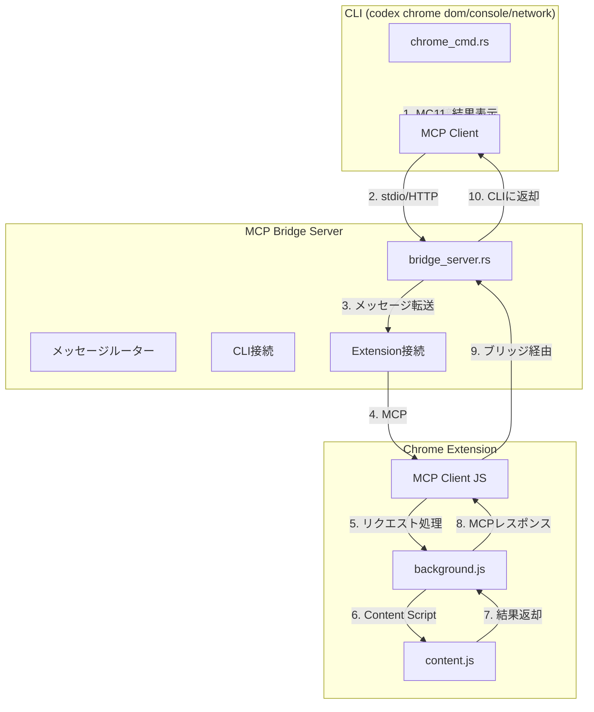

# MCPブリッジサーバー実装計画

## 背景

現在、CLIからNative Messaging Host経由でDOM読み取り、コンソールログ取得、ネットワークログ取得を実装していますが、拡張機能との連携が不完全です。MCP（Model Context Protocol）を使用することで、より堅牢で標準化された通信が可能になります。

## アーキテクチャ



## 実装アプローチ

### オプション1: 単一ブリッジサーバー（推奨）

1. MCPブリッジサーバーを実装（stdio + streamable HTTPの両方をサポート）
2. CLIがstdio経由でブリッジサーバーに接続
3. 拡張機能がstreamable HTTP経由でブリッジサーバーに接続
4. ブリッジサーバーが両者の通信を仲介

### オプション2: 拡張機能をMCPサーバーとして実装

1. 拡張機能がMCPサーバーとして動作（streamable HTTP）
2. CLIがMCPクライアントとして拡張機能に接続
3. より直接的な通信

**推奨アプローチ**: オプション1を採用し、MCPブリッジサーバーを実装します。

## 実装ファイル

### 1. MCPブリッジサーバー（新規作成）

**`codex-rs/chrome-mcp-bridge/Cargo.toml`**（新規作成）

- Rustプロジェクト設定
- `rmcp`、`tokio`、`serde`、`serde_json`などの依存
- stdioとstreamable HTTPの両方をサポート

**`codex-rs/chrome-mcp-bridge/src/main.rs`**（新規作成）

- MCPブリッジサーバーのメインエントリーポイント
- stdioとstreamable HTTPの両方のトランスポートをサポート
- メッセージルーティング

**`codex-rs/chrome-mcp-bridge/src/bridge.rs`**（新規作成）

- CLI接続と拡張機能接続の管理
- メッセージの転送とルーティング
- セッション管理

**`codex-rs/chrome-mcp-bridge/src/tools.rs`**（新規作成）

- MCPツール定義（dom_read、console_get_logs、network_get_logs）
- ツールハンドラーの実装

### 2. CLI実装（修正）

**`codex-rs/cli/src/chrome_cmd.rs`**（修正）

- MCPクライアントを使用してブリッジサーバーに接続
- `run_dom`、`run_console`、`run_network`をMCP経由で実装
- `rmcp-client`を使用してMCP接続

### 3. 拡張機能実装（修正）

**`extensions/chrome-codex/background/background.js`**（修正）

- MCPクライアント（JavaScript）を実装
- streamable HTTP経由でブリッジサーバーに接続
- MCPツール呼び出しの処理

**`extensions/chrome-codex/background/mcp_client.js`**（新規作成）

- MCPクライアントの実装
- streamable HTTPトランスポート
- JSON-RPC 2.0メッセージの処理

### 4. 設定ファイル（更新）

**`codex-rs/Cargo.toml`**（修正）

- `chrome-mcp-bridge`をworkspace membersに追加

## 実装ステップ

### Phase 1: MCPブリッジサーバー実装

1. **`chrome-mcp-bridge`プロジェクト作成**

   - `Cargo.toml`作成
   - workspace membersに追加
   - 必要な依存関係を定義

2. **ブリッジサーバーの基本実装**

   - stdioトランスポートのサポート
   - streamable HTTPトランスポートのサポート
   - メッセージルーティング

3. **MCPツール定義**

   - `dom_read`ツール
   - `console_get_logs`ツール
   - `network_get_logs`ツール

### Phase 2: CLI実装

4. **CLIのMCPクライアント実装**

   - `rmcp-client`を使用してブリッジサーバーに接続
   - `run_dom`、`run_console`、`run_network`をMCP経由で実装

### Phase 3: 拡張機能実装

5. **拡張機能のMCPクライアント実装**

   - JavaScriptでMCPクライアントを実装
   - streamable HTTP経由でブリッジサーバーに接続
   - MCPツール呼び出しの処理

### Phase 4: 統合とテスト

6. **統合テスト**

   - エンドツーエンドテスト
   - エラーハンドリングのテスト

7. **ドキュメント更新**

   - 使用方法の更新
   - アーキテクチャの説明

## 技術詳細

### MCPブリッジサーバー

ブリッジサーバーは以下の機能を提供します：

- **stdioトランスポート**: CLIからの接続を受け付ける
- **streamable HTTPトランスポート**: 拡張機能からの接続を受け付ける
- **メッセージルーティング**: CLIからのリクエストを拡張機能に転送し、結果を返す
- **セッション管理**: 複数の接続を管理

### MCPツール定義

```rust
// dom_read ツール
{
    "name": "dom_read",
    "description": "Read DOM from active tab",
    "inputSchema": {
        "type": "object",
        "properties": {
            "selector": { "type": "string" },
            "max_chars": { "type": "number" }
        }
    }
}

// console_get_logs ツール
{
    "name": "console_get_logs",
    "description": "Get console logs from active tab",
    "inputSchema": {
        "type": "object",
        "properties": {
            "level": { "type": "string" },
            "filter": { "type": "string" },
            "limit": { "type": "number" }
        }
    }
}

// network_get_logs ツール
{
    "name": "network_get_logs",
    "description": "Get network request logs from active tab",
    "inputSchema": {
        "type": "object",
        "properties": {
            "filter": { "type": "string" },
            "limit": { "type": "number" }
        }
    }
}
```

### CLI実装

CLIは`rmcp-client`を使用してブリッジサーバーに接続します：

```rust
use codex_rmcp_client::RmcpClient;

let client = RmcpClient::new_stdio_client(command, args, env).await?;
let result = client.call_tool("dom_read", params).await?;
```

### 拡張機能実装

拡張機能はJavaScriptでMCPクライアントを実装し、streamable HTTP経由でブリッジサーバーに接続します：

```javascript
// MCPクライアントの実装
class MCPClient {
    async connect(url) {
        // streamable HTTP接続
    }
    
    async callTool(name, params) {
        // ツール呼び出し
    }
}
```

## 実装の詳細

### ブリッジサーバーの起動

ブリッジサーバーは以下の方法で起動できます：

1. **stdioモード**: CLIから直接起動
2. **HTTPモード**: バックグラウンドで起動し、HTTPエンドポイントを提供

### セッション管理

ブリッジサーバーは、CLIと拡張機能の接続を管理し、適切にメッセージをルーティングします。複数のCLI接続や拡張機能接続を同時に処理できます。

### エラーハンドリング

- 接続エラーの処理
- タイムアウト処理
- メッセージの検証
- エラーレスポンスの返却

## セキュリティ考慮事項

- 接続の認証（将来実装）
- メッセージの署名・検証（将来実装）
- リクエストの検証
- 権限チェック

## 参考実装

- 既存のMCPサーバー実装（`codex-rs/mcp-server`）
- 既存のMCPクライアント実装（`codex-rs/rmcp-client`）
- MCP仕様: https://modelcontextprotocol.io/