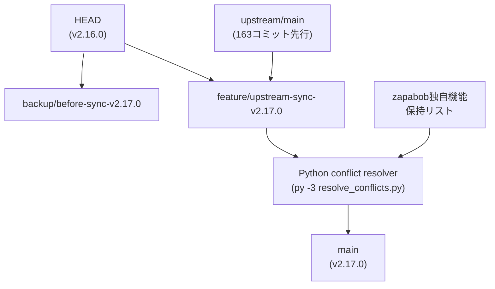

# Upstream Sync & Version Bump: v2.16.0 → v2.17.0

## 背景・状況


| 項目         | 内容                                          |
| ---------- | ------------------------------------------- |
| 現在バージョン    | 2.16.0                                      |
| 目標バージョン    | 2.17.0                                      |
| upstream遅延 | 163コミット                                     |
| 重大CVE      | CVE-2026-24842 (pnpm)                       |
| 変更規模       | +50,948 / -2,469,693行（カスタムファイルが多いため削除行数が巨大） |


## データフロー




## マージ対象の主要upstream変更

### セキュリティ修正（優先度：最高）

- **CVE-2026-24842**: pnpmバージョン更新（`package.json`, `pnpm-lock.yaml`）
- セキュリティポリシー文書追加（`docs/security.md`）

### 新機能

- **MCP OAuth callback URL** 設定可能化（`config/`, `mcp-server/`）
- **permissions.network proxy** config連携（`codex-rs/config/`）
- **Reject approval policy** 粒度の細かい拒否ポリシー（`codex-rs/core/`）
- **configurable agent spawn depth** エージェント生成深度設定（`codex-rs/core/`）
- **configurable write_stdin timeout** 標準入力書き込みタイムアウト
- **shell snapshot failure reason** シェルスナップショット失敗理由
- **apps tool cache** ディスクへのキャッシュ保存

### バグ修正

- app-server スレッドresume/rejoin フロー修正
- flaky テスト修正（`tests/`）
- Bazel proc_macro_dep修正

## 保持するzapabob独自機能

### Rustクレート（カスタム）

- `codex-rs/deep-research/` — DuckDuckGo/Gemini/Braveマルチソース調査
- `codex-rs/supervisor/` — マルチエージェント協調（planner/assigner/executor/aggregator）
- `codex-rs/core/src/organizations/` — 組織管理
- `codex-rs/core/src/orchestration/` — オーケストレーション
- `codex-rs/core/src/agents/` — エージェント管理（delegate-parallel）
- `codex-rs/core/src/plan/` — 計画実行
- `codex-rs/core/src/audit_log/` — 監査ログ
- `codex-rs/core/src/cowork_integration/` — Cowork統合
- Feature gates: `git4d`, `vr-ar`, `a2a-comm`, `autonomous`, `skill-mcp`, `llmops`

### TypeScript/Node（カスタム）

- `codex-gui-x/` — カスタムGUI（Next.js 15/React 19/WebXR）
- `prism-mcp-server/`, `prism-web/` — Prism MCP統合

## 実装ステップ詳細

### Step 1: バックアップブランチ作成

```powershell
git checkout -b backup/before-sync-v2.17.0
git checkout main
```

### Step 2: マージワークブランチ作成

```powershell
git checkout -b feature/upstream-sync-v2.17.0
git fetch upstream
git merge upstream/main --no-commit --no-ff
```

### Step 3: Python自動コンフリクト解決スクリプト実行

`scripts/resolve_conflicts.py` を作成・実行:

- `<<<<<<<` / `=======` / `>>>>>>>` マーカーを検出
- 解決戦略：
  - バージョン文字列 → upstreamを採用
  - zapabob独自ディレクトリ内の変更 → カスタムを保持
  - 同じ機能が両方にある場合 → upstream版をベース+zapabob拡張をマージ
  - セキュリティパッチ → upstreamを採用
  - Cargo.toml依存関係 → upstreamバージョンを採用しカスタムクレートを追加
- 解決できないファイルリストを出力

### Step 4: バージョン一括更新

- `codex-rs/Cargo.toml`: `2.16.0` → `2.17.0`
- `package.json`（ルート）: `2.16.0` → `2.17.0`
- `codex-cli/package.json`: 更新
- `gui/package.json`: 更新

対象ファイル：

- `[codex-rs/Cargo.toml](codex-rs/Cargo.toml)` — `[workspace.package] version`
- `[package.json](package.json)` — `"version"`

### Step 5: pnpm CVE修正

```powershell
cd codex-rs
# Cargo依存関係更新
cargo update

# rootでpnpm更新
cd ..
pnpm update --recursive
```

### Step 6: ビルド確認（高速差分ビルド）

```powershell
cd codex-rs
.\ultra-fast-build-install.ps1
```

### Step 7: テスト実行

```powershell
cd codex-rs
cargo nextest run --no-fail-fast
```

### Step 8: CHANGELOG.md更新とコミット

- v2.17.0エントリを追加
- マージした機能リスト記載

### Step 9: 実装ログ保存

- `_docs/2026-02-20_upstream-sync-v2.17.0.md` に実装ログを保存

## Python競合解決スクリプトの戦略

```python
# scripts/resolve_conflicts.py の主要ロジック（概要）

CUSTOM_DIRS = [
    "codex-gui-x/", "prism-mcp-server/", "prism-web/",
    "zapabob/", "_docs/", "kernel-extensions/",
    "codex-rs/deep-research/", "codex-rs/supervisor/",
]

# カスタムファイル → zapabob側を保持
# セキュリティ関連 → upstream側を採用  
# バージョン文字列 → upstream採用（ただし2.17.0にbump）
# Cargo.toml members → 両方をマージ
```

## リスク管理


| リスク              | 対策                               |
| ---------------- | -------------------------------- |
| Cargoクレート間のAPI破損 | `cargo check`で事前検出、エラー箇所を個別修正    |
| feature gate競合   | カスタムfeature flagを別名前空間で保持        |
| テスト破損            | `--no-fail-fast`で全テスト実行し失敗箇所リスト化 |
| ビルド失敗            | バックアップブランチから復旧可能                 |


