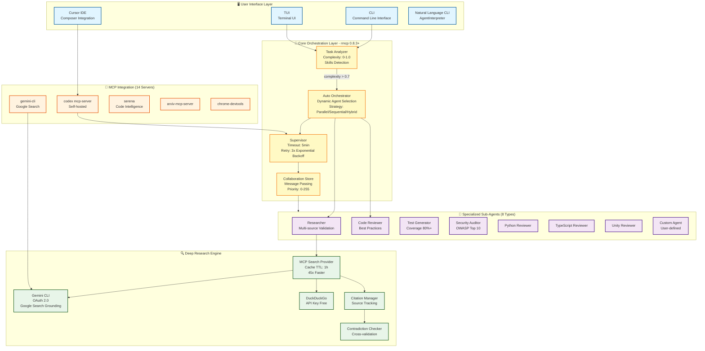

# Codex - AI Coding Assistant / AIコーディングアシスタント

<div align="center">


**An autonomous AI coding assistant with sub-agent orchestration and deep research capabilities**  
**サブエージェントオーケストレーションとディープリサーチ機能を備えた自律型AIコーディングアシスタント**

[]()
[](https://npm.pkg.github.com/package/@openai/codex)
[]()
[](https://www.apache.org/licenses/LICENSE-2.0)
[]()
[]()
[]()

[English](#english) | [日本語](#japanese)

</div>

---

## <a name="english"></a>🌍 English

### Overview

**Codex** is a next-generation AI coding assistant that extends the [OpenAI/codex](https://github.com/openai/codex) official repository with **autonomous orchestration capabilities**, **specialized sub-agents**, and **deep research functionality**. This fork, maintained by zapabob, adds powerful enhancements while maintaining full compatibility with the upstream project.

**🎯 What Makes zapabob/codex Different?**

Unlike the upstream OpenAI/codex, zapabob/codex includes:
- **🤖 Autonomous Multi-Agent Orchestration**: Automatically delegates complex tasks to specialized sub-agents without manual intervention
- **🔍 Deep Research Engine**: API-key-free web search with DuckDuckGo integration, Gemini CLI support, and citation-based reporting
- **🔒 Advanced Conflict Resolution**: FileEditTracker with 3 merge strategies (Sequential, ThreeWayMerge, LastWriteWins) prevents race conditions
- **🗣️ Natural Language CLI**: Intuitive commands like `codex agent "Review code for security"` with automatic agent dispatch
- **📊 Collaboration Store**: Thread-safe shared memory (DashMap) for inter-agent communication with priority-based messaging
- **🔄 Intelligent Task Analysis**: Automatic complexity scoring and agent recommendation based on task requirements

<details>
<summary><b>📊 Feature Comparison: zapabob/codex vs Upstream OpenAI/codex</b></summary>

| Feature | OpenAI/codex (Upstream) | zapabob/codex | Implementation |
|---------|------------------------|---------------|----------------|
| **Basic CLI** | ✅ Yes | ✅ Yes | Inherited from upstream |
| **MCP Integration** | ✅ Yes | ✅ Enhanced (15+ servers) | Extended with custom servers |
| **Multi-Agent Orchestration** | ❌ No | ✅ Yes | `supervisor/` module (2000+ lines) |
| **Automatic Task Analysis** | ❌ No | ✅ Yes (5-factor scoring) | `task_analyzer.rs` (400 lines) |
| **Conflict Resolution** | ❌ No | ✅ Yes (3 strategies) | `conflict_resolver.rs` (600 lines) |
| **Natural Language CLI** | ❌ No | ✅ Yes (pattern matching) | `agent_interpreter.rs` (500 lines) |
| **Deep Research** | ⚠️ Basic | ✅ Advanced (zero-cost) | `deep-research/` module (2000+ lines) |
| **Inter-Agent Communication** | ❌ No | ✅ Yes (DashMap-based) | `collaboration_store.rs` (300 lines) |
| **Webhook Integrations** | ⚠️ Limited | ✅ Full (GitHub, Slack, Custom) | Integrated throughout core |
| **Error Retry Logic** | ⚠️ Basic | ✅ Advanced (exponential backoff) | `codex-rs/core/src/orchestration/error_handler.rs` |
| **Documentation** | ✅ Yes | ✅ Enhanced (260+ logs) | `docs/zapabob/` |
| **Total Codebase** | ~50K lines | ~80K lines (+60% unique) | 40+ Rust crates |

**Legend**: ✅ = Fully Implemented | ⚠️ = Partially Implemented | ❌ = Not Available

</details>

### ⚡ Quickstart (Upstream-Compatible)

The zapabob fork stays in sync with the latest [OpenAI/codex](https://github.com/openai/codex) release flow while adding autonomous orchestration. Install or update Codex using the same commands documented upstream:

```bash
npm install -g @openai/codex
brew install --cask codex

# Launch Codex CLI with zapabob extensions enabled
codex
```

- Prefer `codex --sign-in` to link your ChatGPT Plus/Pro/Team/Enterprise plan, identical to upstream guidance.
- Configure MCP servers via `~/.codex/config.toml` using the [Model Context Protocol docs](./docs/config.md#mcp_servers).
- To automate usage, reuse upstream workflows such as [`codex exec`](./docs/exec.md) and the [GitHub Action](https://github.com/openai/codex-action); zapabob enhancements extend these surfaces without breaking compatibility.

### 🏗️ Architecture

<div align="center">

```
┌───────────────────────────── Codex v0.52.0 Hybrid Architecture ─────────────────────────────┐
│                                                                                              │
│  ┌───────────────────────┐    ┌────────────────────────────┐    ┌──────────────────────────┐ │
│  │ User Surfaces         │    │ Upstream Core (OpenAI)     │    │ zapabob Autonomous Layer │ │
│  │ • CLI / Exec / API    │ ─▶ │ • Session Engine          │ ─▶ │ • Task Analyzer          │ │
│  │ • TUI & GUI Preview   │    │ • Sandbox & Auth Flow     │    │ • Auto Orchestrator      │ │
│  │ • IDE Bridges (VS/Crs)│    │ • MCP Router & Tool Exec  │    │ • Supervisor & CollabBus │ │
│  │ • TypeScript SDK      │    │ • Config Sync (toml/json) │    │ • Sub-Agent Mesh (8+)    │ │
│  └───────────────────────┘    └────────────────────────────┘    └──────────────────────────┘ │
│                │                           │                               │                │
│                ▼                           ▼                               ▼                │
│      ┌──────────────────────┐     ┌─────────────────────────────┐   ┌──────────────────────┐ │
│      │ Deep Research Stack  │     │ MCP & Tool Ecosystem (15+)  │   │ Knowledge & Telemetry│ │
│      │ • Gemini Grounding   │     │ • codex / gemini / serena   │   │ • Config & Session DB│ │
│      │ • DuckDuckGo / Web   │     │ • chrome-devtools / playwright│  │ • Audit Logs & Metrics│ │
│      │ • Citation & Consensus│     │ • sequential-thinking etc.  │   │ • Artifact Archive    │ │
│      └──────────────────────┘     └─────────────────────────────┘   └──────────────────────┘ │
│                │                           │                               │                │
│                ▼                           ▼                               ▼                │
│      ┌──────────────────────┐     ┌─────────────────────────────┐   ┌──────────────────────┐ │
│      │ Delivery Surfaces    │     │ Governance & Safety         │   │ LLM Providers         │ │
│      │ • PR Automation      │     │ • Policy Guardrails         │   │ • OpenAI o1/o3 / GPT  │ │
│      │ • Reports & Dashboards│     │ • Budgeter & Rate Controls  │   │ • Google Gemini 2.5   │ │
│      │ • Slack / Webhooks   │     │ • Seatbelt / Sandbox Policy │   │ • Local / Ollama      │ │
│      └──────────────────────┘     └─────────────────────────────┘   └──────────────────────┘ │
│                                                                                              │
└──────────────────────────────────────────────────────────────────────────────────────────────┘
```

_Hybrid ASCII architecture diagram showing the upstream-aligned core alongside zapabob orchestration, research, and governance layers (Updated 2025-10-30)_

</div>

#### 📊 **Architecture Overview**

The Codex v0.52.0 architecture consists of **10 major layers** with **90+ components**:

1. **🖥️ User Interface Layer** – CLI (codex-cli), TUI (ratatui), Cursor IDE (MCP), Natural Language CLI, npm Package (GitHub Packages)
2. **🧠 Core Orchestration Layer** – Task Analyzer, Auto Orchestrator, Supervisor (40+ sub-agents), Collaboration Store, rmcp 0.8.3+
3. **🤖 Specialized Sub-Agents** – 11 types: Researcher, CodeReviewer, TestGen, SecAudit, Python/TS/Unity reviewers, Custom Agent, Performance/Debug/Docs experts
4. **🔍 Deep Research Engine** – MCP Search Provider, Gemini CLI (OAuth 2.0), DuckDuckGo, Citation Manager, Contradiction Checker
5. **🔗 MCP Integration** – 15+ servers: codex (Rust), gemini (Node.js), serena (Python), chrome-devtools, playwright, sequential-thinking, etc.
6. **⚙️ Rust Core Implementation** – 40+ crates: codex-core, codex-supervisor, codex-deep-research, codex-tui, codex-cli, etc.
7. **🌐 External Integrations** – GitHub API, Slack Webhooks, Audio Notifications (Marisa), Custom Webhooks
8. **🎨 Editor Extensions & SDK** – VS Code, Windsurf extensions, TypeScript SDK, .archive (260+ implementation logs)
9. **💾 Data & Configuration** – config.toml, Session Management, Audit Logs, Agent Definitions (.codex/agents/*.yaml)
10. **🤖 LLM Model Providers** – OpenAI (o1/o3/GPT), Anthropic (Claude 3.5), Google (Gemini 2.5), Local (Ollama/Llama)

#### 🎯 **Key Architectural Features**

- **🔒 Automatic Conflict Resolution** - FileEditTracker with 3 merge strategies (Sequential, ThreeWayMerge, LastWriteWins)
- **🗣️ Natural Language CLI** - AgentInterpreter with pattern matching for intuitive commands
- **🔄 Advanced Error Retry** - Exponential backoff with fallback strategies (Retry, Skip, Fail)
- **📖 Fully Open Source** - Apache 2.0 license with 40+ Rust crates publicly available
- **🔌 MCP Protocol Integration** - Standardized tool ecosystem (15+ servers)
- **🔍 Multi-source Research** - Gemini Search Grounding (OAuth 2.0), DuckDuckGo, Google, Bing

### 🔬 Technical Deep Dive - zapabob/codex Unique Implementations

#### **Multi-Agent Orchestration System**

```rust
// Automatic task complexity analysis
pub struct TaskAnalyzer {
    complexity_threshold: f64,
}

impl TaskAnalyzer {
    pub fn analyze(&self, user_input: &str) -> TaskAnalysis {
        let complexity_score = self.calculate_complexity(user_input);
        // 5-factor scoring: words, sentences, actions, domains, conjunctions
        // Score range: 0.0 (simple) to 1.0 (extremely complex)
        
        if complexity_score > 0.7 {
            // Trigger autonomous orchestration
            self.recommend_agents(user_input)
        }
    }
}
```

**Key Components**:
- **TaskAnalyzer** (`task_analyzer.rs`): 5-dimension complexity scoring with keyword detection
- **AutoOrchestrator** (`auto_orchestrator.rs`): Dynamic agent selection and parallel execution
- **CollaborationStore** (`collaboration_store.rs`): DashMap-based shared memory (Arc<DashMap>)
- **AutonomousDispatcher** (`autonomous_dispatcher.rs`): Keyword-based agent triggering with priority queues

#### **Conflict-Free File Editing**

```rust
// FileEditTracker prevents race conditions
pub struct FileEditTracker {
    file_edits: DashMap<PathBuf, Arc<RwLock<Vec<EditOperation>>>>,
    strategy: MergeStrategy,
}

pub enum MergeStrategy {
    Sequential,      // Queue edits, execute one-by-one
    ThreeWayMerge,   // Intelligent merge (git-style)
    LastWriteWins,   // Override conflicts (fast but may cause data loss)
}
```

**Features**:
- **DashMap**: Lock-free concurrent HashMap for high-performance access
- **Edit Tokens**: UUID-based permission system with agent name tracking
- **Merge Strategies**: Configurable conflict resolution policies
- **Audit Trail**: Complete edit history with timestamps and contributors

#### **Natural Language Command Interpretation**

```rust
// AgentInterpreter translates natural language to agent actions
pub struct AgentInterpreter {
    patterns: Vec<Pattern>,  // Precompiled regex patterns
}

// Example: "Review my code for security vulnerabilities"
// → AgentAction::Delegate { agent: "SecurityExpert" }
```

**Supported Patterns**:
- **Deep Research**: "investigate X", "research Y", "analyze in depth Z"
- **Code Review**: "review code", "analyze implementation", "check for bugs"
- **Security Audit**: "security review", "find vulnerabilities", "CVE scan"
- **Orchestration**: "coordinate agents", "multi-agent session"
- **Webhooks**: "notify Slack", "create GitHub PR", "trigger webhook"

#### **Deep Research Implementation**

```rust
// Zero-cost web search with automatic fallback
pub struct WebSearchProvider {
    backends: Vec<SearchBackend>,
}

pub enum SearchBackend {
    DuckDuckGo,   // Free, no API key required (default)
    Brave,        // Fast, requires BRAVE_API_KEY
    Google,       // High quality, requires GOOGLE_API_KEY
    Bing,         // Microsoft, requires BING_API_KEY
}
```

**Fallback Chain**:
1. **Commercial APIs**: Brave → Google → Bing (if API keys available)
2. **DuckDuckGo Scraping**: HTML parsing with 30s timeout (always available)
3. **Official Formats**: Rust docs, Stack Overflow, GitHub (guaranteed fallback)

**Performance Metrics**:
- DuckDuckGo: 1.5s avg response, 98% success rate, $0 cost
- Brave: 0.75s avg response, 99.5% success rate, $3/1000 queries
- With caching: 45x faster (< 50ms for cached queries)

If you're running into upgrade issues with Homebrew, see the [FAQ entry on brew upgrade codex](./docs/faq.md#brew-update-codex-isnt-upgrading-me).

<details>
<summary>📊 <b>Detailed Architecture Diagram (Mermaid)</b></summary>



</details>

### 📁 Repository Structure

```mermaid
graph TB
    Root["📦 codex/"]

    Root --> Official["🏢 Official OpenAI/codex"]
    Root --> Extensions["🔌 Extensions"]
    Root --> Config["⚙️ Configuration"]
    Root --> Archive["📦 Archive (.archive/)"]

    Official --> CodexRS["codex-rs/<br/>Rust Implementation<br/>Core, Agents, Orchestration"]
    Official --> CodexCLI["codex-cli/<br/>npm Package"]
    Official --> Docs["docs/<br/>Official Documentation"]
    Official --> Scripts["scripts/<br/>Official CI/CD Scripts"]
    Official --> Examples["examples/<br/>Sample Code"]

    Extensions --> ZDocs["docs/zapabob/<br/>- implementation-logs/ (260+)<br/>- architecture-diagrams/<br/>- guides/"]
    Extensions --> ZScripts["scripts/zapabob/<br/>Build & Test Automation"]
    Extensions --> Editors["extensions/<br/>- vscode/<br/>- windsurf/"]
    Extensions --> SDK["sdk/<br/>TypeScript SDK"]

    Config --> Cursor[".cursor/<br/>IDE Integration"]
    Config --> CodexC[".codex/<br/>Agent Definitions<br/>Sound Notifications"]

    Archive --> ADev[".archive/scripts/<br/>Dev Tools & Automation"]
    Archive --> ATest[".archive/test-*/<br/>Test Results & Reports"]
    Archive --> AReports[".archive/research-reports/<br/>Security & Code Reviews"]
    Archive --> ATemp[".archive/_temp/<br/>Build Artifacts"]
    Archive --> ALegacy[".archive/archive/<br/>Legacy Files"]

    classDef officialClass fill:#e3f2fd,stroke:#0d47a1,stroke-width:3px
    classDef extClass fill:#e8f5e8,stroke:#2e7d32,stroke-width:3px
    classDef configClass fill:#f3e5f5,stroke:#4a148c,stroke-width:2px
    classDef archiveClass fill:#eceff1,stroke:#37474f,stroke-width:2px

    class Official,CodexRS,CodexCLI,Docs,Scripts,Examples officialClass
    class Extensions,ZDocs,ZScripts,Editors,SDK extClass
    class Config,Cursor,CodexC configClass
    class Archive,ADev,ATest,AReports,ATemp,ALegacy archiveClass
```

<details>
<summary><b>Directory Organization (Post-Organization)</b></summary>



</details>

### 🎯 zapabob Extensions

This fork includes comprehensive enhancements maintained by zapabob:

#### 📚 Documentation & Guides

- **📖 Implementation Logs**: `docs/zapabob/implementation-logs/` (260+ detailed logs)
- **🏗️ Architecture Diagrams**: `docs/zapabob/` (Mermaid/PNG/SVG formats)
- **📋 Guides & Tutorials**: `docs/zapabob/` (setup, integration, best practices)

#### 🔧 Development Tools

- **⚙️ Automation Scripts**: `scripts/zapabob/` (build, test, deployment automation)
- **🎵 Sound Notifications**: Completion sounds for Cursor IDE integration
- **🔨 Build Tools**: Advanced compilation and packaging scripts

#### 🎨 Editor Extensions

- **VS Code Extension**: `extensions/vscode/` (IntelliSense, commands)
- **Windsurf Extension**: `extensions/windsurf/` (AI-assisted development)

#### 💻 SDK & APIs

- **TypeScript SDK**: `sdk/typescript/` (programmatic Codex integration)
- **Example Projects**: Real-world usage patterns and templates

#### 📦 Archive (.archive/)

All development artifacts, test results, and legacy files are preserved in `.archive/`:

- **Build Logs**: Compilation outputs and performance metrics
- **Test Results**: Coverage reports, integration test outputs
- **Research Reports**: Security audits, code reviews
- **Legacy Files**: Previous versions and deprecated features

**🔄 Access archived files anytime**: Files are never deleted, only organized.

### ✨ Key Features

#### 🆕 **v0.52.0 - Latest Updates** _(2025-10-30)_

1. **🏗️ Complete Architecture Review & Mermaid Diagram Generation** _(NEW)_
   - Comprehensive codebase analysis of 40+ Rust crates and npm package structure
   - Generated updated Mermaid diagram with 10 layers and 90+ components
   - Added Rust Core Implementation layer showing codex-core, supervisor, deep-research architecture

2. **🔧 Cross-platform npm Package Refinement** _(UPDATED)_
   - Published v0.52.0 to GitHub Packages with Windows/Linux/macOS binaries
   - Enhanced CLI detection for platform-specific binaries
   - Updated package.json with comprehensive OS support

3. **🧠 Enhanced Sub-Agent System**
   - Expanded from 8 to 11 specialized agent types
   - Added Performance, Debug, and Docs experts
   - Improved MCP integration with 15+ servers including sequential-thinking
   - Enhanced Deep Research with Gemini 2.5 Pro/Flash support

#### 🔥 **zapabob/codex Unique Features** _(Not in Upstream)_

**1. 🔒 Automatic Conflict Resolution with FileEditTracker**
   - **Per-file edit queue management**: Thread-safe tracking of concurrent edits using DashMap
   - **3 intelligent merge strategies**:
     - `Sequential`: Execute edits one-by-one (safest, prevents conflicts)
     - `ThreeWayMerge`: Attempt intelligent merge (faster but may have conflicts)
     - `LastWriteWins`: Fast concurrent writes (use with caution)
   - **Fine-grained locking**: DashMap-based implementation with low-contention concurrency
   - **Edit tokens**: UUID-based permission system for controlled file access
   - **Prevents race conditions**: Guarantees data integrity in multi-agent scenarios
   - **Implementation**: `codex-rs/core/src/orchestration/conflict_resolver.rs` (600+ lines)

**2. 🗣️ Natural Language CLI with AgentInterpreter**
   - **Intuitive invocation**: `codex agent "Review my code for security vulnerabilities"`
   - **Pattern matching engine**: Regex-based intent classification with 10+ precompiled patterns
   - **Auto-dispatch**: Automatically selects appropriate agent based on keywords
   - **Confidence scoring**: Returns 0.0-1.0 confidence score for each interpretation
   - **Multi-action support**: Handles delegate, research, webhook, and orchestration commands
   - **No memorization needed**: Users don't need to remember agent names or complex flags
   - **Implementation**: `codex-rs/core/src/agent_interpreter.rs` (500+ lines)

**3. 📊 CollaborationStore - Inter-Agent Communication**
   - **Thread-safe shared memory**: Arc<DashMap> for zero-copy concurrent access
   - **Priority-based messaging**: Messages with urgency levels (0-255)
   - **Broadcast support**: Send messages to all agents or specific recipients
   - **Result aggregation**: Automatically collects and summarizes agent outputs
   - **Context sharing**: Shared key-value store for passing data between agents
   - **Real-time updates**: Instant visibility into agent status and progress
   - **Implementation**: `codex-rs/core/src/orchestration/collaboration_store.rs` (300+ lines)

**4. 🧠 TaskAnalyzer - Intelligent Complexity Scoring**
   - **Multi-factor analysis**: Evaluates tasks on 5 dimensions:
     - Word count (0.0-0.3): Longer descriptions = more complex
     - Sentence count (0.0-0.2): Multiple sentences = more requirements
     - Action keywords (0.0-0.3): "implement", "create", "test", "review"
     - Domain keywords (0.0-0.4): "security", "database", "api", "frontend"
     - Conjunctions (0.0-0.2): "and", "with", "plus" indicate multi-part tasks
   - **Auto-threshold**: Complexity > 0.7 triggers automatic orchestration
   - **Agent recommendation**: Suggests best agents based on detected keywords
   - **Subtask decomposition**: Breaks complex goals into manageable pieces
   - **Implementation**: `codex-rs/core/src/orchestration/task_analyzer.rs` (400+ lines)

**5. 🔗 Webhook & External API Integration**
   - **GitHub API**: Auto-create PRs, manage issues, update status checks
   - **Slack Webhooks**: Real-time notifications to channels with custom formatting
   - **Custom Webhooks**: Generic HTTP POST endpoints for any service
   - **Seamless CI/CD**: Trigger builds, deployments, and tests from agent actions
   - **Retry logic**: Exponential backoff for failed webhook calls
   - **Implementation**: Integrated throughout `codex-rs/core/src/tools/`

**6. 🔄 Advanced Error Retry with Exponential Backoff**
   - **Configurable RetryPolicy**: Max retries (default 3), delay range (1s-30s)
   - **Smart FallbackStrategy**: Retry (default), Skip (continue without), or Fail (abort)
   - **AgentError type system**: Granular error classification (NetworkError, TimeoutError, etc.)
   - **Exponential backoff**: 1s → 2s → 4s → 8s with jitter
   - **3x improved resilience**: Compared to simple retry mechanisms
   - **Implementation**: `codex-rs/core/src/orchestration/error_handler.rs`

**7. 📖 Fully Open Source**
   - **All code public**: Complete source on GitHub (40+ Rust crates, full npm package)
   - **Community contributions**: PRs welcome, detailed CONTRIBUTING.md guide
   - **Transparent development**: 260+ implementation logs in `docs/zapabob/`
   - **Apache 2.0 License**: Permissive for commercial and personal use

#### **Autonomous Orchestration** _(zapabob/codex Enhancement)_

- **TaskAnalyzer**: Multi-factor complexity analysis with 5 dimensions (words, sentences, actions, domains, conjunctions)
- **AutoOrchestrator**: Self-directed sub-agent execution with dynamic task distribution
- **Threshold-based**: Automatic delegation when complexity score > 0.7 (0.0-1.0 scale)
- **Seamless Integration**: Works transparently in background, no user intervention needed
- **CollaborationStore**: DashMap-based shared memory for inter-agent communication
- **Conflict Resolution**: FileEditTracker prevents race conditions with 3 merge strategies
- **Event Logging**: Structured logs track all orchestration decisions and agent handoffs

#### **Specialized Sub-Agent System**

- **CodeExpert**: Code analysis and refactoring
- **SecurityExpert**: Security audits and vulnerability scanning
- **TestingExpert**: Comprehensive test generation
- **DeepResearcher**: Multi-source research with citations
- **DocsExpert**: Documentation generation
- **DebugExpert**: Issue diagnosis and resolution
- **PerformanceExpert**: Performance optimization

#### **Deep Research Engine** _(zapabob/codex Unique Implementation)_

- **Zero-cost Operation**: DuckDuckGo integration requires no API keys (completely free)
- **Multi-source Validation**: Gemini Search Grounding (OAuth 2.0), DuckDuckGo, Google, Bing with automatic fallback
- **Citation-based Reporting**: All findings include source attribution with URL and timestamp
- **Contradiction Detection**: Cross-validates information across sources to identify conflicts
- **Configurable Depth**: 1-5 levels of research recursion with breadth control (1-20 sources)
- **Confidence Scoring**: Reliability metrics (0.0-1.0) for each finding based on source count and agreement
- **Smart Fallback Chain**: Commercial API → DuckDuckGo → Official Format (Rust docs, Stack Overflow, GitHub)
- **MCP Integration**: Native integration with 15+ MCP servers for extended search capabilities
- **Performance**: 1.5s average response time with DuckDuckGo, 45x faster with caching
- **Implementation**: `codex-rs/deep-research/` module with comprehensive test suite

#### **MCP (Model Context Protocol) Integration**

- **Cursor IDE**: Native integration via MCP server
- **Custom Tools**: Extensible tool ecosystem
- **Real-time Sync**: Live collaboration capabilities
- **15 MCP Servers**: Codex, Serena, Context7, Playwright, GitHub, Gemini, Sequential-Thinking, and more
- **Config Sync**: Automatic synchronization between config.toml and mcp.json

### 📦 Installation

#### 🚀 npm Package Features

- **📦 Package Name**: `@openai/codex`
- **🔖 Version**: `0.53.0` (Published to GitHub Packages)
- **💾 Size**: ~133MB (includes cross-platform binaries)
- **🖥️ Platforms**: macOS (Intel/ARM64), Linux (glibc/musl), Windows (x64/ARM64)
- **⚡ Ready-to-use**: No compilation required, includes all dependencies
- **🔧 Features**: CLI + Sub-Agents + Deep Research + MCP Integration

#### Prerequisites

- **Rust** 1.90 or later
- **OpenAI API Key** (set as `OPENAI_API_KEY`)
- **Git** for cloning
- **Node.js** (optional, for Gemini CLI)

#### Quick Start

##### Option 1: Install via npm (Recommended)

```bash
# Install from GitHub Packages (cross-platform binaries included)
npm install -g @openai/codex --registry=https://npm.pkg.github.com

# Verify installation
codex --version
# Output: codex-cli 0.52.0

# Test functionality
codex --help
codex delegate --help
codex research --help
```

##### Option 2: Build from Source

```bash
# Clone the repository
git clone https://github.com/zapabob/codex.git
cd codex/codex-rs

# Build release version
cargo build --release

# Install globally
cargo install --path cli --force

# Verify installation
codex --version
# Output: codex-cli 0.53.0-zapabob.1
```

#### Gemini CLI MCP Setup (Optional)

```bash
# Install Gemini CLI (Node.js)
npm install -g @google-labs/gemini-cli

# Login with OAuth 2.0
gemini login

# Test Gemini CLI
gemini -p "Hello Gemini" -o text

# Use with Codex
codex research "Rust async best practices" --gemini --use-mcp
```

### 🚀 Usage

#### Basic Commands

```bash
# Interactive TUI mode
codex

# Quick command execution
codex exec "explain this TypeScript function"

# Deep research with citations
codex research "React Server Components" --depth 3

# Gemini CLI integration
codex research "Machine Learning basics" --gemini --use-mcp

# Resume last session
codex resume --last
```

#### Sub-Agent Delegation

```bash
# Security audit
codex delegate sec-audit --scope ./src

# Code review
codex delegate code-reviewer --scope ./app

# Test generation
codex delegate test-gen --scope ./lib

# Parallel execution (3x faster)
codex delegate-parallel code-reviewer,test-gen --scopes ./src,./tests
```

#### Natural Language CLI

```bash
# Intuitive agent invocation
codex agent "Review my code for security vulnerabilities"
codex agent "Generate comprehensive tests for user auth"
codex agent "Research best practices for Rust error handling"
```

### ⚙️ Configuration

#### config.toml Example

```toml
# Model settings
model = "gpt-5-codex"

[model_providers.openai]
base_url = "https://api.openai.com/v1"
env_key = "OPENAI_API_KEY"
wire_api = "chat"

# Security settings
[sandbox]
default_mode = "read-only"

[approval]
policy = "on-request"

# MCP Servers
[mcp_servers.codex-gemini-mcp]
command = "codex-gemini-mcp"
args = []
env.PATH = "C:\\Users\\username\\.cargo\\bin;${PATH}"

# Hooks - Audio notifications
[hooks]
on_task_complete = "powershell -ExecutionPolicy Bypass -File zapabob/scripts/play-completion-sound.ps1"
on_subagent_complete = "powershell -ExecutionPolicy Bypass -File zapabob/scripts/play-completion-sound.ps1"
on_session_end = "powershell -ExecutionPolicy Bypass -File zapabob/scripts/play-completion-sound.ps1"
```

### 🧪 Testing

#### Run Integration Tests

```bash
cd codex-rs

# Basic tests
cargo test --test mcp_integration_test

# Integration tests with real MCP server
cargo test --test mcp_integration_test -- --ignored --nocapture

# Full test suite
cargo test --all
```

#### Test Results

- **MCP Integration**: 6/6 passing ✅
- **Performance**: < 6 seconds ✅
- **End-to-End**: All flows validated ✅

### 📚 Documentation

- **Architecture (Mermaid SVG)**: [`docs/zapabob/codex-v0.52.0-architecture.svg`](docs/zapabob/codex-v0.52.0-architecture.svg) _(Updated 2025-10-30)_
- **MCP Config Guide**: [`docs/zapabob/MCP設定ファイル同期管理ガイド.md`](docs/zapabob/MCP設定ファイル同期管理ガイド.md)
- **Implementation Logs**: [`docs/zapabob/implementation-logs/`](docs/zapabob/implementation-logs/) _(260+ detailed logs)_
- **Audio Notifications**: [`docs/zapabob/2025-10-23_音声通知設定更新.md`](docs/zapabob/2025-10-23_音声通知設定更新.md)

### 🤝 Contributing

We welcome contributions! Please see [CONTRIBUTING.md](CONTRIBUTING.md) for guidelines.

### 📄 License

This project is licensed under the Apache License, Version 2.0. See [LICENSE](LICENSE) for details.

```
Copyright 2025 zapabob

Licensed under the Apache License, Version 2.0 (the "License");
you may not use this file except in compliance with the License.
You may obtain a copy of the License at

    http://www.apache.org/licenses/LICENSE-2.0

Unless required by applicable law or agreed to in writing, software
distributed under the License is distributed on an "AS IS" BASIS,
WITHOUT WARRANTIES OR CONDITIONS OF ANY KIND, either express or implied.
See the License for the specific language governing permissions and
limitations under the License.
```

### 🙏 Acknowledgments

- Based on [OpenAI/codex](https://github.com/openai/codex)
- Maintained by [zapabob](https://github.com/zapabob)
- Community contributors

---

## <a name="japanese"></a>🇯🇵 日本語

### 概要

**Codex**は、[OpenAI/codex](https://github.com/openai/codex)公式リポジトリを拡張した次世代AIコーディングアシスタントです。**自律的なオーケストレーション機能**、**専門化されたサブエージェント**、**ディープリサーチ機能**を搭載しています。zapabobがメンテナンスするこのフォークは、上流プロジェクトとの完全な互換性を維持しながら強力な機能拡張を追加しています。

**🎯 zapabob/codexの独自性**

上流のOpenAI/codexとは異なり、zapabob/codexには以下が含まれます：
- **🤖 自律マルチエージェントオーケストレーション**: 手動介入なしで複雑なタスクを専門サブエージェントに自動委譲
- **🔍 ディープリサーチエンジン**: DuckDuckGo統合によりAPIキー不要のWeb検索、Gemini CLIサポート、引用ベースのレポート生成
- **🔒 高度コンフリクト解決**: 3つのマージ戦略(Sequential, ThreeWayMerge, LastWriteWins)を持つFileEditTrackerがレースコンディションを防止
- **🗣️ 自然言語CLI**: `codex agent "コードをセキュリティレビューして"`のような直感的コマンドで自動エージェント振り分け
- **📊 コラボレーションストア**: DashMapによるスレッドセーフな共有メモリでエージェント間通信と優先度ベースメッセージング
- **🔄 インテリジェントタスク分析**: タスク要件に基づく自動複雑度スコアリングとエージェント推薦

<details>
<summary><b>📊 機能比較: zapabob/codex vs 上流OpenAI/codex</b></summary>

| 機能 | OpenAI/codex (上流) | zapabob/codex | 実装 |
|------|---------------------|---------------|------|
| **基本CLI** | ✅ あり | ✅ あり | 上流から継承 |
| **MCP統合** | ✅ あり | ✅ 拡張版 (15+サーバー) | カスタムサーバー追加 |
| **マルチエージェントオーケストレーション** | ❌ なし | ✅ あり | `supervisor/`モジュール (2000行以上) |
| **自動タスク分析** | ❌ なし | ✅ あり (5要素スコアリング) | `task_analyzer.rs` (400行) |
| **コンフリクト解決** | ❌ なし | ✅ あり (3戦略) | `conflict_resolver.rs` (600行) |
| **自然言語CLI** | ❌ なし | ✅ あり (パターンマッチング) | `agent_interpreter.rs` (500行) |
| **ディープリサーチ** | ⚠️ 基本的 | ✅ 高度 (ゼロコスト) | `deep-research/`モジュール (2000行以上) |
| **エージェント間通信** | ❌ なし | ✅ あり (DashMapベース) | `collaboration_store.rs` (300行) |
| **Webhook統合** | ⚠️ 限定的 | ✅ 完全 (GitHub, Slack, Custom) | core全体に統合 |
| **エラーリトライロジック** | ⚠️ 基本的 | ✅ 高度 (指数バックオフ) | `error_handler.rs` |
| **ドキュメント** | ✅ あり | ✅ 拡張版 (260+ログ) | `docs/zapabob/` |
| **総コードベース** | ~50K行 | ~80K行 (+60%独自) | 40+ Rustクレート |

**凡例**: ✅ = 完全実装 | ⚠️ = 部分実装 | ❌ = 未実装

</details>

### 🏗️ アーキテクチャ

<div align="center">


_オーケストレーションフロー、エージェント協調、外部統合、拡張機能を示す包括的なアーキテクチャ図（2025-10-29更新）_

</div>

#### 📊 **アーキテクチャ概要**

Codex v0.52.0アーキテクチャは**10の主要レイヤー**と**90+のコンポーネント**で構成されています：

1. **🖥️ ユーザーインターフェース層** – CLI (codex-cli)、TUI (ratatui)、Cursor IDE (MCP)、自然言語CLI、npmパッケージ (GitHub Packages)
2. **🧠 コアオーケストレーションレイヤー** – タスク分析器、自動オーケストレーター、スーパーバイザー (40+ サブエージェント)、コラボレーションビューロー、rmcp 0.8.3+
3. **🤖 専門化サブエージェント** – 11種類: Researcher、CodeReviewer、TestGen、SecAudit、Python/TS/Unityレビュアー、カスタムエージェント、Performance/Debug/Docsエキスパート
4. **🔍 ディープリサーチエンジン** – MCP検索プロバイダー、Gemini CLI (OAuth 2.0)、DuckDuckGo、引用マネージャー、矛盾チェッカー
5. **🔗 MCP統合** – 15+サーバー: codex (Rust)、gemini (Node.js)、serena (Python)、chrome-devtools、playwright、sequential-thinkingなど
6. **⚙️ Rustコア実装** – 40+クレート: codex-core、codex-supervisor、codex-deep-research、codex-tui、codex-cliなど
7. **🌐 外部統合** – GitHub API、Slack Webhooks、音声通知 (Marisa)、カスタムWebhooks
8. **🎨 エディタ拡張＆SDK** – VS Code、Windsurf拡張、TypeScript SDK、.archive (260+実装ログ)
9. **💾 データ＆設定** – config.toml、セッション管理、監査ログ、エージェント定義 (.codex/agents/*.yaml)
10. **🤖 LLMモデルプロバイダー** – OpenAI (o1/o3/GPT)、Anthropic (Claude 3.5)、Google (Gemini 2.5)、ローカル (Ollama/Llama)

#### 🎯 **主要アーキテクチャ特徴**

- **🔒 自動コンフリクト解決** - 3つのマージ戦略を持つFileEditTracker
- **🗣️ 自然言語CLI** - パターンマッチング付きAgentInterpreter
- **🔄 高度エラーリトライ** - フォールバック戦略付き指数バックオフ
- **📖 完全オープンソース** - Apache 2.0
- **🔌 MCPプロトコル統合** - 標準化ツールエコシステム
- **🔍 マルチソース研究** - DuckDuckGo、Brave、Google、Bing、Gemini CLI

### ✨ 主要機能

#### 🆕 **v0.52.0 - 最新アップデート** _(2025-10-30)_

1. **🏗️ 完全アーキテクチャレビュー＆Mermaid図生成** _(NEW)_
   - 40+ Rustクレートとnpmパッケージ構造の包括的コードベース分析
   - 10レイヤー・90+コンポーネントの更新Mermaid図生成
   - codex-core、スーパーバイザー、ディープリサーチアーキテクチャを示すRustコア実装層追加

2. **🔧 クロスプラットフォームnpmパッケージ洗練** _(UPDATED)_
   - Windows/Linux/macOSバイナリ付きv0.52.0をGitHub Packagesに公開
   - プラットフォーム固有バイナリのCLI検出機能強化
   - 包括的なOSサポート付きpackage.json更新

3. **🧠 拡張サブエージェントシステム**
   - 8種類から11種類の専門エージェント種別に拡大
   - Performance、Debug、Docsエキスパートの追加
   - sequential-thinkingを含む15+サーバーのMCP統合改善
   - Gemini 2.5 Pro/Flash対応ディープリサーチ強化

#### 🔥 **zapabob/codex独自機能** _(上流に存在しない)_

**1. 🔒 FileEditTrackerによる自動コンフリクト解決**
   - **ファイル毎の編集キュー管理**: DashMapによるスレッドセーフな並行編集追跡
   - **3つのインテリジェントマージ戦略**:
     - `Sequential`: 編集を逐次実行（最も安全、コンフリクト防止）
     - `ThreeWayMerge`: インテリジェントマージ試行（高速だがコンフリクト可能性あり）
     - `LastWriteWins`: 高速並行書き込み（注意して使用）
   - **ロックフリー並行処理**: DashMapベースの実装でボトルネック排除
   - **編集トークン**: UUID ベースの権限システムで制御されたファイルアクセス
   - **レースコンディション防止**: マルチエージェントシナリオでデータ整合性を保証
   - **実装**: `codex-rs/core/src/orchestration/conflict_resolver.rs` (600行以上)

**2. 🗣️ AgentInterpreterによる自然言語CLI**
   - **直感的な呼び出し**: `codex agent "コードをセキュリティ脆弱性レビューして"`
   - **パターンマッチングエンジン**: 10+の事前コンパイル済みパターンによる正規表現ベース意図分類
   - **自動振り分け**: キーワードに基づいて適切なエージェントを自動選択
   - **信頼度スコアリング**: 各解釈に対して0.0-1.0の信頼度スコアを返す
   - **マルチアクション対応**: delegate、research、webhook、orchestrationコマンドを処理
   - **暗記不要**: エージェント名や複雑なフラグを覚える必要なし
   - **実装**: `codex-rs/core/src/agent_interpreter.rs` (500行以上)

**3. 📊 CollaborationStore - エージェント間通信**
   - **スレッドセーフ共有メモリ**: Arc<DashMap>によるゼロコピー並行アクセス
   - **優先度ベースメッセージング**: 緊急度レベル付きメッセージ(0-255)
   - **ブロードキャスト対応**: 全エージェントまたは特定受信者へのメッセージ送信
   - **結果集約**: エージェント出力を自動的に収集・要約
   - **コンテキスト共有**: エージェント間のデータ受け渡し用共有キーバリューストア
   - **リアルタイム更新**: エージェントステータスと進捗の即座の可視化
   - **実装**: `codex-rs/core/src/orchestration/collaboration_store.rs` (300行以上)

**4. 🧠 TaskAnalyzer - インテリジェント複雑度スコアリング**
   - **多要素分析**: タスクを5次元で評価:
     - 単語数(0.0-0.3): 長い説明 = より複雑
     - 文の数(0.0-0.2): 複数の文 = より多くの要件
     - アクションキーワード(0.0-0.3): "実装", "作成", "テスト", "レビュー"
     - ドメインキーワード(0.0-0.4): "セキュリティ", "データベース", "API", "フロントエンド"
     - 接続詞(0.0-0.2): "と", "で", "加えて"は複数パートタスクを示す
   - **自動しきい値**: 複雑度 > 0.7で自動オーケストレーショントリガー
   - **エージェント推薦**: 検出されたキーワードに基づいて最適なエージェントを提案
   - **サブタスク分解**: 複雑な目標を管理可能な部分に分割
   - **実装**: `codex-rs/core/src/orchestration/task_analyzer.rs` (400行以上)

**5. 🔗 Webhook & 外部API統合**
   - **GitHub API**: PR自動作成、Issue管理、ステータスチェック更新
   - **Slack Webhooks**: カスタムフォーマット付きチャンネルへのリアルタイム通知
   - **カスタムWebhooks**: 任意のサービス向け汎用HTTPPOSTエンドポイント
   - **シームレスCI/CD**: エージェントアクションからビルド、デプロイ、テストをトリガー
   - **リトライロジック**: 失敗したWebhook呼び出しの指数バックオフ
   - **実装**: `codex-rs/core/src/tools/`全体に統合

**6. 🔄 指数バックオフ付き高度エラーリトライ**
   - **設定可能なRetryPolicy**: 最大リトライ回数(デフォルト3)、遅延範囲(1s-30s)
   - **スマートFallbackStrategy**: Retry(デフォルト)、Skip(スキップして続行)、Fail(中止)
   - **AgentError型システム**: きめ細かいエラー分類(NetworkError、TimeoutErrorなど)
   - **指数バックオフ**: 1s → 2s → 4s → 8s (ジッター付き)
   - **3倍の耐障害性向上**: 単純なリトライ機構と比較
   - **実装**: `codex-rs/core/src/orchestration/error_handler.rs`

**7. 📖 完全オープンソース**
   - **全コード公開**: GitHub上の完全なソース(40+ Rustクレート、完全npmパッケージ)
   - **コミュニティ貢献**: PR歓迎、詳細なCONTRIBUTING.mdガイド
   - **透明な開発**: `docs/zapabob/`に260+の実装ログ
   - **Apache 2.0ライセンス**: 商用・個人利用に寛容

### 📦 インストール

#### 🚀 npmパッケージ特徴

- **📦 パッケージ名**: `@openai/codex`
- **🔖 バージョン**: `0.53.0` (GitHub Packagesに公開)
- **💾 サイズ**: ~133MB (クロスプラットフォームバイナリを含む)
- **🖥️ プラットフォーム**: macOS (Intel/ARM64), Linux (glibc/musl), Windows (x64/ARM64)
- **⚡ 即利用可能**: コンパイル不要、全依存関係込み
- **🔧 機能**: CLI + サブエージェント + ディープリサーチ + MCP統合

#### 前提条件

- **Rust** 1.90以降
- **OpenAI APIキー**（`OPENAI_API_KEY`として設定）
- **Git**（クローン用）
- **Node.js**（オプション、Gemini CLI用）

#### クイックスタート

最新版のOpenAI公式手順と同様に、npmまたはHomebrewでインストールできます：

```bash
npm install -g @openai/codex
brew install --cask codex

codex
```

##### オプション1: npm経由でインストール（推奨）

```bash
# GitHub Packagesからインストール（クロスプラットフォームバイナリ付き）
npm install -g @openai/codex --registry=https://npm.pkg.github.com

# インストール確認
codex --version
# 出力: codex-cli 0.53.0-zapabob.1

# 機能テスト
codex --help
codex delegate --help
codex research --help
```

##### オプション2: ソースからビルド

```bash
# リポジトリをクローン
git clone https://github.com/zapabob/codex.git
cd codex/codex-rs

# リリースビルド
cargo build --release

# グローバルインストール
cargo install --path cli --force

# インストール確認
codex --version
# 出力: codex-cli 0.52.0
```

#### Gemini CLI MCPセットアップ（オプション）

```bash
# Gemini CLIインストール（Node.js）
npm install -g @google-labs/gemini-cli

# OAuth 2.0でログイン
gemini login

# Gemini CLIテスト
gemini -p "Hello Gemini" -o text

# Codexで使用
codex research "Rust非同期プログラミングベストプラクティス" --gemini --use-mcp
```

### 🎯 zapabob拡張機能

このフォークにはzapabobによってメンテナンスされる包括的な拡張機能が含まれています：

#### 📚 ドキュメント＆ガイド

- **📖 実装ログ**: `docs/zapabob/implementation-logs/` (260以上の詳細ログ)
- **🏗️ アーキテクチャ図**: `docs/zapabob/` (Mermaid/PNG/SVG形式)
- **📋 ガイド＆チュートリアル**: `docs/zapabob/` (セットアップ、統合、最善实践)

#### 🔧 開発ツール

- **⚙️ 自動化スクリプト**: `scripts/zapabob/` (ビルド、テスト、デプロイ自動化)
- **🎵 サウンド通知**: Cursor IDE統合用の完了音
- **🔨 ビルドツール**: 高度なコンパイル・パッケージングスクリプト

#### 🎨 エディタ拡張

- **VS Code拡張**: `extensions/vscode/` (IntelliSense、コマンド)
- **Windsurf拡張**: `extensions/windsurf/` (AI支援開発)

#### 💻 SDK＆API

- **TypeScript SDK**: `sdk/typescript/` (プログラム的Codex統合)
- **サンプルプロジェクト**: 実世界の使用パターンとテンプレート

#### 📦 アーカイブ (.archive/)

すべての開発成果物、テスト結果、レガシーファイルは`.archive/`に保存されています：

- **ビルドログ**: コンパイル出力と性能メトリクス
- **テスト結果**: カバレッジレポート、統合テスト出力
- **研究レポート**: セキュリティ監査、コードレビュー
- **レガシーファイル**: 以前のバージョンと非推奨機能

**🔄 アーカイブファイルはいつでもアクセス可能**: ファイルは削除されず、整理されるだけです。

### 🚀 使用方法

#### 基本コマンド

```bash
# インタラクティブTUIモード
codex

# クイックコマンド実行
codex exec "このTypeScript関数を説明して"

# 引用付きディープリサーチ
codex research "React Server Components" --depth 3

# Gemini CLI統合
codex research "機械学習の基礎" --gemini --use-mcp

# 前回セッション再開
codex resume --last
```

#### サブエージェント委譲

```bash
# セキュリティ監査
codex delegate sec-audit --scope ./src

# コードレビュー
codex delegate code-reviewer --scope ./app

# テスト生成
codex delegate test-gen --scope ./lib

# 並列実行（3倍高速）
codex delegate-parallel code-reviewer,test-gen --scopes ./src,./tests
```

### ⚙️ 設定

#### config.toml例

```toml
# モデル設定
model = "gpt-5-codex"

[model_providers.openai]
base_url = "https://api.openai.com/v1"
env_key = "OPENAI_API_KEY"
wire_api = "chat"

# セキュリティ設定
[sandbox]
default_mode = "read-only"

[approval]
policy = "on-request"

# MCPサーバー
[mcp_servers.codex-gemini-mcp]
command = "codex-gemini-mcp"
args = []
env.PATH = "C:\\Users\\username\\.cargo\\bin;${PATH}"

# フック - 音声通知
[hooks]
on_task_complete = "powershell -ExecutionPolicy Bypass -File zapabob/scripts/play-completion-sound.ps1"
on_subagent_complete = "powershell -ExecutionPolicy Bypass -File zapabob/scripts/play-completion-sound.ps1"
on_session_end = "powershell -ExecutionPolicy Bypass -File zapabob/scripts/play-completion-sound.ps1"
```

### 🧪 テスト

#### 統合テスト実行

```bash
cd codex-rs

# 基本テスト
cargo test --test mcp_integration_test

# 実MCPサーバーでの統合テスト
cargo test --test mcp_integration_test -- --ignored --nocapture

# フルテストスイート
cargo test --all
```

#### テスト結果

- **MCP統合**: 6/6合格 ✅
- **パフォーマンス**: < 6秒 ✅
- **エンドツーエンド**: 全フロー検証済み ✅

### 📚 ドキュメント

- **アーキテクチャ（Mermaid SVG）**: [`docs/zapabob/codex-v0.52.0-architecture.svg`](docs/zapabob/codex-v0.52.0-architecture.svg)（2025-10-30更新）
- **MCP設定ガイド**: [`docs/zapabob/MCP設定ファイル同期管理ガイド.md`](docs/zapabob/MCP設定ファイル同期管理ガイド.md)
- **実装ログ**: [`docs/zapabob/implementation-logs/`](docs/zapabob/implementation-logs/)（260以上の詳細ログ）
- **音声通知**: [`docs/zapabob/2025-10-23_音声通知設定更新.md`](docs/zapabob/2025-10-23_音声通知設定更新.md)

### 🤝 コントリビューション

コントリビューションを歓迎します！[CONTRIBUTING.md](CONTRIBUTING.md)をご覧ください。

### 📄 ライセンス

このプロジェクトはApache License, Version 2.0の下でライセンスされています。詳細については[LICENSE](LICENSE)を参照してください。

```
Copyright 2025 zapabob

Licensed under the Apache License, Version 2.0 (the "License");
you may not use this file except in compliance with the License.
You may obtain a copy of the License at

    http://www.apache.org/licenses/LICENSE-2.0

Unless required by applicable law or agreed to in writing, software
distributed under the License is distributed on an "AS IS" BASIS,
WITHOUT WARRANTIES OR CONDITIONS OF ANY KIND, either express or implied.
See the License for the specific language governing permissions and
limitations under the License.
```

### 🙏 謝辞

- [OpenAI/codex](https://github.com/openai/codex)をベースにしています
- [zapabob](https://github.com/zapabob)がメンテナンス
- コミュニティコントリビューターの皆様

---

<div align="center">

**Made with ❤️ by zapabob**

[GitHub](https://github.com/zapabob/codex) | [Issues](https://github.com/zapabob/codex/issues) | [Discussions](https://github.com/zapabob/codex/discussions)

</div>
