# Codex - AI Coding Assistant / AI コーディングアシスタント

<div align="center">


**An autonomous AI coding assistant with sub-agent orchestration and deep research capabilities**  
**サブエージェントオーケストレーションとディープリサーチ機能を備えた自律型AIコーディングアシスタント**

[]()
[]()
[]()
[]()

[English](#english) | [日本語](#japanese)

</div>

---

## <a name="english"></a>🌍 English

### Overview

**Codex** is a next-generation AI coding assistant that extends the [OpenAI/codex](https://github.com/openai/codex) official repository with autonomous orchestration capabilities, specialized sub-agents, and deep research functionality. This fork, maintained by zapabob, adds powerful enhancements while maintaining compatibility with the upstream project.

### 🏗️ Architecture

<div align="center">



*Comprehensive architecture diagram showing orchestration flow, agent coordination, and external integrations*

</div>

### ✨ Key Features

#### 🆕 **v0.48.0 - ClaudeCode-Surpassing Features**

1. **🔒 Automatic Conflict Resolution** *(Unique to Codex)*
   - FileEditTracker: Per-file edit queue management
   - 3 merge strategies: Sequential, LastWriteWins, ThreeWayMerge
   - DashMap-based lock-free concurrency
   - Prevents race conditions in multi-agent editing

2. **🗣️ Natural Language CLI** *(Unique to Codex)*
   - `codex agent "Review code for security"` - intuitive invocation
   - AgentInterpreter: Pattern matching & intent classification
   - Auto-dispatch to appropriate specialized agents
   - No need to remember agent names or complex flags

3. **🔗 Webhook & External API Integration** *(Unique to Codex)*
   - GitHub API: Auto-create PRs, manage issues
   - Slack Webhooks: Channel notifications
   - Custom Webhooks: Generic HTTP endpoints
   - Seamless CI/CD pipeline integration

4. **🔄 Advanced Error Retry with Exponential Backoff** *(Codex Advantage)*
   - Configurable RetryPolicy (max 3 retries, 1s-30s delay)
   - FallbackStrategy: Retry, Skip, or Fail
   - AgentError type system for granular error handling
   - 3x improved resilience over basic retry

5. **📖 Fully Open Source** *(Unique to Codex)*
   - All code publicly available on GitHub
   - Community contributions welcome
   - Transparent development process
   - Apache 2.0 / MIT dual license

#### **Autonomous Orchestration** (ClaudeCode-style)
- **TaskAnalyzer**: Automatic task complexity analysis
- **AutoOrchestrator**: Self-directed sub-agent execution
- **Threshold-based**: Automatic delegation when complexity > 0.7
- **Seamless Integration**: Works transparently in the background

#### 2. **Specialized Sub-Agent System**
- **CodeExpert**: Code analysis and refactoring
- **SecurityExpert**: Security audits and vulnerability scanning
- **TestingExpert**: Comprehensive test generation
- **DeepResearcher**: Multi-source research with citations
- **DocsExpert**: Documentation generation
- **DebugExpert**: Issue diagnosis and resolution
- **PerformanceExpert**: Performance optimization

#### 3. **Deep Research Engine**
- **Multi-source**: DuckDuckGo, Brave, Google, Bing integration
- **Citation-based**: All findings with source attribution
- **Contradiction Detection**: Identifies conflicting information
- **Configurable Depth**: 1-5 levels of research depth
- **Confidence Scoring**: Reliability metrics for each finding

#### 4. **MCP (Model Context Protocol) Integration**
- **Cursor IDE**: Native integration via MCP server
- **Custom Tools**: Extensible tool ecosystem
- **Real-time Sync**: Live collaboration capabilities

### 🏗️ Architecture

```
┌─────────────────────────────────────────────────────────────────┐
│                         Codex CLI / TUI                          │
│                   (User Interface Layer)                         │
└───────────────────────────┬─────────────────────────────────────┘
                            │
                            ▼
┌─────────────────────────────────────────────────────────────────┐
│                    Codex Core Runtime                            │
│  ┌──────────────┐  ┌──────────────┐  ┌──────────────┐          │
│  │ TaskAnalyzer │  │ AutoOrchestra│  │    Session   │          │
│  │              │─▶│     tor      │─▶│   Manager    │          │
│  └──────────────┘  └──────────────┘  └──────────────┘          │
└───────────────────────────┬─────────────────────────────────────┘
                            │
              ┌─────────────┼─────────────┐
              ▼             ▼             ▼
    ┌─────────────┐ ┌─────────────┐ ┌─────────────┐
    │ Sub-Agent   │ │ Sub-Agent   │ │ Sub-Agent   │
    │ Supervisor  │ │ Deep        │ │ Custom      │
    │             │ │ Research    │ │ Commands    │
    └──────┬──────┘ └──────┬──────┘ └──────┬──────┘
           │               │               │
    ┌──────▼───────────────▼───────────────▼──────┐
    │         Specialized Sub-Agents               │
    │  ┌────────┐ ┌────────┐ ┌────────┐          │
    │  │Code    │ │Security│ │Testing │ ...      │
    │  │Expert  │ │Expert  │ │Expert  │          │
    │  └────────┘ └────────┘ └────────┘          │
    └──────────────────┬───────────────────────────┘
                       │
                       ▼
    ┌────────────────────────────────────────────┐
    │         LLM Providers & Tools              │
    │  ┌──────────┐ ┌──────────┐ ┌──────────┐  │
    │  │ OpenAI   │ │ Anthropic│ │   MCP    │  │
    │  │  API     │ │   API    │ │  Server  │  │
    │  └──────────┘ └──────────┘ └──────────┘  │
    └────────────────────────────────────────────┘
```

### 🚀 Quick Start

#### Installation

```bash
# Clone the repository
git clone https://github.com/zapabob/codex.git
cd codex

# Build Rust components
cd codex-rs
cargo build --release -p codex-cli
cargo install --path cli --force

# Verify installation
codex --version
# codex-cli 0.48.0
```

#### Configuration

Create `~/.codex/config.toml`:

```toml
model = "gpt-5-codex"

[model_providers.openai]
base_url = "https://api.openai.com/v1"
env_key = "OPENAI_API_KEY"
wire_api = "chat"

[sandbox]
default_mode = "read-only"

[approval]
policy = "on-request"
```

#### Basic Usage

```bash
# Interactive mode
codex

# Execute with initial prompt
codex "Implement JWT authentication"

# Use sub-agent delegation
codex delegate code-reviewer --scope ./src

# Deep research
codex research "React Server Components best practices" --depth 3

# Parallel execution
codex delegate-parallel code-reviewer,test-gen --scopes ./src,./tests
```

### 📚 Documentation

- [Getting Started](docs/getting-started.md)
- [Autonomous Orchestration Guide](docs/auto-orchestration.md)
- [Sub-Agents Quick Start](docs/quickstart-subagents.md)
- [Deep Research Guide](docs/quickstart-deepresearch.md)
- [Cursor IDE Integration](docs/cursor-implementation-plan.md)
- [API Documentation](docs/api/)

### 🛠️ Development

#### Prerequisites

- **Rust**: 1.85+
- **Node.js**: 18+
- **PNPM**: 9+
- **OS**: Windows 11, macOS, Linux

#### Project Structure

```
codex-main/
├── codex-rs/              # Rust core implementation
│   ├── cli/               # Command-line interface
│   ├── core/              # Core runtime
│   ├── tui/               # Terminal UI
│   ├── mcp-server/        # MCP server (zapabob)
│   ├── supervisor/        # Sub-agent management (zapabob)
│   └── deep-research/     # Deep research engine (zapabob)
├── codex-cli/             # Node.js CLI
├── docs/                  # Documentation
├── examples/              # Example code
├── zapabob/               # zapabob-specific extensions
│   ├── docs/              # Additional documentation
│   ├── scripts/           # Build scripts
│   ├── extensions/        # IDE extensions
│   └── sdk/               # TypeScript SDK
└── _docs/                 # Implementation logs
```

#### Building from Source

```bash
# Full build
cd codex-rs
cargo clean
cargo build --release

# Install globally
cargo install --path cli --force
```

### 🤝 Contributing

We welcome contributions! Please see [CONTRIBUTING.md](docs/contributing.md) for details.

1. Fork the repository
2. Create a feature branch (`git checkout -b feature/amazing-feature`)
3. Commit your changes (`git commit -m 'feat: Add amazing feature'`)
4. Push to the branch (`git push origin feature/amazing-feature`)
5. Open a Pull Request

### 📊 Comparison with Official Repo

| Feature | Official OpenAI/codex | zapabob/codex |
|---------|----------------------|---------------|
| Basic CLI | ✅ | ✅ |
| TUI Interface | ✅ | ✅ |
| MCP Server | ✅ | ✅ Enhanced |
| Sub-Agents | ❌ | ✅ 7 Specialized |
| Auto Orchestration | ❌ | ✅ ClaudeCode-style |
| Deep Research | ❌ | ✅ Multi-source |
| Parallel Execution | ❌ | ✅ Optimized |
| Cursor Integration | ✅ | ✅ Enhanced |

### 📄 License

This project inherits the license from [OpenAI/codex](https://github.com/openai/codex). See [LICENSE](LICENSE) for details.

### 🔗 Links

- [OpenAI Official Codex](https://github.com/openai/codex)
- [zapabob Fork](https://github.com/zapabob/codex)
- [Documentation](https://codex.zapabob.dev)
- [Discord Community](https://discord.gg/codex)

---

## <a name="japanese"></a>🇯🇵 日本語

### 概要

**Codex**は、[OpenAI/codex](https://github.com/openai/codex)公式リポジトリを拡張した次世代AIコーディングアシスタントです。zapabobが保守するこのフォークは、自律オーケストレーション機能、専門サブエージェント、ディープリサーチ機能を追加しながら、上流プロジェクトとの互換性を維持しています。

### ✨ 主な機能

#### 🆕 **v0.48.0 - ClaudeCode超え新機能**

1. **🔒 コンフリクト自動回避** *(Codex独自機能)*
   - FileEditTracker: ファイル別編集キュー管理
   - 3種マージ戦略: Sequential, LastWriteWins, ThreeWayMerge
   - DashMapベースのロックフリー並行処理
   - 複数エージェント編集時の競合を自動解決

2. **🗣️ 自然言語CLI** *(Codex独自機能)*
   - `codex agent "セキュリティ重視でコードレビュー"` - 直感的呼び出し
   - AgentInterpreter: パターンマッチング＆意図分類
   - 適切なエージェントへ自動振り分け
   - エージェント名や複雑なフラグ不要

3. **🔗 Webhook/外部API統合** *(Codex独自機能)*
   - GitHub API: PR自動作成、Issue管理
   - Slack Webhook: チャンネル通知
   - カスタムWebhook: 汎用HTTPエンドポイント
   - CI/CDパイプラインとシームレス連携

4. **🔄 指数バックオフエラーリトライ** *(Codex優位)*
   - 設定可能なRetryPolicy（最大3回、1-30秒遅延）
   - FallbackStrategy: Retry、Skip、Fail
   - AgentError型システムで細かいエラー処理
   - 基本リトライの3倍の回復力

5. **📖 完全オープンソース** *(Codex独自機能)*
   - 全コードGitHub公開
   - コミュニティ貢献歓迎
   - 透明な開発プロセス
   - Apache 2.0 / MIT デュアルライセンス

#### **自律オーケストレーション** (ClaudeCode風)
- **TaskAnalyzer**: タスクの複雑度を自動分析
- **AutoOrchestrator**: サブエージェントを自律的に実行
- **閾値ベース**: 複雑度 > 0.7 で自動委譲
- **シームレス統合**: バックグラウンドで透過的に動作

#### 2. **専門サブエージェントシステム**
- **CodeExpert**: コード分析とリファクタリング
- **SecurityExpert**: セキュリティ監査と脆弱性スキャン
- **TestingExpert**: 包括的なテスト生成
- **DeepResearcher**: 引用付き多元調査
- **DocsExpert**: ドキュメント生成
- **DebugExpert**: 問題診断と解決
- **PerformanceExpert**: パフォーマンス最適化

#### 3. **ディープリサーチエンジン**
- **多元ソース**: DuckDuckGo、Brave、Google、Bing統合
- **引用ベース**: すべての発見にソース帰属
- **矛盾検出**: 競合する情報を識別
- **深度設定可能**: 1-5レベルの調査深度
- **信頼性スコア**: 各発見の信頼性メトリクス

#### 4. **MCP (Model Context Protocol) 統合**
- **Cursor IDE**: MCPサーバー経由のネイティブ統合
- **カスタムツール**: 拡張可能なツールエコシステム
- **リアルタイム同期**: ライブコラボレーション機能

### 🏗️ アーキテクチャ

```
┌─────────────────────────────────────────────────────────────────┐
│                      Codex CLI / TUI                             │
│                  (ユーザーインターフェース層)                       │
└───────────────────────────┬─────────────────────────────────────┘
                            │
                            ▼
┌─────────────────────────────────────────────────────────────────┐
│                  Codex コアランタイム                             │
│  ┌──────────────┐  ┌──────────────┐  ┌──────────────┐          │
│  │ Task         │  │ Auto         │  │ セッション   │          │
│  │ Analyzer     │─▶│ Orchestrator │─▶│ マネージャー │          │
│  └──────────────┘  └──────────────┘  └──────────────┘          │
└───────────────────────────┬─────────────────────────────────────┘
                            │
              ┌─────────────┼─────────────┐
              ▼             ▼             ▼
    ┌─────────────┐ ┌─────────────┐ ┌─────────────┐
    │ サブ        │ │ ディープ    │ │ カスタム    │
    │ エージェント│ │ リサーチ    │ │ コマンド    │
    │ 監督者      │ │             │ │             │
    └──────┬──────┘ └──────┬──────┘ └──────┬──────┘
           │               │               │
    ┌──────▼───────────────▼───────────────▼──────┐
    │         専門サブエージェント                 │
    │  ┌────────┐ ┌────────┐ ┌────────┐          │
    │  │コード  │ │セキュリ│ │テスト  │ ...      │
    │  │専門家  │ │ティ専門│ │専門家  │          │
    │  └────────┘ └────────┘ └────────┘          │
    └──────────────────┬───────────────────────────┘
                       │
                       ▼
    ┌────────────────────────────────────────────┐
    │         LLMプロバイダー & ツール            │
    │  ┌──────────┐ ┌──────────┐ ┌──────────┐  │
    │  │ OpenAI   │ │ Anthropic│ │   MCP    │  │
    │  │  API     │ │   API    │ │  Server  │  │
    │  └──────────┘ └──────────┘ └──────────┘  │
    └────────────────────────────────────────────┘
```

### 🚀 クイックスタート

#### インストール

```bash
# リポジトリをクローン
git clone https://github.com/zapabob/codex.git
cd codex

# Rustコンポーネントをビルド
cd codex-rs
cargo build --release -p codex-cli
cargo install --path cli --force

# インストール確認
codex --version
# codex-cli 0.48.0
```

#### 設定

`~/.codex/config.toml` を作成:

```toml
model = "gpt-5-codex"

[model_providers.openai]
base_url = "https://api.openai.com/v1"
env_key = "OPENAI_API_KEY"
wire_api = "chat"

[sandbox]
default_mode = "read-only"

[approval]
policy = "on-request"
```

#### 基本的な使い方

```bash
# インタラクティブモード
codex

# 初期プロンプトで実行
codex "JWT認証を実装して"

# サブエージェント委譲
codex delegate code-reviewer --scope ./src

# ディープリサーチ
codex research "React Server Componentsのベストプラクティス" --depth 3

# 並列実行
codex delegate-parallel code-reviewer,test-gen --scopes ./src,./tests
```

### 📚 ドキュメント

- [はじめに](docs/getting-started.md)
- [自律オーケストレーションガイド](docs/auto-orchestration.md)
- [サブエージェントクイックスタート](docs/quickstart-subagents.md)
- [ディープリサーチガイド](docs/quickstart-deepresearch.md)
- [Cursor IDE統合](docs/cursor-implementation-plan.md)
- [APIドキュメント](docs/api/)

### 🛠️ 開発

#### 前提条件

- **Rust**: 1.85以上
- **Node.js**: 18以上
- **PNPM**: 9以上
- **OS**: Windows 11, macOS, Linux

#### プロジェクト構造

```
codex-main/
├── codex-rs/              # Rustコア実装
│   ├── cli/               # コマンドラインインターフェース
│   ├── core/              # コアランタイム
│   ├── tui/               # ターミナルUI
│   ├── mcp-server/        # MCPサーバー (zapabob)
│   ├── supervisor/        # サブエージェント管理 (zapabob)
│   └── deep-research/     # ディープリサーチエンジン (zapabob)
├── codex-cli/             # Node.js CLI
├── docs/                  # ドキュメント
├── examples/              # サンプルコード
├── zapabob/               # zapabob独自拡張
│   ├── docs/              # 追加ドキュメント
│   ├── scripts/           # ビルドスクリプト
│   ├── extensions/        # IDE拡張
│   └── sdk/               # TypeScript SDK
└── _docs/                 # 実装ログ
```

#### ソースからビルド

```bash
# フルビルド
cd codex-rs
cargo clean
cargo build --release

# グローバルインストール
cargo install --path cli --force
```

### 🤝 コントリビューション

コントリビューションを歓迎します！詳細は [CONTRIBUTING.md](docs/contributing.md) をご覧ください。

1. リポジトリをフォーク
2. フィーチャーブランチを作成 (`git checkout -b feature/amazing-feature`)
3. 変更をコミット (`git commit -m 'feat: すごい機能を追加'`)
4. ブランチにプッシュ (`git push origin feature/amazing-feature`)
5. プルリクエストを開く

### 📊 公式リポジトリとの比較

| 機能 | 公式 OpenAI/codex | zapabob/codex |
|------|------------------|---------------|
| 基本CLI | ✅ | ✅ |
| TUIインターフェース | ✅ | ✅ |
| MCPサーバー | ✅ | ✅ 強化版 |
| サブエージェント | ❌ | ✅ 7種の専門家 |
| 自律オーケストレーション | ❌ | ✅ ClaudeCode風 |
| ディープリサーチ | ❌ | ✅ 多元ソース |
| 並列実行 | ❌ | ✅ 最適化済み |
| Cursor統合 | ✅ | ✅ 強化版 |

### 📄 ライセンス

このプロジェクトは [OpenAI/codex](https://github.com/openai/codex) からライセンスを継承しています。詳細は [LICENSE](LICENSE) を参照してください。

### 🔗 リンク

- [OpenAI公式Codex](https://github.com/openai/codex)
- [zapabobフォーク](https://github.com/zapabob/codex)
- [ドキュメント](https://codex.zapabob.dev)
- [Discordコミュニティ](https://discord.gg/codex)

---

<div align="center">

**Made with ❤️ by zapabob | Built on OpenAI/codex**

**Version**: 0.48.0 | **Last Updated**: 2025-10-15

</div>
