<div align="center">


# Codex - AI-Powered Multi-Agent Coding Assistant

**自律型AIコーディングアシスタント - サブエージェントオーケストレーション・Deep Research・MCP統合**

[](https://github.com/zapabob/codex)
[](https://npm.pkg.github.com/package/@zapabob/codex)
[](https://www.rust-lang.org)
[](LICENSE)
[]()
[]()
[]()

[English](#english) | [日本語](#japanese)

</div>

---

<a name="english"></a>
## 📖 English

### 🎉 What's New in v1.0.0 - Major Release!

**Release Date**: November 2, 2025  
**Codename**: "Spectrum"

#### 🌟 Major Features

**🎯 Blueprint Mode (Phase 1)** - Complete hierarchical planning system
- Execution strategy (Single/Orchestrated/Competition)
- Budget management with cost estimation
- State persistence with checkpoint/resume
- Policy enforcement for security

**🌍 Multi-Language /review** - Code review in your native language
- 8 languages supported: Japanese, English, Chinese, Korean, French, German, Spanish, Portuguese
- AGENTS.md integration for automatic language detection
- Localized system prompts for each language

**📊 Monitoring & Telemetry** - Privacy-respecting analytics
- SHA-256 hashing for data protection
- Event tracking with structured logs
- Webhook integration (GitHub/Slack/HTTP, HMAC-SHA256)

**🤖 Multi-LLM Support** - Unified interface for all major providers
- OpenAI GPT-5-codex (Primary)
- Google Gemini 2.5 Pro/Flash (Search grounding)
- Anthropic Claude 3.5+ (Alternative)
- Local/Ollama models (Privacy-first)

### ✨ Key Features

| Feature | Description |
|---------|-------------|
| **🤖 Auto-Orchestration** | Automatically analyzes task complexity and coordinates specialized sub-agents in parallel |
| **⚡ 2.6x Faster** | Parallel execution of independent tasks for maximum productivity |
| **🔍 Deep Research** | Multi-source research with citations, contradiction detection (Gemini CLI + DuckDuckGo) |
| **🔒 Secure by Default** | Sandbox isolation (Seatbelt/Landlock) with approval policies |
| **🌐 Multi-IDE Support** | VS Code, Cursor, Windsurf extensions with unified experience |
| **🔌 MCP Integration** | Bi-directional Model Context Protocol support (client & server) |
| **🌍 Cross-platform** | Windows, macOS, Linux support with native performance |

---

### 🏗️ Architecture

<div align="center">

#### System Architecture Overview (v1.0.0)

```mermaid
graph TB
    subgraph Client["🖥️ Client Layer"]
        CLI["CLI<br/>codex-cli<br/>Cross-platform binaries"]
        TUI["TUI<br/>ratatui-based<br/>Rich terminal UI"]
        VSCode["VSCode Extension<br/>v1.0.0<br/>Blueprint UI<br/>Multi-language support"]
        Cursor["Cursor IDE<br/>MCP Integration<br/>Composer support"]
        WebGUI["Web GUI<br/>React + Vite<br/>Dashboard"]
    end

    subgraph Orchestration["🎯 Orchestration Layer (v1.0.0)"]
        OrchestratorRPC["Orchestrator RPC Server<br/>16 RPC methods<br/>HMAC-SHA256 auth<br/>TCP/UDS/Named Pipe"]
        ProtocolClient["Protocol Client<br/>@zapabob/codex-protocol-client<br/>TypeScript SDK<br/>React hooks"]
        TaskQueue["Single-Writer Queue<br/>Concurrent task management<br/>Priority-based execution"]
        LockManager["Lock Manager<br/>.codex/lock.json<br/>Repository-level concurrency"]
    end

    subgraph Core["⚙️ Core Runtime (Rust)"]
        CoreEngine["Core Engine<br/>codex-core<br/>Session management<br/>Tool execution"]
        Blueprint["Blueprint Mode<br/>v1.0.0 Complete<br/>3 execution strategies<br/>Budget & Policy enforcement"]
        TokenBudget["Token Budget<br/>Thread-safe tracking<br/>Per-agent limits"]
        AuditLog["Audit Logger<br/>Structured logs<br/>Security events"]
        ProjectDoc["Project Doc<br/>AGENTS.md parser<br/>Language detection<br/>Multi-language support"]
    end

    subgraph Agents["🤖 Sub-Agent System"]
        Supervisor["Supervisor<br/>Agent lifecycle<br/>Timeout: 5min<br/>Retry: 3x"]
        CodeReviewer["Code Reviewer<br/>Multi-Language v1.0.0<br/>8 languages (JA/EN/ZH/KO/FR/DE/ES/PT)<br/>AGENTS.md integration<br/>ReviewLocale"]
        TestGen["Test Generator<br/>Coverage 80%+<br/>Unit/Integration"]
        SecAudit["Security Auditor<br/>OWASP Top 10<br/>CVE scanning"]
        DeepResearch["Deep Researcher<br/>Multi-source<br/>Citation-based"]
        CustomAgent["Custom Agents<br/>YAML-defined<br/>.codex/agents/"]
    end

    subgraph Research["🔍 Deep Research Engine"]
        SearchProvider["Search Provider<br/>Cache TTL: 1h<br/>45x faster"]
        GeminiCLI["Gemini CLI<br/>OAuth 2.0 PKCE<br/>Google Search Grounding"]
        DuckDuckGo["DuckDuckGo<br/>Zero-cost<br/>No API key"]
        Citation["Citation Manager<br/>Source tracking<br/>Confidence scoring"]
    end

    subgraph MCP["🔌 MCP Integration (15+ Servers)"]
        CodexMCP["codex mcp-server<br/>Self-hosted<br/>Rust-based"]
        GeminiMCP["gemini-cli-mcp<br/>Google Search<br/>Gemini 2.5"]
        ChromeMCP["chrome-devtools<br/>Browser automation"]
        PlaywrightMCP["playwright<br/>E2E testing"]
        SequentialMCP["sequential-thinking<br/>CoT reasoning"]
    end

    subgraph Storage["💾 Storage & Config"]
        ConfigTOML["config.toml<br/>Model providers<br/>Sandbox settings"]
        SessionDB["Session DB<br/>Conversation history<br/>Checkpoints"]
        AgentDefs[".codex/agents/<br/>YAML definitions<br/>Agent configs"]
        ArtifactArchive["Artifact Archive<br/>_docs/<br/>Implementation logs"]
        BlueprintStore["Blueprint Store<br/>State persistence<br/>Checkpoint/resume"]
    end

    subgraph Monitoring["📊 Monitoring & Telemetry (v1.0.0)"]
        Telemetry["Telemetry Module<br/>Privacy-respecting<br/>SHA-256 hashing<br/>Event tracking"]
        Webhooks["Webhooks Module<br/>GitHub/Slack/HTTP<br/>HMAC-SHA256<br/>Real-time notifications"]
    end

    subgraph External["🌐 External Integrations"]
        GitHub["GitHub API<br/>PR automation<br/>Issue management"]
        Slack["Slack Webhooks<br/>Real-time notifications"]
        CustomWebhook["Custom Webhooks<br/>HTTP POST endpoints"]
        AudioNotif["Audio Notifications<br/>marisa_owattaze.wav<br/>Task completion sound"]
    end

    subgraph LLM["🤖 LLM Providers"]
        OpenAI["OpenAI<br/>GPT-5-codex<br/>Primary provider"]
        Gemini["Google Gemini<br/>2.5 Pro/Flash<br/>Search grounding"]
        Anthropic["Anthropic<br/>Claude 3.5+<br/>Alternative"]
        Local["Local/Ollama<br/>Llama models<br/>Privacy-first"]
    end

    CLI --> OrchestratorRPC
    TUI --> OrchestratorRPC
    VSCode --> OrchestratorRPC
    Cursor --> CodexMCP
    WebGUI --> ProtocolClient
    
    ProtocolClient --> OrchestratorRPC
    OrchestratorRPC --> TaskQueue
    OrchestratorRPC --> LockManager
    TaskQueue --> CoreEngine
    
    CoreEngine --> Blueprint
    CoreEngine --> TokenBudget
    CoreEngine --> AuditLog
    CoreEngine --> Supervisor
    CoreEngine --> ProjectDoc
    
    ProjectDoc --> CodeReviewer
    Supervisor --> CodeReviewer
    Supervisor --> TestGen
    Supervisor --> SecAudit
    Supervisor --> DeepResearch
    Supervisor --> CustomAgent
    
    DeepResearch --> SearchProvider
    SearchProvider --> GeminiCLI
    SearchProvider --> DuckDuckGo
    SearchProvider --> Citation
    
    CoreEngine --> CodexMCP
    CodexMCP --> GeminiMCP
    CodexMCP --> ChromeMCP
    CodexMCP --> PlaywrightMCP
    CodexMCP --> SequentialMCP
    
    CoreEngine --> ConfigTOML
    CoreEngine --> SessionDB
    Supervisor --> AgentDefs
    CoreEngine --> ArtifactArchive
    Blueprint --> BlueprintStore
    
    CoreEngine --> Telemetry
    CoreEngine --> Webhooks
    Telemetry --> GitHub
    Webhooks --> Slack
    Webhooks --> CustomWebhook
    Supervisor --> AudioNotif
    
    CoreEngine --> GitHub
    CoreEngine --> Slack
    CoreEngine --> CustomWebhook
    
    CoreEngine --> OpenAI
    GeminiCLI --> Gemini
    CoreEngine --> Anthropic
    CoreEngine --> Local

    classDef clientClass fill:#e1f5ff,stroke:#01579b,stroke-width:2px
    classDef orchClass fill:#fff9c4,stroke:#f57f17,stroke-width:3px
    classDef coreClass fill:#ffebee,stroke:#c62828,stroke-width:2px
    classDef agentClass fill:#f3e5f5,stroke:#4a148c,stroke-width:2px
    classDef researchClass fill:#e8f5e9,stroke:#1b5e20,stroke-width:2px
    classDef mcpClass fill:#fff3e0,stroke:#e65100,stroke-width:2px
    classDef storageClass fill:#e0f2f1,stroke:#004d40,stroke-width:2px
    classDef monitoringClass fill:#f1f8e9,stroke:#558b2f,stroke-width:2px
    classDef externalClass fill:#fce4ec,stroke:#880e4f,stroke-width:2px
    classDef llmClass fill:#ede7f6,stroke:#311b92,stroke-width:2px

    class CLI,TUI,VSCode,Cursor,WebGUI clientClass
    class OrchestratorRPC,ProtocolClient,TaskQueue,LockManager orchClass
    class CoreEngine,Blueprint,TokenBudget,AuditLog,ProjectDoc coreClass
    class Supervisor,CodeReviewer,TestGen,SecAudit,DeepResearch,CustomAgent agentClass
    class SearchProvider,GeminiCLI,DuckDuckGo,Citation researchClass
    class CodexMCP,GeminiMCP,ChromeMCP,PlaywrightMCP,SequentialMCP mcpClass
    class ConfigTOML,SessionDB,AgentDefs,ArtifactArchive,BlueprintStore storageClass
    class Telemetry,Webhooks monitoringClass
    class GitHub,Slack,CustomWebhook,AudioNotif externalClass
    class OpenAI,Gemini,Anthropic,Local llmClass
```



<details>
<summary><b>📊 Interactive Mermaid Diagram (Click to expand)</b></summary>



_Interactive Mermaid diagram for GitHub viewers_

</details>

---

**📥 Download High-Resolution Diagram**:
- [SVG (Scalable Vector Graphics)](docs/architecture-v1.0.0.svg) - Best for web/print
- [PNG (2400x1800px)](docs/architecture-v1.0.0.png) - Best for presentations/social media
- [Mermaid Source](docs/architecture-v1.0.0.mmd) - Editable source code

_Comprehensive system architecture diagram showing the complete v1.0.0 ecosystem with VSCode extension integration, orchestrator RPC layer, multi-language support, Blueprint Mode, and Monitoring & Telemetry (Updated 2025-11-02)_

</div>

#### 📊 **Architecture Overview**

The Codex v1.0.0 architecture consists of **10 major layers** with **55+ core components**:

1. **🖥️ Client Layer** – CLI (codex-cli), TUI (ratatui), VSCode Extension (v1.0.0), Cursor IDE (MCP), Web GUI (React + Vite)
2. **🎯 Orchestration Layer** – Orchestrator RPC Server (16 methods, HMAC-SHA256), Protocol Client (TypeScript SDK), Task Queue (single-writer), Lock Manager (.codex/lock.json)
3. **⚙️ Core Runtime** – Core Engine (codex-core), Blueprint Mode (v1.0.0 Complete), Token Budget (thread-safe), Audit Logger (structured logs), Project Doc (AGENTS.md parser, Multi-language)
4. **🤖 Sub-Agent System** – Supervisor (agent lifecycle, 5min timeout, 3x retry), CodeReviewer (Multi-Language v1.0.0, 8 languages), TestGen, SecAudit, DeepResearch, Custom Agents (YAML-defined)
5. **🔍 Deep Research Engine** – Search Provider (cache TTL: 1h, 45x faster), Gemini CLI (OAuth 2.0 PKCE), DuckDuckGo (zero-cost), Citation Manager (confidence scoring)
6. **🔌 MCP Integration** – 15+ servers: codex mcp-server (Rust), gemini-cli-mcp (Google Search), chrome-devtools, playwright, sequential-thinking
7. **💾 Storage & Config** – config.toml (model providers, sandbox), Session DB (conversation history), Agent Definitions (.codex/agents/), Artifact Archive (_docs/), Blueprint Store (state persistence)
8. **📊 Monitoring & Telemetry** – Telemetry Module (privacy-respecting, SHA-256), Webhooks Module (GitHub/Slack/HTTP, HMAC-SHA256)
9. **🌐 External Integrations** – GitHub API (PR automation), Slack Webhooks (notifications), Custom Webhooks (HTTP POST), Audio Notifications (marisa_owattaze.wav)
10. **🤖 LLM Providers** – OpenAI (GPT-5-codex), Google Gemini (2.5 Pro/Flash), Anthropic (Claude 3.5+), Local/Ollama (Llama models)

---

### 🚀 Quick Start

```bash
# Interactive TUI
codex

# Start with prompt
codex "explain this codebase"

# Non-interactive execution
codex exec "add logging to API endpoints"

# Resume previous session
codex resume --last

# Delegate to sub-agent
codex delegate code-reviewer --scope ./src

# Deep research
codex research "React Server Components best practices" --depth 3

# Blueprint execution
codex blueprint execute ./workflows/auth-flow.json
```

### 📚 Available Commands (v1.0.0)

See [AVAILABLE_COMMANDS_v1.0.0.md](docs/AVAILABLE_COMMANDS_v1.0.0.md) for complete command reference.

**Main Commands**:
- `codex` - Interactive TUI
- `codex exec` - Non-interactive execution
- `codex resume` - Resume previous session
- `codex apply` - Apply latest diff

**Agent Commands**:
- `codex delegate` - Delegate to sub-agent
- `codex delegate-parallel` - Parallel delegation
- `codex pair` - Pair programming with supervisor
- `codex agent-create` - Create custom agent

**Blueprint Commands**:
- `codex blueprint create` - Create new blueprint
- `codex blueprint execute` - Execute blueprint
- `codex blueprint list` - List blueprints
- `codex blueprint status` - Check blueprint status

**Research Commands**:
- `codex research` - Deep research with citations
- `codex ask` - Ask with @mention integration

---

### 📦 Installation

#### Option 1: GitHub Releases (Recommended)

```bash
# Windows
curl -L https://github.com/zapabob/codex/releases/download/v1.0.0/codex-windows-x64.exe -o codex.exe

# macOS (Intel)
curl -L https://github.com/zapabob/codex/releases/download/v1.0.0/codex-darwin-x64 -o codex
chmod +x codex

# macOS (Apple Silicon)
curl -L https://github.com/zapabob/codex/releases/download/v1.0.0/codex-darwin-arm64 -o codex
chmod +x codex

# Linux
curl -L https://github.com/zapabob/codex/releases/download/v1.0.0/codex-linux-x64 -o codex
chmod +x codex
```

#### Option 2: From Source (Rust 2024 Edition)

```bash
# Clone repository
git clone https://github.com/zapabob/codex.git
cd codex

# Build and install
cd codex-rs
cargo install --path cli --force

# Verify installation
codex --version
# codex-cli 1.0.0
```

---

### 🔧 Configuration

Create `~/.codex/config.toml`:

```toml
# Codex v1.0.0 Configuration
model = "gpt-5-codex"

[model_providers.openai]
base_url = "https://api.openai.com/v1"
env_key = "OPENAI_API_KEY"
wire_api = "chat"

[sandbox]
default_mode = "read-only"

[approval]
policy = "on-request"

[blueprint]
default_mode = "orchestrated"
enable_budget_enforcement = true
enable_policy_enforcement = true

[telemetry]
enabled = true
privacy_mode = true  # SHA-256 hashing for data protection

[webhooks]
github_enabled = true
slack_enabled = false
```

---

### 📄 License

Apache-2.0 - See [LICENSE](LICENSE) for details.

---

<a name="japanese"></a>
## 📖 日本語

### 🎉 v1.0.0 の新機能 - メジャーリリース！

**リリース日**: 2025年11月2日  
**コードネーム**: "Spectrum"

#### 🌟 主要機能

**🎯 Blueprint Mode (Phase 1)** - 完全な階層的プランニングシステム
- 実行戦略（Single/Orchestrated/Competition）
- コスト見積もり付き予算管理
- チェックポイント/再開可能な状態永続化
- セキュリティのためのポリシー強制

**🌍 多言語/review** - 母国語でコードレビュー
- 8言語対応: 日本語、英語、中国語、韓国語、フランス語、ドイツ語、スペイン語、ポルトガル語
- AGENTS.md統合による自動言語検出
- 各言語向けにローカライズされたシステムプロンプト

**📊 Monitoring & Telemetry** - プライバシー保護型分析
- データ保護のためのSHA-256ハッシング
- 構造化ログによるイベント追跡
- Webhook統合（GitHub/Slack/HTTP、HMAC-SHA256）

**🤖 マルチLLM対応** - 全主要プロバイダー向け統一インターフェース
- OpenAI GPT-5-codex（プライマリ）
- Google Gemini 2.5 Pro/Flash（検索グラウンディング）
- Anthropic Claude 3.5+（代替）
- Local/Ollamaモデル（プライバシー重視）

### ✨ 主要機能

| 機能 | 説明 |
|---------|-------------|
| **🤖 自動オーケストレーション** | タスクの複雑さを自動分析し、専門サブエージェントを並列調整 |
| **⚡ 2.6倍高速** | 独立したタスクの並列実行で最大生産性 |
| **🔍 Deep Research** | 引用付きマルチソース研究、矛盾検出（Gemini CLI + DuckDuckGo） |
| **🔒 デフォルトで安全** | 承認ポリシー付きサンドボックス分離（Seatbelt/Landlock） |
| **🌐 マルチIDE対応** | VS Code、Cursor、Windsurf拡張機能で統一体験 |
| **🔌 MCP統合** | 双方向Model Context Protocolサポート（クライアント＆サーバー） |
| **🌍 クロスプラットフォーム** | ネイティブパフォーマンスでWindows、macOS、Linuxをサポート |

---

### 🏗️ アーキテクチャ

<div align="center">

#### システムアーキテクチャ概要 (v1.0.0)

v1.0.0アーキテクチャは**10の主要レイヤー**と**55以上のコアコンポーネント**で構成されています。

詳細は上記の英語セクションのMermaid図を参照してください。

</div>

---

### 🚀 クイックスタート

```bash
# インタラクティブTUI
codex

# プロンプトで開始
codex "このコードベースを説明して"

# 非インタラクティブ実行
codex exec "APIエンドポイントにロギングを追加"

# 前のセッションを再開
codex resume --last

# サブエージェントに委譲
codex delegate code-reviewer --scope ./src

# Deep Research
codex research "React Server Components ベストプラクティス" --depth 3

# Blueprint実行
codex blueprint execute ./workflows/auth-flow.json
```

### 📚 利用可能なコマンド (v1.0.0)

完全なコマンドリファレンスは [AVAILABLE_COMMANDS_v1.0.0.md](docs/AVAILABLE_COMMANDS_v1.0.0.md) を参照してください。

**主要コマンド**:
- `codex` - インタラクティブTUI
- `codex exec` - 非インタラクティブ実行
- `codex resume` - 前のセッションを再開
- `codex apply` - 最新の差分を適用

**エージェントコマンド**:
- `codex delegate` - サブエージェントに委譲
- `codex delegate-parallel` - 並列委譲
- `codex pair` - スーパーバイザーとペアプログラミング
- `codex agent-create` - カスタムエージェント作成

**Blueprintコマンド**:
- `codex blueprint create` - 新規Blueprint作成
- `codex blueprint execute` - Blueprint実行
- `codex blueprint list` - Blueprint一覧
- `codex blueprint status` - Blueprint状態確認

**リサーチコマンド**:
- `codex research` - 引用付きDeep Research
- `codex ask` - @メンション統合で質問

---

### 📦 インストール

#### オプション1: GitHub Releases（推奨）

```bash
# Windows
curl -L https://github.com/zapabob/codex/releases/download/v1.0.0/codex-windows-x64.exe -o codex.exe

# macOS (Intel)
curl -L https://github.com/zapabob/codex/releases/download/v1.0.0/codex-darwin-x64 -o codex
chmod +x codex

# macOS (Apple Silicon)
curl -L https://github.com/zapabob/codex/releases/download/v1.0.0/codex-darwin-arm64 -o codex
chmod +x codex

# Linux
curl -L https://github.com/zapabob/codex/releases/download/v1.0.0/codex-linux-x64 -o codex
chmod +x codex
```

#### オプション2: ソースから（Rust 2024 Edition）

```bash
# リポジトリをクローン
git clone https://github.com/zapabob/codex.git
cd codex

# ビルドとインストール
cd codex-rs
cargo install --path cli --force

# インストール確認
codex --version
# codex-cli 1.0.0
```

---

### 🔧 設定

`~/.codex/config.toml` を作成:

```toml
# Codex v1.0.0 設定
model = "gpt-5-codex"

[model_providers.openai]
base_url = "https://api.openai.com/v1"
env_key = "OPENAI_API_KEY"
wire_api = "chat"

[sandbox]
default_mode = "read-only"

[approval]
policy = "on-request"

[blueprint]
default_mode = "orchestrated"
enable_budget_enforcement = true
enable_policy_enforcement = true

[telemetry]
enabled = true
privacy_mode = true  # データ保護のためのSHA-256ハッシング

[webhooks]
github_enabled = true
slack_enabled = false
```

---

### 📄 ライセンス

Apache-2.0 - 詳細は [LICENSE](LICENSE) を参照してください。

---

<div align="center">

**Made with ❤️ by zapabob**

[](https://github.com/zapabob/codex)
[](https://discord.gg/codex)
[](https://twitter.com/zapabob_ouj)

</div>
