# Codex Extended - Advanced AI-Native Development Platform

<p align="center"><code>npm i -g @zapabob/codex</code><br />or <code>just build-install</code></p>
<p align="center"><strong>Codex Extended CLI</strong> - Enterprise-grade AI development platform with Skills + MCP + Agents SDK
<p align="center">
  
</p>
</br>
<strong>v2.10.1 "Skills + MCP + Agents SDK + GeminiCLI Integration"</strong> - Production-ready multi-agent orchestration with Google Gemini AI integration.
</br>
*This is an independent fork/extension and is not affiliated with OpenAI.*

[](https://github.com/zapabob/codex)
[](https://www.npmjs.com/package/@zapabob/codex)
[](https://www.rust-lang.org)
[](LICENSE)

[English](#english) | [日本語](#japanese)

## 🏆 Enterprise Features

**For Hiring Managers & Tech Leaders:**

- **🔬 Research-Grade Architecture**: Skills + MCP + Agents SDK pattern implementation
- **🏗️ Production Ready**: Comprehensive testing, CI/CD, security hardening
- **📈 Scalable Design**: Multi-agent orchestration with guardrails and structured output
- **🔒 Enterprise Security**: Sandboxing, audit logging, dependency scanning
- **🎯 Quality Assurance**: Automated QA, performance monitoring, comprehensive testing
- **🚀 Developer Experience**: Fast iteration cycles, hot reload, parallel development

---

<a name="english"></a>
## 📖 English

### 🎯 TL;DR

**Codex Extended is zapabob/codex fork implementing Skills + MCP + Agents SDK architecture.**

- **Status**: Skills System + MCP Integration + Supervisor Orchestration are **stable**
- **Quickstart**: `npm i -g @zapabob/codex && codex --version && codex`
- **Use cases**: Multi-agent orchestration, parallel development, automated QA, CI/CD integration

### Why Codex Extended?

Codex Extended implements the official OpenAI Codex Skills + MCP + Agents SDK pattern:

* **Skills System**: Modular `.codex/skills/` with specialized capabilities (Build Manager, QA Service, CI/CD Integration)
* **MCP Integration**: WebSocket-based communication between Codex CLI (server) and external orchestrators (clients)
* **Agents SDK Patterns**: Supervisor/Worker architecture with guardrails, handoffs, and structured output
* **Parallel Development**: Git worktree-based isolated environments with automated QA
* **Advanced QA**: Mathematical/quantum optimization, software engineering best practices, security/performance analysis

### What's implemented compared to upstream OpenAI/codex?

* **Skills System**: Official `.codex/skills/` architecture with specialized skills (Build Manager, QA Service, etc.)
* **MCP Integration**: WebSocket-based communication protocol for external orchestration
* **Agents SDK Patterns**: Supervisor/Worker architecture with guardrails, handoffs, structured output
* **Parallel Development**: Git worktree-based isolated environments for team collaboration
* **Advanced QA System**: Automated reviews with mathematical/quantum optimization and security analysis
* **CI/CD Integration**: Pipeline generation with Slack/Discord/Email notifications
* **Web Search Deepresearch 2.0**: ClaudeCowork integrated next-generation research platform
* **Multi-Model Intelligence**: Manus/Genspark-style advanced AI agent integration with GeminiCLI
* **Cowork Productivity Suite**: Apple Human Interface compliant productivity automation
* **GeminiCLI Integration**: MCP/A2A/Skills-based Google Gemini AI access
* **MCP/A2A Skills Architecture**: WebSocket-based multi-agent communication and orchestration
* **Web Search Deepresearch 2.0**: ClaudeCowork統合の次世代研究プラットフォーム
* **Multi-Model Intelligence**: Manus/Gensparkスタイルの高度AIエージェント統合
* **Cowork Productivity Suite**: Apple Human Interface準拠の生産性自動化
* **Web Search Deepresearch 2.0**: ClaudeCowork統合 + Manus/GensparkスタイルAIエージェント
* **Multi-Model Intelligence**: 状況に応じた最適AIモデル選択と適応学習
* **Cowork Productivity**: Apple風GUI統合の生産性自動化システム

### Safety model

* Default sandbox: read-only
* Risky commands require explicit approval
* Agent actions can be audited via structured logs

### 📊 Feature Status Matrix

| Feature                   | Status                     | Proof                        |
| ------------------------- | -------------------------- | ---------------------------- |
| **Skills System**         | ✅ **Stable**              | `.codex/skills/`             |
| **MCP Integration**       | ✅ **Stable**              | `codex mcp-server`           |
| **Supervisor Orchestration**| ✅ **Stable**            | `tools/codex-supervisor/`    |
| **Parallel Development**  | ✅ **Stable**              | `tools/worktree_manager.py`  |
| **Advanced QA Engine**    | ✅ **Stable**              | `.codex/skills/qa-engineer/` |
| **CI/CD Integration**     | ✅ **Stable**              | `.github/workflows/qa-ci.yml`|
| **Build Manager**         | ✅ **Stable**              | `.codex/skills/build-manager/` |
| **Web Search Deepresearch**| 🆕 **Enhanced v2.0**       | ClaudeCowork + Manus/Genspark|
| **Multi-Model Intelligence**| 🆕 **Stable**             | GeminiCLI + Adaptive AI      |
| **Cowork Productivity**   | 🆕 **Stable**              | Apple-style GUI integration  |
| **GeminiCLI Integration** | 🆕 **Stable**              | MCP/A2A Google Gemini access |
| **MCP/A2A Skills**        | 🆕 **Stable**              | WebSocket-based communication|
| **Web Search Deepresearch**| 🆕 **Enhanced v2.0**       | ClaudeCowork + Manus/Genspark|
| **Multi-Model Intelligence**| 🆕 **Beta**               | Adaptive AI selection        |
| **Cowork Productivity**   | 🆕 **Stable**              | Apple-style GUI integration  |

### 🚀 Quickstart

#### Install
```bash
# Recommended: npm package
npm install -g @zapabob/codex

# Or download a prebuilt binary from GitHub Releases (see Releases page).
```

#### Build from Source (Avast/Windows Defender対策)
```bash
# If you encounter antivirus false positives during build:
# 1. Run simple Avast exclusion setup
powershell -ExecutionPolicy Bypass -File scripts/setup_avast_exclusions_simple.ps1

# 2. Use Avast-safe build script
powershell -ExecutionPolicy Bypass -File scripts/avast_safe_build.ps1 -Release -Install

# Or manually exclude these paths in your antivirus:
# - %USERPROFILE%\.cargo
# - %USERPROFILE%\.rustup
# - [project-root]\codex-rs
# - [project-root]\codex-rs\target
```

#### Troubleshooting Build Issues
```bash
# If you encounter build errors:
# 1. Clean build cache
cargo clean

# 2. Check antivirus exclusions
.\scripts\setup_avast_exclusions_simple.ps1

# 3. Build with verbose output
cargo build --release --all-features -v

# 4. Check build logs for specific errors
```

#### Verify Installation
```bash
codex --version
# codex-cli 2.8.3
```

#### Basic Usage
```bash
# Interactive mode
codex

# Skills execution
codex $ build-manager fast-build
codex $ qa-engineer analyze --scope ./src
codex $ worktree-manager create feature-branch

# MCP server mode (for external orchestration)
codex mcp-server

# Parallel development with QA
codex $ worktree-manager create --qa-enabled feature-x
codex $ worktree-manager merge --qa-check feature-x

# CI/CD pipeline generation
codex $ cicd-integration generate github-actions
```

### 🏗️ Architecture & Installation

#### Install Codex Extended

```shell
# Install using npm (extended version)
npm install -g @zapabob/codex

# Or build from source with fast build system
just build-install
```

#### Install upstream OpenAI Codex

```shell
# Install using npm
npm install -g @openai/codex

# Install using Homebrew
brew install --cask codex
```

Codex Extended implements the official Skills + MCP + Agents SDK architecture:

- **Skills System**: Modular `.codex/skills/` with specialized capabilities
- **MCP Protocol**: WebSocket-based communication for external orchestration
- **Agents SDK Patterns**: Supervisor/Worker architecture with guardrails and handoffs
- **Parallel Development**: Git worktree-based isolated environments
- **Advanced QA Engine**: Automated reviews with comprehensive criteria analysis
- **Web Search Deepresearch 2.0**: ClaudeCowork integrated next-generation research platform
- **Multi-Model Intelligence**: Manus/Genspark-style advanced AI agent integration
- **Cowork Productivity Suite**: Apple Human Interface compliant productivity automation

### 📚 Documentation

- [Architecture](./ARCHITECTURE.md) - Skills + MCP + Agents SDK architecture
- [Skills System](./.codex/skills/) - Available skills and their capabilities
- [Supervisor Orchestration](./tools/codex-supervisor/README.md) - Multi-agent orchestration
- [QA Integration](./tools/qa_integration_guide.md) - Advanced QA system setup
- [CI/CD Integration](./tools/cicd_integration_guide.md) - Pipeline generation and notifications

### 🔧 What's New in v2.10.0

- ✅ **Skills System**: Official `.codex/skills/` architecture with Build Manager, QA Service, CI/CD Integration
- ✅ **MCP Integration**: WebSocket-based communication protocol for external Supervisor orchestration
- ✅ **Agents SDK Patterns**: Supervisor/Worker architecture with guardrails, handoffs, structured output
- ✅ **Parallel Development**: Git worktree-based isolated environments with automated QA integration
- ✅ **Advanced QA Engine**: Comprehensive analysis including mathematical/quantum optimization and security

<<<<<<< HEAD
### 👔 For recruiters / hiring managers

If you want to evaluate engineering depth quickly:
1) Read: `ARCHITECTURE.md`
2) Run: `codex --version` and `codex --help`
3) Skim: `docs/benchmarks/README.md` and `SECURITY.md`

### 🤝 Contributing

We welcome contributions! This project demonstrates practical AI agent orchestration and local AI tooling.

**Development setup:**
```bash
git clone https://github.com/zapabob/codex.git
cd codex
cargo build --release -p codex-cli
cargo install --path cli --force
```

---

<a name="japanese"></a>
## 📖 日本語

### 🎯 要約

**Codex ExtendedはSkills + MCP + Agents SDKアーキテクチャを実装したzapabob/codexのフォークです。**

- **ステータス**: Skills System + MCP Integration + Supervisor Orchestrationは**安定版**。
- **クイックスタート**: `npm i -g @zapabob/codex && codex --version && codex`
- **ユースケース**: マルチエージェントオーケストレーション、並列開発、自動QA、CI/CD統合

### Codexを使う理由

Codex Extendedは公式のOpenAI Codex Skills + MCP + Agents SDKパターンを実装します：

* **Skills System**: 専門化した能力を持つモジュラーな`.codex/skills/`（Build Manager、QA Service、CI/CD Integration）
* **MCP Integration**: Codex CLI（サーバー）と外部オーケストレータ（クライアント）間のWebSocket通信
* **Agents SDK Patterns**: ガードレール、ハンドオフ、構造化出力を持つSupervisor/Workerアーキテクチャ

### 上流OpenAI/codexとの実装点

* **Skills System**: 公式の`.codex/skills/`アーキテクチャと専門化されたスキル（Build Manager、QA Serviceなど）
* **MCP Integration**: 外部オーケストレーションのためのWebSocketベース通信プロトコル
* **Agents SDK Patterns**: ガードレール、ハンドオフ、構造化出力を持つSupervisor/Workerアーキテクチャ
* **並列開発**: 自動QAを備えたGit worktreeベースの分離環境
* **高度なQAシステム**: 数学的/量子的最適化、ソフトウェア工学ベストプラクティス、セキュリティ分析

### 安全モデル

* デフォルトサンドボックス: 読み取り専用
* 危険なコマンドには明示的な承認が必要
* エージェントアクションは構造化ログで監査可能

### 📊 機能ステータスマトリックス

| 機能                     | ステータス                  | 証明                          |
| ----------------------- | -------------------------- | ---------------------------- |
| **Skills System**       | ✅ **安定版**              | `.codex/skills/`             |
| **MCP Integration**     | ✅ **安定版**              | `codex mcp-server`           |
| **Supervisor Orchestration**| ✅ **安定版**           | `tools/codex-supervisor/`    |
| **並列開発**            | ✅ **安定版**              | `tools/worktree_manager.py`  |
| **高度なQA Engine**     | ✅ **安定版**              | `.codex/skills/qa-engineer/` |
| **CI/CD Integration**   | ✅ **安定版**              | `.github/workflows/qa-ci.yml`|
| **Build Manager**       | ✅ **安定版**              | `.codex/skills/build-manager/` |
| **Web Search Deepresearch**| 🆕 **強化版 v2.0**         | ClaudeCowork + Manus/Genspark|
| **Multi-Model Intelligence**| 🆕 **安定版**              | GeminiCLI + 適応型AI選択     |
| **Cowork Productivity** | 🆕 **安定版**              | Apple風GUI統合               |
| **GeminiCLI Integration**| 🆕 **安定版**              | MCP/A2A経由Google Gemini    |
| **MCP/A2A Skills**      | 🆕 **安定版**              | WebSocketベース通信         |

### 🚀 クイックスタート

#### インストール
```bash
# 推奨: npmパッケージ
npm install -g @zapabob/codex

# またはリリースからバイナリをダウンロード
# GitHub Releasesからダウンロード
```

#### インストール確認
```bash
codex --version
# codex-cli 2.8.3
```

#### 基本的な使い方
```bash
# インタラクティブモード
codex

# Skills実行
codex $ build-manager fast-build
codex $ qa-engineer analyze --scope ./src
codex $ worktree-manager create feature-branch

# MCPサーバーモード（外部オーケストレーション用）
codex mcp-server

# QAを備えた並列開発
codex $ worktree-manager create --qa-enabled feature-x
codex $ worktree-manager merge --qa-check feature-x

# CI/CDパイプライン生成
codex $ cicd-integration generate github-actions
```

### 🏗️ アーキテクチャ

Codex Extendedは公式のSkills + MCP + Agents SDKアーキテクチャを実装：

- **Skills System**: 専門化した能力を持つモジュラーな`.codex/skills/`
- **MCP Protocol**: 外部オーケストレーションのためのWebSocketベース通信
- **Agents SDK Patterns**: ガードレールとハンドオフを持つSupervisor/Workerアーキテクチャ
- **並列開発**: Git worktreeベースの分離環境
- **高度なQA Engine**: 包括的な基準分析による自動レビュー

### 📚 ドキュメント

- [Architecture](./ARCHITECTURE.md) - Skills + MCP + Agents SDKアーキテクチャ
- [Skills System](./.codex/skills/) - 利用可能なスキルとその能力
- [Supervisor Orchestration](./tools/codex-supervisor/README.md) - マルチエージェントオーケストレーション
- [QA Integration](./tools/qa_integration_guide.md) - 高度なQAシステム設定
- [CI/CD Integration](./tools/cicd_integration_guide.md) - パイプライン生成と通知
- [Web Search Deepresearch 2.0](./web_search_deepresearch_enhancement_plan.md) - ClaudeCowork + Manus/Genspark統合
- [Multi-Model Intelligence](./multi_model_intelligence.py) - 適応型AI選択システム
- [Cowork Productivity Suite](./scripts/cowork_apple_gui.py) - Apple風生産性自動化
- [Enhanced Research Agent](./enhanced_research_agent.py) - 統合研究・生産性プラットフォーム
- [GeminiCLI Integration](./gemini_cli_deepresearch_integration_plan.md) - MCP/A2A経由Google Gemini統合
- [GeminiCLI Skill](./.codex/skills/gemini-cli-integration/) - Google Gemini AIスキルラッパー

### 🔧 v2.10.0の新機能

- ✅ **Skills System**: Build Manager、QA Service、CI/CD Integrationを備えた公式`.codex/skills/`アーキテクチャ
- ✅ **MCP Integration**: SupervisorオーケストレーションのためのWebSocketベース通信プロトコル
- ✅ **Agents SDK Patterns**: ガードレール、ハンドオフ、構造化出力を持つSupervisor/Workerアーキテクチャ
- ✅ **並列開発**: 自動QA統合を備えたGit worktreeベースの分離環境
- ✅ **高度なQA Engine**: 数学的/量子的最適化とセキュリティを含む包括的な分析
- ✅ **Web Search Deepresearch 2.0**: ClaudeCowork統合の次世代研究プラットフォーム
- ✅ **Multi-Model Intelligence**: Manus/Gensparkスタイルの高度AIエージェント統合
- ✅ **Cowork Productivity Suite**: Apple Human Interface準拠の生産性自動化

### 🤝 Contributing

貢献をお待ちしています！このプロジェクトは実践的なAIエージェントオーケストレーションとローカルAIツールをデモンストレーションしています。

**開発環境構築:**
```bash
git clone https://github.com/zapabob/codex.git
cd codex
cargo build --release -p codex-cli
cargo install --path cli --force
```

---

## 📄 License

Apache License 2.0 - See [LICENSE](./LICENSE)

## 🙏 Acknowledgments

- Based on [OpenAI/codex](https://github.com/openai/codex)
- Extended with fast build system by [@zapabob](https://github.com/zapabob)

## Docs

- [**Codex Documentation**](https://developers.openai.com/codex)
- [**Contributing**](./docs/contributing.md)
- [**Installing & building**](./docs/install.md)
- [**Open source fund**](./docs/open-source-fund.md)
- [**Fast Build System**](./scripts/fast_build.py) - Custom extension
- [**Web Search Deepresearch 2.0**](./web_search_deepresearch_enhancement_plan.md) - ClaudeCowork + Manus/Genspark integration
- [**Multi-Model Intelligence**](./multi_model_intelligence.py) - Adaptive AI selection system
- [**Cowork Productivity Suite**](./scripts/cowork_apple_gui.py) - Apple-style productivity automation
- [**Enhanced Research Agent**](./enhanced_research_agent.py) - Unified research and productivity platform

---

**Built with ❤️ by [@zapabob](https://github.com/zapabob)**
