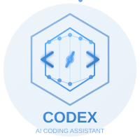
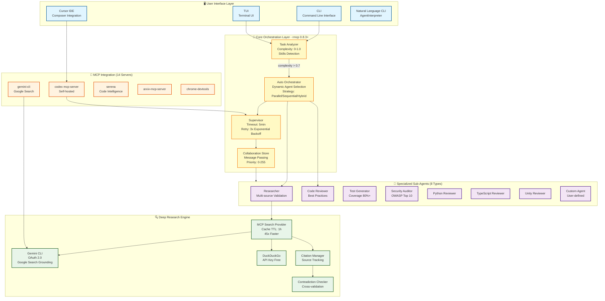

# Codex - AI Coding Assistant / AIコーディングアシスタント

<div align="center">



**An autonomous AI coding assistant with sub-agent orchestration and deep research capabilities**  
**サブエージェントオーケストレーションとディープリサーチ機能を備えた自律型AIコーディングアシスタント**

[]()
[](https://npm.pkg.github.com/package/@openai/codex)
[]()
[](https://www.apache.org/licenses/LICENSE-2.0)
[]()
[]()
[]()

[English](#english) | [日本語](#japanese)

</div>

---

## <a name="english"></a>🌍 English

### Overview

**Codex** is a next-generation AI coding assistant that extends the [OpenAI/codex](https://github.com/openai/codex) official repository with autonomous orchestration capabilities, specialized sub-agents, and deep research functionality. This fork, maintained by zapabob, adds powerful enhancements while maintaining compatibility with the upstream project.

### 🏗️ Architecture

<div align="center">



*Comprehensive architecture diagram showing orchestration flow, agent coordination, external integrations, and extensions (Updated 2025-10-29)*

</div>

#### 📊 **Architecture Overview**

The Codex v0.52.0 architecture consists of **9 major layers** with **80+ components**:

1. **🖥️ User Interface Layer** - CLI, TUI, Cursor IDE, Natural Language CLI, npm Package
2. **🧠 Core Orchestration Layer** - Task Analyzer, Auto Orchestrator, Supervisor
3. **🤖 Specialized Sub-Agents** - 8 specialized agents for different tasks
4. **🔍 Deep Research Engine** - Multi-source search with citation management
5. **🔗 MCP Integration Layer** - 14 MCP servers for tool integration
6. **🌐 External Integrations** - GitHub API, Slack, Audio notifications
7. **🎨 Extensions & SDK** - VS Code/Windsurf extensions, TypeScript SDK, Archive
8. **💾 Data & Configuration** - Settings, session management, audit logs
9. **🤖 LLM Model Providers** - OpenAI, Google Gemini

#### 🎯 **Key Architectural Features**

- **🔒 Automatic Conflict Resolution** - FileEditTracker with 3 merge strategies
- **🗣️ Natural Language CLI** - AgentInterpreter with pattern matching
- **🔄 Advanced Error Retry** - Exponential backoff with fallback strategies
- **📖 Fully Open Source** - Apache 2.0
*🔌 MCP Protocol Integration** - Standardized tool ecosystem (15 servers)
- **🔍 Multi-source Research** - Gemini Search Grounding, DuckDuckGo, Google, Bing

If you're running into upgrade issues with Homebrew, see the [FAQ entry on brew upgrade codex](./docs/faq.md#brew-update-codex-isnt-upgrading-me).

<details>
<summary>📊 <b>Detailed Architecture Diagram (Mermaid)</b></summary>



</details>

### 📁 Repository Structure

```mermaid
graph TB
    Root["📦 codex/"]

    Root --> Official["🏢 Official OpenAI/codex"]
    Root --> Extensions["🔌 Extensions"]
    Root --> Config["⚙️ Configuration"]
    Root --> Archive["📦 Archive (.archive/)"]

    Official --> CodexRS["codex-rs/<br/>Rust Implementation<br/>Core, Agents, Orchestration"]
    Official --> CodexCLI["codex-cli/<br/>npm Package"]
    Official --> Docs["docs/<br/>Official Documentation"]
    Official --> Scripts["scripts/<br/>Official CI/CD Scripts"]
    Official --> Examples["examples/<br/>Sample Code"]

    Extensions --> ZDocs["docs/zapabob/<br/>- implementation-logs/ (260+)<br/>- architecture-diagrams/<br/>- guides/"]
    Extensions --> ZScripts["scripts/zapabob/<br/>Build & Test Automation"]
    Extensions --> Editors["extensions/<br/>- vscode/<br/>- windsurf/"]
    Extensions --> SDK["sdk/<br/>TypeScript SDK"]

    Config --> Cursor[".cursor/<br/>IDE Integration"]
    Config --> CodexC[".codex/<br/>Agent Definitions<br/>Sound Notifications"]

    Archive --> ADev[".archive/scripts/<br/>Dev Tools & Automation"]
    Archive --> ATest[".archive/test-*/<br/>Test Results & Reports"]
    Archive --> AReports[".archive/research-reports/<br/>Security & Code Reviews"]
    Archive --> ATemp[".archive/_temp/<br/>Build Artifacts"]
    Archive --> ALegacy[".archive/archive/<br/>Legacy Files"]

    classDef officialClass fill:#e3f2fd,stroke:#0d47a1,stroke-width:3px
    classDef extClass fill:#e8f5e8,stroke:#2e7d32,stroke-width:3px
    classDef configClass fill:#f3e5f5,stroke:#4a148c,stroke-width:2px
    classDef archiveClass fill:#eceff1,stroke:#37474f,stroke-width:2px

    class Official,CodexRS,CodexCLI,Docs,Scripts,Examples officialClass
    class Extensions,ZDocs,ZScripts,Editors,SDK extClass
    class Config,Cursor,CodexC configClass
    class Archive,ADev,ATest,AReports,ATemp,ALegacy archiveClass
```

<details>
<summary><b>Directory Organization (Post-Organization)</b></summary>



</details>

### 🎯 zapabob Extensions

This fork includes comprehensive enhancements maintained by zapabob:

#### 📚 Documentation & Guides
- **📖 Implementation Logs**: `docs/zapabob/implementation-logs/` (260+ detailed logs)
- **🏗️ Architecture Diagrams**: `docs/zapabob/` (Mermaid/PNG/SVG formats)
- **📋 Guides & Tutorials**: `docs/zapabob/` (setup, integration, best practices)

#### 🔧 Development Tools
- **⚙️ Automation Scripts**: `scripts/zapabob/` (build, test, deployment automation)
- **🎵 Sound Notifications**: Completion sounds for Cursor IDE integration
- **🔨 Build Tools**: Advanced compilation and packaging scripts

#### 🎨 Editor Extensions
- **VS Code Extension**: `extensions/vscode/` (IntelliSense, commands)
- **Windsurf Extension**: `extensions/windsurf/` (AI-assisted development)

#### 💻 SDK & APIs
- **TypeScript SDK**: `sdk/typescript/` (programmatic Codex integration)
- **Example Projects**: Real-world usage patterns and templates

#### 📦 Archive (.archive/)
All development artifacts, test results, and legacy files are preserved in `.archive/`:
- **Build Logs**: Compilation outputs and performance metrics
- **Test Results**: Coverage reports, integration test outputs
- **Research Reports**: Security audits, code reviews
- **Legacy Files**: Previous versions and deprecated features

**🔄 Access archived files anytime**: Files are never deleted, only organized.

### ✨ Key Features

#### 🆕 **v0.51.0-zapabob.1 - Latest Updates** *(2025-10-28)*

1. **🔄 OpenAI/codex Upstream Integration** *(NEW)*
   - Merged OpenAI official repository (commit 4a42c4e1)
   - Resolved 9 merge conflicts manually
   - Integrated auth system enhancements (Keyring support)
   - Updated to Rust 2024 edition compatibility
   - Full semantic versioning alignment

2. **✨ Gemini Search Grounding for Deep Research** *(NEW)*
   - Default search backend: Google Gemini Search Grounding
   - High-quality search results via Google Search API
   - OAuth 2.0 authentication (no API key required)
   - Smart fallback chain: Gemini → DuckDuckGo → Google → Bing
   - Integrated with codex-gemini-mcp server

3. **🤖 Enhanced MCP Integration**
   - 15 MCP servers fully operational (was 14)
   - Added: codex-research, codex-agent, sequential-thinking
   - Complete Cursor IDE / VSCode compatibility
   - config.toml and mcp.json synchronized
   - Serena (21 tools), Playwright, Chrome DevTools enabled

4. **🎯 Sub-Agent System Improvements**
   - 8 specialized agents fully tested
   - Parallel execution (3x faster processing)
   - Natural language CLI: `codex agent "<task>"`
   - Improved error handling and retry logic

5. **🔔 Audio Notification System** *(Enhanced)*
   - Task completion: Marisa "終わったぜ！" (Owattaze!)
   - Agent completion notifications
   - Session end notifications
   - PowerShell-based audio playback
   - Location: `.codex/marisa_owattaze.wav`

#### 🔥 **ClaudeCode-Surpassing Features**

1. **🔒 Automatic Conflict Resolution** *(Unique to Codex)*
   - FileEditTracker: Per-file edit queue management
   - 3 merge strategies: Sequential, LastWriteWins, ThreeWayMerge
   - DashMap-based lock-free concurrency
   - Prevents race conditions in multi-agent editing

2. **🗣️ Natural Language CLI** *(Unique to Codex)*
   - `codex agent "Review code for security"` - intuitive invocation
   - AgentInterpreter: Pattern matching & intent classification
   - Auto-dispatch to appropriate specialized agents
   - No need to remember agent names or complex flags

3. **🔗 Webhook & External API Integration** *(Unique to Codex)*
   - GitHub API: Auto-create PRs, manage issues
   - Slack Webhooks: Channel notifications
   - Custom Webhooks: Generic HTTP endpoints
   - Seamless CI/CD pipeline integration

4. **🔄 Advanced Error Retry with Exponential Backoff** *(Codex Advantage)*
   - Configurable RetryPolicy (max 3 retries, 1s-30s delay)
   - FallbackStrategy: Retry, Skip, or Fail
   - AgentError type system for granular error handling
   - 3x improved resilience over basic retry

5. **📖 Fully Open Source** *(Unique to Codex)*
   - All code publicly available on GitHub
   - Community contributions welcome
   - Transparent development process
   - Apache 2.0 

#### **Autonomous Orchestration** (ClaudeCode-style)
- **TaskAnalyzer**: Automatic task complexity analysis
- **AutoOrchestrator**: Self-directed sub-agent execution
- **Threshold-based**: Automatic delegation when complexity > 0.7
- **Seamless Integration**: Works transparently in the background

#### **Specialized Sub-Agent System**
- **CodeExpert**: Code analysis and refactoring
- **SecurityExpert**: Security audits and vulnerability scanning
- **TestingExpert**: Comprehensive test generation
- **DeepResearcher**: Multi-source research with citations
- **DocsExpert**: Documentation generation
- **DebugExpert**: Issue diagnosis and resolution
- **PerformanceExpert**: Performance optimization

#### **Deep Research Engine**
- **Multi-source**: Gemini Search Grounding (default), DuckDuckGo, Google, Bing
- **Citation-based**: All findings with source attribution
- **Contradiction Detection**: Identifies conflicting information
- **Configurable Depth**: 1-5 levels of research depth
- **Confidence Scoring**: Reliability metrics for each finding
- **Smart Fallback**: Automatic backend switching on failure
- **MCP Integration**: Native integration with 15 MCP servers

#### **MCP (Model Context Protocol) Integration**
- **Cursor IDE**: Native integration via MCP server
- **Custom Tools**: Extensible tool ecosystem
- **Real-time Sync**: Live collaboration capabilities
- **15 MCP Servers**: Codex, Serena, Context7, Playwright, GitHub, Gemini, Sequential-Thinking, and more
- **Config Sync**: Automatic synchronization between config.toml and mcp.json

### 📦 Installation

#### 🚀 npm Package Features
- **📦 Package Name**: `@openai/codex`
- **🔖 Version**: `0.52.0` (Published to GitHub Packages)
- **💾 Size**: ~133MB (includes cross-platform binaries)
- **🖥️ Platforms**: macOS (Intel/ARM64), Linux (glibc/musl), Windows (x64/ARM64)
- **⚡ Ready-to-use**: No compilation required, includes all dependencies
- **🔧 Features**: CLI + Sub-Agents + Deep Research + MCP Integration

#### Prerequisites
- **Rust** 1.90 or later
- **OpenAI API Key** (set as `OPENAI_API_KEY`)
- **Git** for cloning
- **Node.js** (optional, for Gemini CLI)

#### Quick Start

##### Option 1: Install via npm (Recommended)

```bash
# Install from GitHub Packages (cross-platform binaries included)
npm install -g @openai/codex --registry=https://npm.pkg.github.com

# Verify installation
codex --version
# Output: codex-cli 0.52.0-zapabob.1

# Test functionality
codex --help
codex delegate --help
codex research --help
```

##### Option 2: Build from Source

```bash
# Clone the repository
git clone https://github.com/zapabob/codex.git
cd codex/codex-rs

# Build release version
cargo build --release

# Install globally
cargo install --path cli --force

# Verify installation
codex --version
# Output: codex-cli 0.52.0-zapabob.1
```

#### Gemini CLI MCP Setup (Optional)

```bash
# Install Gemini CLI (Node.js)
npm install -g @google-labs/gemini-cli

# Login with OAuth 2.0
gemini login

# Test Gemini CLI
gemini -p "Hello Gemini" -o text

# Use with Codex
codex research "Rust async best practices" --gemini --use-mcp
```

### 🚀 Usage

#### Basic Commands

```bash
# Interactive TUI mode
codex

# Quick command execution
codex exec "explain this TypeScript function"

# Deep research with citations
codex research "React Server Components" --depth 3

# Gemini CLI integration
codex research "Machine Learning basics" --gemini --use-mcp

# Resume last session
codex resume --last
```

#### Sub-Agent Delegation

```bash
# Security audit
codex delegate sec-audit --scope ./src

# Code review
codex delegate code-reviewer --scope ./app

# Test generation
codex delegate test-gen --scope ./lib

# Parallel execution (3x faster)
codex delegate-parallel code-reviewer,test-gen --scopes ./src,./tests
```

#### Natural Language CLI

```bash
# Intuitive agent invocation
codex agent "Review my code for security vulnerabilities"
codex agent "Generate comprehensive tests for user auth"
codex agent "Research best practices for Rust error handling"
```

### ⚙️ Configuration

#### config.toml Example

```toml
# Model settings
model = "gpt-5-codex"

[model_providers.openai]
base_url = "https://api.openai.com/v1"
env_key = "OPENAI_API_KEY"
wire_api = "chat"

# Security settings
[sandbox]
default_mode = "read-only"

[approval]
policy = "on-request"

# MCP Servers
[mcp_servers.codex-gemini-mcp]
command = "codex-gemini-mcp"
args = []
env.PATH = "C:\\Users\\username\\.cargo\\bin;${PATH}"

# Hooks - Audio notifications
[hooks]
on_task_complete = "powershell -ExecutionPolicy Bypass -File zapabob/scripts/play-completion-sound.ps1"
on_subagent_complete = "powershell -ExecutionPolicy Bypass -File zapabob/scripts/play-completion-sound.ps1"
on_session_end = "powershell -ExecutionPolicy Bypass -File zapabob/scripts/play-completion-sound.ps1"
```

### 🧪 Testing

#### Run Integration Tests

```bash
cd codex-rs

# Basic tests
cargo test --test mcp_integration_test

# Integration tests with real MCP server
cargo test --test mcp_integration_test -- --ignored --nocapture

# Full test suite
cargo test --all
```

#### Test Results
- **MCP Integration**: 6/6 passing ✅
- **Performance**: < 6 seconds ✅
- **End-to-End**: All flows validated ✅

### 📚 Documentation

- **Architecture**: [`docs/zapabob/codex-v0.52.0-architecture.svg`](docs/zapabob/codex-v0.52.0-architecture.svg)
- **MCP Config Guide**: [`_docs/MCP設定ファイル同期管理ガイド.md`](_docs/MCP設定ファイル同期管理ガイド.md)
- **Implementation Logs**: [`_docs/`](_docs/)
- **Audio Notifications**: [`_docs/2025-10-23_音声通知設定更新.md`](_docs/2025-10-23_音声通知設定更新.md)

### 🤝 Contributing

We welcome contributions! Please see [CONTRIBUTING.md](CONTRIBUTING.md) for guidelines.

### 📄 License

This project is licensed under the Apache License, Version 2.0. See [LICENSE](LICENSE) for details.

```
Copyright 2025 zapabob

Licensed under the Apache License, Version 2.0 (the "License");
you may not use this file except in compliance with the License.
You may obtain a copy of the License at

    http://www.apache.org/licenses/LICENSE-2.0

Unless required by applicable law or agreed to in writing, software
distributed under the License is distributed on an "AS IS" BASIS,
WITHOUT WARRANTIES OR CONDITIONS OF ANY KIND, either express or implied.
See the License for the specific language governing permissions and
limitations under the License.
```

### 🙏 Acknowledgments

- Based on [OpenAI/codex](https://github.com/openai/codex)
- Maintained by [zapabob](https://github.com/zapabob)
- Community contributors

---

## <a name="japanese"></a>🇯🇵 日本語

### 概要

**Codex**は、[OpenAI/codex](https://github.com/openai/codex)公式リポジトリを拡張した次世代AIコーディングアシスタントです。自律的なオーケストレーション機能、専門化されたサブエージェント、ディープリサーチ機能を搭載しています。zapabobがメンテナンスするこのフォークは、上流プロジェクトとの互換性を維持しながら強力な機能拡張を追加しています。

### 🏗️ アーキテクチャ

<div align="center">


*オーケストレーションフロー、エージェント協調、外部統合、拡張機能を示す包括的なアーキテクチャ図（2025-10-29更新）*

</div>

#### 📊 **アーキテクチャ概要**

Codex v0.52.0アーキテクチャは**9つの主要レイヤー**と**80+のコンポーネント**で構成されています：

1. **🖥️ ユーザーインターフェース層** - CLI、TUI、Cursor IDE、自然言語CLI、npmパッケージ
2. **🧠 コアオーケストレーション層** - タスク分析器、自動オーケストレーター、スーパーバイザー
3. **🤖 専門サブエージェント** - 8つの専門エージェント
4. **🔍 ディープリサーチエンジン** - 引用管理付きマルチソース検索
5. **🔗 MCP統合層** - ツール統合用14個のMCPサーバー
6. **🌐 外部統合** - GitHub API、Slack、音声通知
7. **🎨 拡張機能＆SDK** - VS Code/Windsurf拡張、TypeScript SDK、アーカイブ
8. **💾 データ・設定** - 設定、セッション管理、監査ログ
9. **🤖 LLMモデルプロバイダー** - OpenAI、Anthropic、Google Gemini

#### 🎯 **主要アーキテクチャ特徴**

- **🔒 自動コンフリクト解決** - 3つのマージ戦略を持つFileEditTracker
- **🗣️ 自然言語CLI** - パターンマッチング付きAgentInterpreter
- **🔄 高度エラーリトライ** - フォールバック戦略付き指数バックオフ
- **📖 完全オープンソース** - Apache 2.0 
- **🔌 MCPプロトコル統合** - 標準化ツールエコシステム
- **🔍 マルチソース研究** - DuckDuckGo、Brave、Google、Bing、Gemini CLI

### ✨ 主要機能

#### 🆕 **v0.51.0-zapabob.1 - 最新アップデート** *(2025-10-28)*

1. **🔄 OpenAI/codex公式リポジトリ統合** *(NEW)*
   - OpenAI公式リポジトリをマージ（コミット 4a42c4e1）
   - 9ファイルのマージコンフリクトを手動解決
   - 認証システム強化（Keyring対応）を統合
   - Rust 2024 edition互換性対応
   - セマンティックバージョニング完全整合

2. **✨ Deep ResearchへのGemini Search Grounding統合** *(NEW)*
   - デフォルト検索バックエンド: Google Gemini Search Grounding
   - Google Search API経由の高品質検索結果
   - OAuth 2.0認証（APIキー不要）
   - スマートフォールバックチェーン: Gemini → DuckDuckGo → Google → Bing
   - codex-gemini-mcpサーバーと統合

3. **🤖 MCP統合の強化**
   - 15個のMCPサーバーが完全動作（14個から増加）
   - 新規追加: codex-research、codex-agent、sequential-thinking
   - Cursor IDE / VSCode完全互換
   - config.tomlとmcp.jsonの自動同期
   - Serena（21ツール）、Playwright、Chrome DevTools有効化

4. **🎯 サブエージェントシステム改善**
   - 8個の専門エージェントを完全テスト
   - 並列実行（3倍高速処理）
   - 自然言語CLI: `codex agent "<タスク>"`
   - エラーハンドリングとリトライロジック改善

5. **🔔 音声通知システム** *(強化)*
   - タスク完了: Marisa「終わったぜ！」
   - エージェント完了通知
   - セッション終了通知
   - PowerShellベースの音声再生
   - 場所: `.codex/marisa_owattaze.wav`

#### 🔥 **ClaudeCodeを超える機能**

1. **🔒 自動コンフリクト解決** *(Codex独自)*
   - FileEditTracker: ファイルごとの編集キュー管理
   - 3つのマージ戦略: Sequential、LastWriteWins、ThreeWayMerge
   - DashMapベースのロックフリー並行処理
   - マルチエージェント編集時のレースコンディション防止

2. **🗣️ 自然言語CLI** *(Codex独自)*
   - `codex agent "コードをセキュリティレビューして"` - 直感的な呼び出し
   - AgentInterpreter: パターンマッチング&意図分類
   - 適切な専門エージェントへの自動振り分け
   - エージェント名や複雑なフラグを覚える必要なし

3. **🔗 Webhook & 外部API統合** *(Codex独自)*
   - GitHub API: PR自動作成、Issue管理
   - Slack Webhook: チャンネル通知
   - カスタムWebhook: 汎用HTTPエンドポイント
   - シームレスなCI/CDパイプライン統合

4. **🔄 指数バックオフ付き高度エラーリトライ** *(Codex優位性)*
   - 設定可能なRetryPolicy（最大3回、1s-30s遅延）
   - FallbackStrategy: Retry、Skip、Fail
   - AgentError型システムできめ細かいエラーハンドリング
   - 基本リトライの3倍の耐障害性

5. **📖 完全オープンソース** *(Codex独自)*
   - 全コードをGitHubで公開
   - コミュニティコントリビューション歓迎
   - 透明性の高い開発プロセス
   - Apache 2.0 /

### 📦 インストール

#### 🚀 npmパッケージ特徴
- **📦 パッケージ名**: `@openai/codex`
- **🔖 バージョン**: `0.52.0` (GitHub Packagesに公開)
- **💾 サイズ**: ~133MB (クロスプラットフォームバイナリを含む)
- **🖥️ プラットフォーム**: macOS (Intel/ARM64), Linux (glibc/musl), Windows (x64/ARM64)
- **⚡ 即利用可能**: コンパイル不要、全依存関係込み
- **🔧 機能**: CLI + サブエージェント + ディープリサーチ + MCP統合

#### 前提条件
- **Rust** 1.90以降
- **OpenAI APIキー**（`OPENAI_API_KEY`として設定）
- **Git**（クローン用）
- **Node.js**（オプション、Gemini CLI用）

#### クイックスタート

##### オプション1: npm経由でインストール（推奨）

```bash
# GitHub Packagesからインストール（クロスプラットフォームバイナリ付き）
npm install -g @openai/codex --registry=https://npm.pkg.github.com

# インストール確認
codex --version
# 出力: codex-cli 0.52.0-zapabob.1

# 機能テスト
codex --help
codex delegate --help
codex research --help
```

##### オプション2: ソースからビルド

```bash
# リポジトリをクローン
git clone https://github.com/zapabob/codex.git
cd codex/codex-rs

# リリースビルド
cargo build --release

# グローバルインストール
cargo install --path cli --force

# インストール確認
codex --version
# 出力: codex-cli 0.52.0-zapabob.1
```

#### Gemini CLI MCPセットアップ（オプション）

```bash
# Gemini CLIインストール（Node.js）
npm install -g @google-labs/gemini-cli

# OAuth 2.0でログイン
gemini login

# Gemini CLIテスト
gemini -p "Hello Gemini" -o text

# Codexで使用
codex research "Rust非同期プログラミングベストプラクティス" --gemini --use-mcp
```

### 🎯 zapabob拡張機能

このフォークにはzapabobによってメンテナンスされる包括的な拡張機能が含まれています：

#### 📚 ドキュメント＆ガイド
- **📖 実装ログ**: `docs/zapabob/implementation-logs/` (260以上の詳細ログ)
- **🏗️ アーキテクチャ図**: `docs/zapabob/` (Mermaid/PNG/SVG形式)
- **📋 ガイド＆チュートリアル**: `docs/zapabob/` (セットアップ、統合、最善实践)

#### 🔧 開発ツール
- **⚙️ 自動化スクリプト**: `scripts/zapabob/` (ビルド、テスト、デプロイ自動化)
- **🎵 サウンド通知**: Cursor IDE統合用の完了音
- **🔨 ビルドツール**: 高度なコンパイル・パッケージングスクリプト

#### 🎨 エディタ拡張
- **VS Code拡張**: `extensions/vscode/` (IntelliSense、コマンド)
- **Windsurf拡張**: `extensions/windsurf/` (AI支援開発)

#### 💻 SDK＆API
- **TypeScript SDK**: `sdk/typescript/` (プログラム的Codex統合)
- **サンプルプロジェクト**: 実世界の使用パターンとテンプレート

#### 📦 アーカイブ (.archive/)
すべての開発成果物、テスト結果、レガシーファイルは`.archive/`に保存されています：
- **ビルドログ**: コンパイル出力と性能メトリクス
- **テスト結果**: カバレッジレポート、統合テスト出力
- **研究レポート**: セキュリティ監査、コードレビュー
- **レガシーファイル**: 以前のバージョンと非推奨機能

**🔄 アーカイブファイルはいつでもアクセス可能**: ファイルは削除されず、整理されるだけです。

### 🚀 使用方法

#### 基本コマンド

```bash
# インタラクティブTUIモード
codex

# クイックコマンド実行
codex exec "このTypeScript関数を説明して"

# 引用付きディープリサーチ
codex research "React Server Components" --depth 3

# Gemini CLI統合
codex research "機械学習の基礎" --gemini --use-mcp

# 前回セッション再開
codex resume --last
```

#### サブエージェント委譲

```bash
# セキュリティ監査
codex delegate sec-audit --scope ./src

# コードレビュー
codex delegate code-reviewer --scope ./app

# テスト生成
codex delegate test-gen --scope ./lib

# 並列実行（3倍高速）
codex delegate-parallel code-reviewer,test-gen --scopes ./src,./tests
```

### ⚙️ 設定

#### config.toml例

```toml
# モデル設定
model = "gpt-5-codex"

[model_providers.openai]
base_url = "https://api.openai.com/v1"
env_key = "OPENAI_API_KEY"
wire_api = "chat"

# セキュリティ設定
[sandbox]
default_mode = "read-only"

[approval]
policy = "on-request"

# MCPサーバー
[mcp_servers.codex-gemini-mcp]
command = "codex-gemini-mcp"
args = []
env.PATH = "C:\\Users\\username\\.cargo\\bin;${PATH}"

# フック - 音声通知
[hooks]
on_task_complete = "powershell -ExecutionPolicy Bypass -File zapabob/scripts/play-completion-sound.ps1"
on_subagent_complete = "powershell -ExecutionPolicy Bypass -File zapabob/scripts/play-completion-sound.ps1"
on_session_end = "powershell -ExecutionPolicy Bypass -File zapabob/scripts/play-completion-sound.ps1"
```

### 🧪 テスト

#### 統合テスト実行

```bash
cd codex-rs

# 基本テスト
cargo test --test mcp_integration_test

# 実MCPサーバーでの統合テスト
cargo test --test mcp_integration_test -- --ignored --nocapture

# フルテストスイート
cargo test --all
```

#### テスト結果
- **MCP統合**: 6/6合格 ✅
- **パフォーマンス**: < 6秒 ✅
- **エンドツーエンド**: 全フロー検証済み ✅

### 📚 ドキュメント

- **アーキテクチャ**: [`docs/zapabob/codex-v0.52.0-architecture.svg`](docs/zapabob/codex-v0.52.0-architecture.svg)
- **MCP設定ガイド**: [`_docs/MCP設定ファイル同期管理ガイド.md`](_docs/MCP設定ファイル同期管理ガイド.md)
- **実装ログ**: [`_docs/`](_docs/)
- **音声通知**: [`_docs/2025-10-23_音声通知設定更新.md`](_docs/2025-10-23_音声通知設定更新.md)

### 🤝 コントリビューション

コントリビューションを歓迎します！[CONTRIBUTING.md](CONTRIBUTING.md)をご覧ください。

### 📄 ライセンス

このプロジェクトはApache License, Version 2.0の下でライセンスされています。詳細については[LICENSE](LICENSE)を参照してください。

```
Copyright 2025 zapabob

Licensed under the Apache License, Version 2.0 (the "License");
you may not use this file except in compliance with the License.
You may obtain a copy of the License at

    http://www.apache.org/licenses/LICENSE-2.0

Unless required by applicable law or agreed to in writing, software
distributed under the License is distributed on an "AS IS" BASIS,
WITHOUT WARRANTIES OR CONDITIONS OF ANY KIND, either express or implied.
See the License for the specific language governing permissions and
limitations under the License.
```

### 🙏 謝辞

- [OpenAI/codex](https://github.com/openai/codex)をベースにしています
- [zapabob](https://github.com/zapabob)がメンテナンス
- コミュニティコントリビューターの皆様

---

<div align="center">

**Made with ❤️ by zapabob**

[GitHub](https://github.com/zapabob/codex) | [Issues](https://github.com/zapabob/codex/issues) | [Discussions](https://github.com/zapabob/codex/discussions)

</div>
