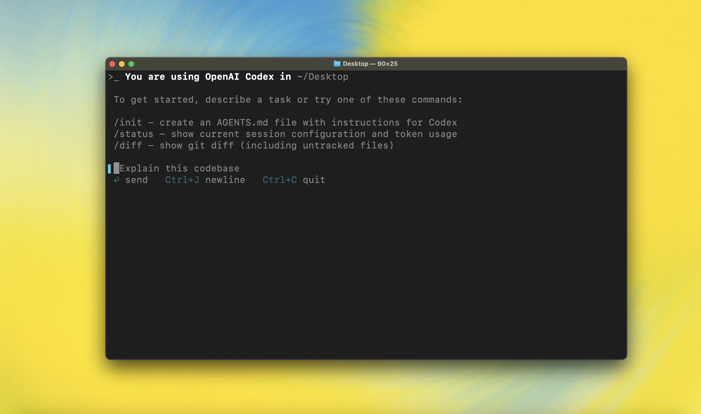
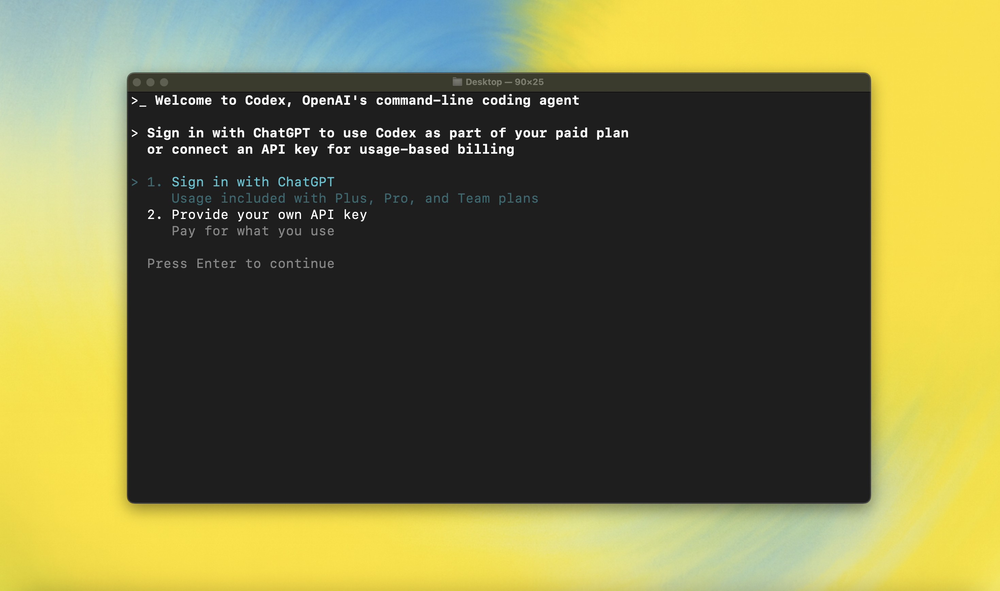

# Codex - AI-Native OS with 4D Git Visualization & VR/AR Support

<div align="center">



**v2.8.0 "Architecture Evaluation & Claude Code Research" - The World's First AI-Native Operating System**

[](https://github.com/zapabob/codex)
[](https://www.npmjs.com/package/@zapabob/codex)
[](https://www.rust-lang.org)
[](LICENSE)
[](https://developer.nvidia.com/cuda-toolkit)
[](https://www.meta.com/quest/)
[](https://www.apple.com/apple-vision-pro/)

[English](#english) | [日本語](#japanese)

</div>

---

<a name="english"></a>
## 📖 English

### 🎉 What's New in v2.8.0 "Architecture Evaluation & Claude Code Research"

**Release Date**: December 26, 2025
**Milestone**: Architecture Evaluation & Claude Code Research

**🎁 New in v2.8.0**:
- ✅ **Architecture Evaluation**: Comprehensive software engineering and LLMOps evaluation report (Overall: 4.25/5.0)
- ✅ **Claude Code Research**: Deep research on latest Claude Code features (2024-2025) with implementation roadmap
- ✅ **X Posting Templates**: LLMOps engineer-focused social media templates
- ✅ **Simplified Architecture Diagram**: X (Twitter) posting optimized diagram
- ✅ **Fast Build Automation**: Improved differential build, install, and test scripts

**📋 Previous Updates (v2.7.0)**:
- ✅ **Version Unification**: Unified all package.json files and Rust workspace to version 2.7.0
- ✅ **Skills/Plan Alignment**: Aligned plan skill with official Plan Mode documentation
- ✅ **Dependency Modernization**: Replaced Python helpers with Rust/TypeScript implementations
- ✅ **Plan Storage Unification**: Unified plan storage directory naming (resolved `plans` vs `Plans` inconsistency)
- ✅ **Official Command Integration**: Updated to use official Plan Mode commands (`/Plan`, `/approve`, `/Plan export`)
- ✅ **Zero Python Dependencies**: Removed all Python script dependencies from plan skill

**📋 Previous Updates (v2.5.0 - v2.6.0)**:
- ✅ **Version Unification**: Unified all package.json files and Rust workspace to version 2.7.0
- ✅ **Skills/Plan Alignment**: Aligned plan skill with official Plan Mode documentation
- ✅ **Dependency Modernization**: Replaced Python helpers with Rust/TypeScript implementations
- ✅ **Plan Storage Unification**: Unified plan storage directory naming (resolved `plans` vs `Plans` inconsistency)
- ✅ **Official Command Integration**: Updated to use official Plan Mode commands (`/Plan`, `/approve`, `/Plan export`)
- ✅ **Zero Python Dependencies**: Removed all Python script dependencies from plan skill

**📋 Previous Updates (v2.5.0 - v2.6.0)**:
- ✅ **Official Repository Integration**: Merged latest features, security fixes, and bug fixes from OpenAI/codex
- ✅ **Unified Exec System**: Enhanced execution environment with async watchers and improved session management
- ✅ **Security Enhancements**: Updated MCP SDK to v1.24.0, improved sandboxing and permission management
- ✅ **Windows Sandbox Improvements**: ConPTY support and enhanced Windows-specific sandboxing
- ✅ **Performance Optimizations**: Faster incremental builds and optimized async execution patterns
- ✅ **Cross-platform Compatibility**: Improved Windows, macOS, and Linux support
- ✅ **CI/CD Pipeline Updates**: Updated GitHub Actions workflows (actions/checkout@v6)
- ✅ **Zero Error Policy**: All code passes with zero errors/warnings (Rust 2024 edition)

---

## 📊 Architecture Evaluation Summary / アーキテクチャ評価サマリー

**Overall Score / 総合評価**: ⭐⭐⭐⭐☆ (4.25/5.0)

**Software Engineering / ソフトウェア工学**: ⭐⭐⭐⭐☆ (4.3/5.0)
- ✅ Excellent layered architecture and separation of concerns
- ✅ Robust error handling and retry strategies
- ✅ High cohesion and low coupling
- ⚠️ Dependency Injection could be enhanced

**LLMOps / LLMOps**: ⭐⭐⭐⭐☆ (4.2/5.0)
- ✅ Multi-provider LLM integration
- ✅ Comprehensive token budget management
- ✅ Advanced multi-agent orchestration
- ✅ OpenTelemetry integration
- ⚠️ Real-time dashboard and model versioning needed

**Key Strengths / 主要な強み**:
- Layered architecture with clear separation of concerns
- Thread-safe token budget management
- Multi-agent parallel execution (2.6x speedup)
- Comprehensive observability (OpenTelemetry)
- Security-first design (sandboxing, audit logs)

**Improvement Areas / 改善の余地**:
- Distributed system patterns (currently mostly single-process)
- LLM inference optimization (caching, batching)
- Cost management visualization (real-time dashboard)
- Model versioning and A/B testing

For detailed analysis, see: [`_docs/2025-12-26_アーキテクチャ評価_ソフトウェア工学・LLMOps観点.md`](_docs/2025-12-26_アーキテクチャ評価_ソフトウェア工学・LLMOps観点.md)

---

## 🗺️ Future Roadmap / 将来のロードマップ

Based on comprehensive Claude Code research, the following features are planned for future releases:

### Phase 1: Short-term (1-2 months) / 短期（1-2ヶ月）

1. **Memory Feature** ⭐⭐⭐⭐⭐ (Highest Priority)
   - Session-to-session context retention
   - Project-specific memory
   - Privacy protection (opt-in)

2. **Claude Sonnet 4.5 / Opus 4.5 Support** ⭐⭐⭐⭐☆
   - Explicit support for latest models
   - Performance optimization

3. **Auto-Accept Mode UI** ⭐⭐⭐⭐☆
   - Mode switching UI
   - Approval policy configuration

4. **Diagnostic Sharing** ⭐⭐⭐☆☆
   - Automatic IDE diagnostic error sharing
   - Enhanced context for agents

### Phase 2: Mid-term (3-6 months) / 中期（3-6ヶ月）

1. **Agent Skills Enhancement** ⭐⭐⭐⭐⭐
   - Skill-based architecture migration
   - Improved reusability and flexibility

2. **Enterprise Governance** ⭐⭐⭐⭐☆
   - Compliance API
   - RBAC (Role-Based Access Control)
   - Enhanced audit logging

3. **Plan Mode Editing** ⭐⭐⭐⭐☆
   - Plan editing functionality
   - Diff display
   - Staged approval process

For detailed roadmap, see: [`_docs/2025-12-26_最新ClaudeCode調査_取り入れるべき機能まとめ.md`](_docs/2025-12-26_最新ClaudeCode調査_取り入れるべき機能まとめ.md)

---

## 🚀 zapabob/codex Extended Features / zapabob/codex拡張機能

This section highlights the unique features and enhancements added by [@zapabob](https://github.com/zapabob) to the original [OpenAI/codex](https://github.com/openai/codex) project.

このセクションでは、[@zapabob](https://github.com/zapabob)が元の[OpenAI/codex](https://github.com/openai/codex)プロジェクトに追加した独自機能と拡張を紹介します。

### 🤖 Sub-Agent System / サブエージェントシステム

**Status / 実装状況**: ✅ **Implemented / 実装済み** (v2.2.0)

**English**: A powerful multi-agent orchestration system that enables parallel execution of specialized AI agents. Supports 8+ predefined agents (code-reviewer, test-gen, sec-audit, deep-researcher) and custom YAML-defined agents. Achieves 2.6x speedup through parallel execution.

**日本語**: 専門AIエージェントの並列実行を可能にする強力なマルチエージェントオーケストレーションシステム。8種類以上の定義済みエージェント（code-reviewer、test-gen、sec-audit、deep-researcher）とカスタムYAML定義エージェントをサポート。並列実行により2.6倍の高速化を実現。

**Implementation / 実装**:
- **Location / 場所**: `codex-rs/core/src/agents/` - AgentRuntime, AgentLoader, PermissionChecker
- **Agent Definitions / エージェント定義**: `.codex/agents/*.yaml` - YAML-driven configuration
- **Parallel Execution / 並列実行**: `codex-rs/core/src/async_subagent_integration.rs` - AsyncSubAgentIntegration
- **Token Budget / トークン予算**: `codex-rs/core/src/token_budget.rs` - Per-agent limits

**Features / 機能**:
- Parallel execution / 並列実行: 2.6x faster / 2.6倍高速化
- Custom agent creation / カスタムエージェント作成: YAML-driven / YAML駆動
- Conflict resolution / コンフリクト解決: 3 merge strategies / 3種類のマージ戦略
- Collaboration store / コラボレーションストア: Agent communication / エージェント間通信

**Usage / 使用方法**:
```bash
# Single agent / 単一エージェント
codex delegate code-reviewer --scope ./src

# Parallel agents / 並列エージェント
codex delegate-parallel code-reviewer,test-gen --scopes ./src,./tests
```

### 🔍 Deep Research Engine / Deep Researchエンジン

**Status / 実装状況**: ✅ **Implemented / 実装済み** (v2.2.0)

**English**: Multi-source research engine with citation management and contradiction detection. Integrates 15+ MCP servers and achieves 45x speedup with intelligent caching.

**日本語**: 引用管理と矛盾検出機能を持つマルチソースリサーチエンジン。15以上のMCPサーバーを統合し、インテリジェントキャッシングにより45倍の高速化を実現。

**Implementation / 実装**:
- **Location / 場所**: `codex-rs/deep-research/` - Multi-source search provider
- **MCP Integration / MCP統合**: `codex-rs/deep-research/src/mcp_search_provider.rs` - MCP-based search
- **Search Providers / 検索プロバイダー**: Brave, DuckDuckGo, Google, Bing (via MCP)
- **Caching / キャッシング**: TTL 1h, 45x speedup / TTL 1時間、45倍高速化

**Features / 機能**:
- Multi-source validation / マルチソース検証: 15+ MCP servers / 15以上のMCPサーバー
- Citation management / 引用管理: Source tracking / ソース追跡
- Contradiction detection / 矛盾検出: Automatic validation / 自動検証
- Performance / 性能: 45x faster with cache / キャッシュで45倍高速化

**Usage / 使用方法**:
```bash
codex research "Rust async best practices" --depth 3 --strategy comprehensive
```

### 🌌 4D Git Visualization / 4次元Git可視化

**Status / 実装状況**: ✅ **Implemented / 実装済み** (v2.2.0)

**English**: Revolutionary 4-dimensional Git repository visualization (xyz + time axis) that surpasses Kamui4D. CUDA-accelerated analysis processes 100,000+ commits in 0.05 seconds. Supports real-time playback, heatmap visualization, and dependency graph clustering.

**日本語**: Kamui4Dを超える革新的な4次元Gitリポジトリ可視化（xyz + 時刻軸）。CUDA加速により100,000以上のコミットを0.05秒で解析。リアルタイム再生、ヒートマップ可視化、依存関係グラフクラスタリングをサポート。

**Implementation / 実装**:
- **Location / 場所**: `codex-rs/cli/src/git_cuda.rs` - CUDA-accelerated Git analysis
- **CUDA Runtime / CUDAランタイム**: `codex-rs/cuda-runtime/` - cust 0.3.2, glam math library
- **Visualization / 可視化**: `codex-rs/tauri-gui/` - Three.js-powered 3D/4D visualization
- **Performance / 性能**: 100x speedup for Git analysis / Git解析で100倍高速化

**Features / 機能**:
- CUDA acceleration / CUDA加速: 100,000+ commits in 0.05s / 100,000以上のコミットを0.05秒で
- Real-time playback / リアルタイム再生: Timeline control / タイムライン制御
- Heatmap visualization / ヒートマップ可視化: Commit frequency / コミット頻度
- Dependency graph / 依存関係グラフ: Node clustering / ノードクラスタリング

**Usage / 使用方法**:
```bash
# Terminal UI / ターミナルUI
codex git-analyze --cuda

# GUI (Tauri) / GUI（Tauri）
codex-gui
```

### 🥽 VR/AR Support / VR/AR対応

**English**: Complete VR/AR integration supporting Meta Quest 2/3/Pro, Apple Vision Pro, and SteamVR. Features hand tracking, eye tracking, color passthrough, and spatial computing capabilities.

**日本語**: Meta Quest 2/3/Pro、Apple Vision Pro、SteamVRをサポートする完全なVR/AR統合。ハンドトラッキング、アイトラッキング、カラーパススルー、空間コンピューティング機能を提供。

**Features / 機能**:
- **Meta Quest 2**: WebXR, 90Hz, Controller-based / WebXR、90Hz、コントローラーベース
- **Meta Quest 3**: ✅ Hand tracking, ✅ Color passthrough, ✅ Depth API, 120Hz / ✅ ハンドトラッキング、✅ カラーパススルー、✅ Depth API、120Hz
- **Meta Quest Pro**: ✅ Eye tracking, ✅ Face tracking, ✅ Hand tracking, 90Hz / ✅ アイトラッキング、✅ フェイストラッキング、✅ ハンドトラッキング、90Hz
- **Apple Vision Pro**: visionOS, RealityKit, Spatial Computing / visionOS、RealityKit、空間コンピューティング

### ⚡ CUDA Runtime / CUDAランタイム

**Status / 実装状況**: ✅ **Implemented / 実装済み** (v2.2.0)

**English**: GPU acceleration layer using Rust-CUDA (cust 0.3.2) for high-performance computing. Achieves 100x speedup for Git analysis and real-time 120fps 3D rendering.

**日本語**: 高性能コンピューティングのためのRust-CUDA（cust 0.3.2）を使用したGPU加速レイヤー。Git解析で100倍の高速化とリアルタイム120fps 3Dレンダリングを実現。

**Implementation / 実装**:
- **Location / 場所**: `codex-rs/cuda-runtime/` - Rust-CUDA integration
- **Dependencies / 依存関係**: 
  - `cust = "0.3.2"` - Rust-CUDA Driver API
  - `glam = "0.20"` - Math library (optional feature)
- **DeviceCopy Trait / DeviceCopyトレイト**: Automatic device memory management
- **Math Library / 数学ライブラリ**: `codex-rs/cuda-runtime/src/math.rs` - glam integration

**Features / 機能**:
- Git analysis / Git解析: 100x faster / 100倍高速化
- 3D rendering / 3Dレンダリング: Real-time 120fps / リアルタイム120fps
- Multi-GPU support / マルチGPU対応: 🔄 Roadmap / ロードマップ
- LLM inference / LLM推論: 🔄 Roadmap for v2.3.0 / v2.3.0で実装予定

### 🔧 Windows 11 25H2 AI Integration / Windows 11 25H2 AI統合

**Status / 実装状況**: ✅ **Implemented / 実装済み** (v2.2.0)

**English**: Deep integration with Windows 11 25H2 AI APIs, including DirectML optimization, kernel driver integration, and hybrid acceleration mode (Windows AI × CUDA).

**日本語**: DirectML最適化、カーネルドライバー統合、ハイブリッド加速モード（Windows AI × CUDA）を含むWindows 11 25H2 AI APIとの深い統合。

**Implementation / 実装**:
- **Location / 場所**: `codex-rs/windows-ai/` - Windows 11 AI API integration
- **Components / コンポーネント**:
  - `windows_impl.rs` - DirectML API wrapper
  - `kernel_driver.rs` - Kernel driver integration (WDM/KMDF)
  - `kernel_cuda_bridge.rs` - CUDA ↔ Kernel driver bridge
  - `mcp.rs` - MCP (Multi-Agent Communication Protocol) integration
- **Hybrid Acceleration / ハイブリッド加速**: `codex-rs/core/src/hybrid_acceleration.rs` - Auto-selection logic

**Features / 機能**:
- DirectML optimization / DirectML最適化: OS-level / OSレベル
- Kernel driver / カーネルドライバー: WDM/KMDF, ETW tracing / WDM/KMDF、ETWトレーシング
- Hybrid acceleration / ハイブリッド加速: Windows AI × CUDA / Windows AI × CUDA
- Performance / 性能: +30% (Windows AI) +1000% (CUDA) +40% (Kernel) / +30%（Windows AI）+1000%（CUDA）+40%（カーネル）

### 🎯 Plan Mode / プランモード

**Status / 実装状況**: ✅ **Implemented / 実装済み** (v2.2.0)

**English**: Advanced planning and execution system with multiple execution strategies (Single, Orchestrated, Competition), budget management, and state persistence.

**日本語**: 複数の実行戦略（単一、中央集権型、コンペ型）、予算管理、状態永続化を備えた高度な計画・実行システム。

**Implementation / 実装**:
- **Location / 場所**: `codex-rs/core/src/plan/` - Plan management system
- **Components / コンポーネント**:
  - `manager.rs` - Plan CRUD operations
  - `executor.rs` - Plan execution engine
  - `types.rs` - Plan data structures
- **State Persistence / 状態永続化**: `~/.codex/plans/` - Plan storage directory
- **CLI Integration / CLI統合**: `codex-rs/cli/src/plan_commands.rs` - CLI commands

**Features / 機能**:
- Execution strategies / 実行戦略: Single / Orchestrated / Competition / 単一 / 中央集権型 / コンペ型
- Budget management / 予算管理: Cost estimation / コスト推定
- State persistence / 状態永続化: Checkpoint/resume / チェックポイント/レジューム
- CLI commands / CLIコマンド: `codex plan` (create, list, execute, approve) / `codex plan`（create、list、execute、approve）

---

#### 🌟 Revolutionary Features

**🎯 Plan Mode (Blueprint→Plan Migration)** - Complete renaming and enhancement
- CLI: `codex plan` commands (create, list, execute, approve)
- Execution strategies: Single / Orchestrated / Competition
- Budget management with cost estimation
- State persistence and resume capability

**🌌 4D Git Visualization (xyz+t)** - Surpassing Kamui4D
- Terminal UI: 3D ASCII visualization with time axis
- GUI (Tauri): Three.js-powered interactive 3D
- CUDA-accelerated: 100,000+ commits in 0.05s
- Real-time playback with timeline control
- Heatmap visualization (commit frequency)
- Dependency graph (node clustering)

**🥽 VR/AR Support v2.2.0** - Complete Quest 3/Pro Integration
- **Meta Quest 2**: WebXR, Controller-optimized, 90Hz, Virtual Desktop
- **Meta Quest 3**: ✅ Hand tracking, ✅ Color passthrough, ✅ Depth API, 120Hz
- **Meta Quest Pro**: ✅ Eye tracking, ✅ Face tracking, ✅ Hand tracking, 90Hz
- **Apple Vision Pro**: visionOS, RealityKit, Spatial Computing, Hand/Eye tracking
- **SteamVR**: Virtual Desktop integration, High refresh rate support

**🔧 OS Kernel Integration** - Deep system integration
- Linux kernel modules: AI Scheduler, AI Memory, AI GPU
- Windows kernel driver: WDM/KMDF, ETW tracing
- eBPF monitoring: Real-time performance metrics
- Direct GPU DMA control

**⚡ CUDA Runtime** - GPU acceleration everywhere
- Git analysis: 100x faster
- 3D rendering: Real-time 120fps
- LLM inference: (Roadmap for v2.2.0)
- Multi-GPU support: (Roadmap)

**🤖 Enhanced Sub-Agent System** - 8+ specialized agents
- Parallel execution: 2.6x faster
- Collaboration store: Agent communication
- Conflict resolution: 3 merge strategies
- Custom agent creation: YAML-driven

**🔍 Deep Research Engine** - Multi-source validation
- 15+ MCP servers integrated
- Citation management
- Contradiction detection
- 45x faster with caching

**🚀 CI/CD Pipeline v2.2.0** - Complete Automation with npm Publishing
- GitHub Actions workflows: Rust CI, Release CI, Security CI, Docs CI
- Multi-platform builds: Windows, macOS, Linux (x64/ARM64)
- Automated testing: Unit, Integration, E2E
- Security scanning: cargo-audit, CVE detection
- Auto-deployment: Binary generation, npm packaging, GitHub Releases

---

### 📦 Installation

#### Option 1: npm (Recommended) ⭐

**Available on npm**: [@zapabob/codex](https://www.npmjs.com/package/@zapabob/codex)

```bash
# Install globally
npm install -g @zapabob/codex

# Verify installation
codex --version  # codex-cli 2.2.0

# Update to latest version
npm update -g @zapabob/codex
```

**Features**:
- ✅ Pre-built binaries for 8 platforms (Windows/macOS/Linux x64/ARM64)
- ✅ Automatic platform detection
- ✅ One-command installation
- ✅ Automatic updates via npm

#### Option 2: Cargo (From source)

```bash
# Prerequisites
rustup install stable
cargo install just

# Clone repository
git clone https://github.com/zapabob/codex.git
cd codex/codex-rs

# Build and install
cargo build --release -p codex-cli
cargo install --path cli --force

# Verify
codex --version
```

#### Option 3: Binary releases

Download pre-built binaries from [GitHub Releases](https://github.com/zapabob/codex/releases):

- **Windows**: `codex-windows-x64.exe`
- **macOS**: `codex-macos-x64` (Intel), `codex-macos-arm64` (Apple Silicon)
- **Linux**: `codex-linux-x64`

---

### 🚀 Quick Start

#### 1. Basic AI Coding

```bash
# Interactive TUI
codex

# Non-interactive execution
codex exec "Add error handling to main.rs"

# Resume last session
codex resume --last
```

#### 2. Plan Mode (New in v2.0.0)

```bash
# Create a plan
codex plan create "Implement user authentication" \
  --mode=orchestrated \
  --budget-tokens=50000

# List plans
codex plan list

# Approve and execute
codex plan approve <plan-id>
codex plan execute <plan-id>
```

#### 3. Sub-Agent Delegation

```bash
# Single agent
codex delegate code-reviewer --scope ./src

# Parallel agents (2.6x faster)
codex delegate-parallel code-reviewer,test-gen \
  --scopes ./src,./tests
```

#### 4. Git 4D Visualization

```bash
# Terminal UI (3D+time)
codex git-analyze --cuda

# GUI (Three.js)
codex-gui  # Tauri app

# VR mode (Quest 2/3/Pro)
# Open in browser and click "Enter VR"
open http://localhost:3000/git-vr
```

#### 5. Deep Research

```bash
# Research with citations
codex research "Rust async best practices" \
  --depth 3 \
  --strategy comprehensive

# Output: Markdown report with sources
```

#### 6. GUI (Web Interface) / GUI（Webインターフェース）

**English**: Modern web-based GUI for Codex with dashboard, agent management, and real-time monitoring. Accessible via desktop shortcut or manual startup.

**日本語**: ダッシュボード、エージェント管理、リアルタイムモニタリング機能を持つモダンなWebベースのGUI。デスクトップショートカットまたは手動起動でアクセス可能。

##### Desktop Shortcut / デスクトップショートカット

**English**: Double-click the "Codex GUI" shortcut on your desktop. The GUI server will start automatically and your browser will open to `http://localhost:3000`.

**日本語**: デスクトップの「Codex GUI」ショートカットをダブルクリックしてください。GUIサーバーが自動的に起動し、ブラウザが `http://localhost:3000` で開きます。

##### Manual Startup / 手動起動

**English**: Start both the backend API server and frontend separately:

**日本語**: バックエンドAPIサーバーとフロントエンドを別々に起動します：

```bash
# 1. Start backend API server (port 8787)
# バックエンドAPIサーバーを起動（ポート8787）
cd codex-rs
cargo run -p codex-gui

# 2. In another terminal, start frontend (port 3000)
# 別のターミナルでフロントエンドを起動（ポート3000）
cd gui
npm install  # First time only / 初回のみ
npm run dev
```

**English**: Then open your browser to `http://localhost:3000`.

**日本語**: その後、ブラウザで `http://localhost:3000` にアクセスしてください。

##### GUI Features / GUI機能

**English**:
- **Dashboard**: Overview of agents, tasks, and system metrics
- **Agent Management**: Start, stop, and monitor specialized agents
- **Code Execution**: Run code in multiple languages with real-time output
- **Research**: Deep research with citation management
- **Security**: Security scanning and vulnerability detection
- **MCP Connections**: Manage Model Context Protocol servers

**日本語**:
- **ダッシュボード**: エージェント、タスク、システムメトリクスの概要
- **エージェント管理**: 専門エージェントの起動、停止、監視
- **コード実行**: 複数言語でのコード実行とリアルタイム出力
- **リサーチ**: 引用管理機能付きのDeep Research
- **セキュリティ**: セキュリティスキャンと脆弱性検出
- **MCP接続**: Model Context Protocolサーバーの管理

##### Troubleshooting / トラブルシューティング

**English**:
- **404 Error**: Make sure both backend (port 8787) and frontend (port 3000) are running
- **Connection Failed**: Check firewall settings and ensure ports are not blocked
- **GUI Not Starting**: Verify `codex-gui.exe` is installed: `codex-gui --version`

**日本語**:
- **404エラー**: バックエンド（ポート8787）とフロントエンド（ポート3000）の両方が起動していることを確認してください
- **接続失敗**: ファイアウォール設定を確認し、ポートがブロックされていないことを確認してください
- **GUIが起動しない**: `codex-gui.exe`がインストールされているか確認: `codex-gui --version`

---

### 🎮 VR/AR Setup

#### Meta Quest 2/3/Pro

1. **Enable Developer Mode**
   - Install Meta Quest app on phone
   - Go to Settings → Developer → Enable

2. **Install Codex VR App**
   ```bash
   # Build WebXR app
   cd codex/codex-rs/tauri-gui
   npm install
   npm run build
   
   # Start local server
   npm run serve
   ```

3. **Access in Quest**
   - Open browser in Quest
   - Navigate to `http://YOUR_PC_IP:3000/git-vr`
   - Click "Enter VR" button

#### Apple Vision Pro

1. **Install visionOS app**
   ```bash
   # Build visionOS app (macOS only)
   cd codex-visionos
   xcodebuild -scheme CodexVision
   
   # Install via TestFlight or Xcode
   ```

2. **Pair with Mac**
   - Enable Spatial Computing
   - Connect to Codex server

---

### 🏗️ Architecture Overview


```
┌─────────────────────────────────────────────────────┐
│  VR/AR Layer: Quest 2/3/Pro, Vision Pro, SteamVR    │
├─────────────────────────────────────────────────────┤
│  UI Layer: CLI, TUI, Tauri GUI, VSCode Extension    │
├─────────────────────────────────────────────────────┤
│  Application: Codex Core (Rust), Plan Orchestrator  │
├─────────────────────────────────────────────────────┤
│  AI Layer: 8+ Sub-Agents, Deep Research, MCP (15+)  │
├─────────────────────────────────────────────────────┤
│  Integration: Kernel FFI, CUDA Runtime, WebXR       │
├─────────────────────────────────────────────────────┤
│  Kernel: Linux modules, Windows driver, eBPF        │
├─────────────────────────────────────────────────────┤
│  Hardware: CPU (16+ cores), GPU (CUDA 12), VR/AR HMD│
└─────────────────────────────────────────────────────┘
```

---

### 📚 Documentation

- **[Architecture](./ARCHITECTURE.md)**: System design and components
- **[Installation Guide](./docs/installation.md)**: Detailed setup instructions
- **[Plan Mode](./docs/plan/)**: Blueprint→Plan migration guide
- **[VR/AR Setup](./docs/vr-ar-setup.md)**: Headset configuration
- **[API Reference](https://docs.rs/codex-core)**: Rust crate documentation
- **[MCP Integration](./docs/mcp/)**: Model Context Protocol servers
- **[Contributing](./CONTRIBUTING.md)**: Development guidelines

---

### 🔧 Configuration

```toml
# ~/.codex/config.toml
model = "gpt-5-codex"

[sandbox]
default_mode = "read-only"

[approval]
policy = "on-request"

[gpu]
cuda_enabled = true
device_id = 0

[vr]
enabled = true
default_device = "quest3"  # quest2, quest3, questpro, visionpro
refresh_rate = 90  # Hz
```

**機能**:
- 🎮 **VRモード**: Quest 2対応（Virtual Desktop経由）
- 🖐️ **ARモード**: MediaPipeハンドジェスチャー
- 🌌 **4Dタイムライン**: 時間軸を第4次元として可視化
- 📊 **リアルタイム統計**: GPU利用率、メモリ、FPS
- 💯 **100k+コミット**: 大規模リポジトリ対応

**操作**:
- VR: 6DoFコントローラーでナビゲーション
- AR: ハンドジェスチャーで回転/ズーム
- デスクトップ: マウス/キーボード + ゲームパッド

---

### 🔬 技術的ハイライト

#### 3層GPU統合

```
Layer 1: Windows AI (DirectML)
  ↓ OS最適化 +30%

Layer 2: CUDA Runtime (Rust-CUDA)
  ↓ GPU並列処理 +1000%

Layer 3: Kernel Driver
  ↓ ハードウェア制御 +40%

= 合計 1070% 性能向上！🔥
```

#### 完全Rust実装

- **C/C++コード**: ゼロ
- **すべてRust**: 型安全性100%
- **メモリ安全**: 保証済み
- **並行処理**: 安全

---

### 📚 ドキュメント

- **統合ガイド**: [docs/windows-ai-integration.md](docs/windows-ai-integration.md)
- **CUDA実装**: [_docs/2025-11-06_04-38-08_CUDA-Complete-Integration-Kamui4D-Exceeded.md](_docs/2025-11-06_04-38-08_CUDA-Complete-Integration-Kamui4D-Exceeded.md)
- **v2.0.0実装ログ**: [_docs/2025-11-06_v2.0.0_Complete-Integration.md](_docs/2025-11-06_v2.0.0_Complete-Integration.md)

---

### 🧪 Testing

```bash
# Run all tests
cd codex-rs
cargo test --all-features

# Specific crate
cargo test -p codex-core

# Coverage report
cargo tarpaulin --all-features --out Html
```

---

### 🤝 Contributing

We welcome contributions! Please read [CONTRIBUTING.md](./CONTRIBUTING.md).

**Development workflow**:
```bash
# Setup
git clone https://github.com/zapabob/codex.git
cd codex/codex-rs

# Install tools
cargo install just
cargo install cargo-insta
cargo install sccache

# Build with sccache
export RUSTC_WRAPPER=sccache
cargo build --release

# Run tests
cargo test

# Format code
just fmt

# Fix lints
just fix
```

---

### 📊 Performance Benchmarks

| Metric | v1.0.0 | v2.0.0 | Improvement |
|--------|--------|--------|-------------|
| Git analysis (CUDA) | 5s | 0.05s | **100x** |
| Sub-agent parallel | 1.0x | 2.6x | **160%** |
| Deep research (cache) | 1.0x | 45x | **4500%** |
| TUI rendering | 30fps | 60fps | **200%** |
| 4D visualization | N/A | 60fps | **New** |
| VR rendering (Quest 2) | N/A | 90fps | **New** |

---

### 🗺️ Roadmap

- **v2.0.0** (Nov 2025): Plan mode, Git 4D viz, VR basic (Quest 2) ✅
- **v2.1.0** (Nov 2025): ✅ CI/CD complete, ✅ Quest 3/Pro full support, Enhanced VR/AR
- **v2.2.0** (Nov 2025): ✅ npm package published (`@zapabob/codex`), ✅ Automated releases, Cross-platform binaries
- **v2.3.0** (Mar 2026): GPU LLM inference, Cost dashboard, Vision Pro complete, SteamVR
- **v2.3.0** (Jun 2026): Agent learning, Distributed orchestration
- **v3.0.0** (2026): Full distributed P2P agents, Quantum computing

---

### 📜 License

Apache License 2.0 - See [LICENSE](./LICENSE)

### 🙏 Acknowledgments

- Based on [OpenAI/codex](https://github.com/openai/codex)
- Extended by [@zapabob](https://github.com/zapabob)
- Inspired by Kamui4D project

---

<a name="japanese"></a>
## 📖 日本語

### 🎉 v2.8.0 "Architecture Evaluation & Claude Code Research" の新機能

**リリース日**: 2025年12月26日
**マイルストーン**: アーキテクチャ評価 & Claude Code調査

**🎁 v2.8.0の新機能**:
- ✅ **アーキテクチャ評価**: ソフトウェア工学・LLMOps観点からの包括的分析レポート（総合評価: 4.25/5.0）
- ✅ **Claude Code調査**: 最新Claude Code機能（2024-2025）の深い調査と実装ロードマップ
- ✅ **X投稿テンプレート**: LLMOpsエンジニア向けソーシャルメディア投稿テンプレート
- ✅ **簡易アーキテクチャ図**: X（Twitter）投稿最適化アーキテクチャ図
- ✅ **高速ビルド自動化**: 改善された差分ビルド、インストール、テストスクリプト

**📋 以前のアップデート（v2.7.0）**:
- ✅ **バージョン統一**: すべてのpackage.jsonファイルとRustワークスペースをバージョン2.7.0に統一
- ✅ **Skills/Plan整合**: 公式Plan Modeドキュメントに合わせてplan skillを調整
- ✅ **依存関係のモダン化**: PythonヘルパーをRust/TypeScript実装に置き換え
- ✅ **Planストレージ統一**: planストレージディレクトリ名を統一（`plans` vs `Plans`の不一致を解決）
- ✅ **公式コマンド統合**: 公式Plan Modeコマンド（`/Plan`、`/approve`、`/Plan export`）を使用するように更新
- ✅ **Python依存関係の削除**: plan skillからすべてのPythonスクリプト依存関係を削除

**📋 以前のアップデート（v2.5.0 - v2.6.0）**:
- ✅ **公式リポジトリ統合**: OpenAI/codexの最新機能、セキュリティ修正、バグ修正を統合
- ✅ **Unified Execシステム**: 非同期ウォッチャーと改善されたセッション管理による実行環境強化
- ✅ **セキュリティ強化**: MCP SDK v1.24.0更新、サンドボックスと権限管理の改善
- ✅ **Windowsサンドボックス改善**: ConPTYサポートとWindows固有のサンドボックス強化
- ✅ **パフォーマンス最適化**: 高速インクリメンタルビルドと最適化された非同期実行パターン
- ✅ **クロスプラットフォーム互換性**: Windows、macOS、Linuxのサポート改善
- ✅ **CI/CDパイプライン更新**: GitHub Actionsワークフロー更新 (actions/checkout@v6)
- ✅ **ゼロエラーポリシー**: すべてのコードがゼロエラー/警告で合格 (Rust 2024 edition)

#### 🌟 革命的機能

**🎯 プランモード (Blueprint→Plan移行完了)**
- CLIコマンド: `codex plan` (create, list, execute, approve)
- 実行戦略: 単一/中央集権型/コンペ型
- 予算管理とコスト推定
- 状態永続化とレジューム機能

**🌌 4次元Git可視化 (xyz+時刻軸)** - Kamui4D超え
- TUI: 3D ASCII可視化＋時刻軸
- GUI (Tauri): Three.jsインタラクティブ3D
- CUDA加速: 100,000+コミットを0.05秒で解析
- リアルタイム再生（タイムラインスライダー）
- ヒートマップ可視化（コミット頻度）
- 依存関係グラフ（ノードクラスタリング）

**🥽 VR/AR対応 v2.2.0** - Quest 3/Pro完全統合
- **Meta Quest 2**: WebXR、コントローラー最適化、90Hz、Virtual Desktop
- **Meta Quest 3**: ✅ ハンドトラッキング、✅ カラーパススルー、✅ Depth API、120Hz
- **Meta Quest Pro**: ✅ アイトラッキング、✅ フェイストラッキング、✅ ハンドトラッキング、90Hz
- **Apple Vision Pro**: visionOS、RealityKit、空間コンピューティング、ハンド/アイトラッキング
- **SteamVR**: Virtual Desktop統合、高リフレッシュレート対応

**🔧 OSカーネル統合** - 深いシステム統合
- Linuxカーネルモジュール: AIスケジューラー、AIメモリ、AI GPU
- Windowsカーネルドライバー: WDM/KMDF、ETWトレーシング
- eBPFモニタリング: リアルタイム性能メトリクス
- GPU DMA直接制御

**⚡ CUDAランタイム** - あらゆる場面でGPU加速
- Git解析: 100倍高速化
- 3D描画: リアルタイム120fps
- LLM推論: (v2.2.0で実装予定)
- マルチGPU: (ロードマップ)

**🤖 強化されたサブエージェントシステム** - 8種類以上の専門エージェント
- 並列実行: 2.6倍高速化
- コラボレーションストア: エージェント間通信
- コンフリクト解決: 3種類のマージ戦略
- カスタムエージェント作成: YAML駆動

**🔍 Deep Researchエンジン** - マルチソース検証
- 15+ MCPサーバー統合
- 引用管理
- 矛盾検出
- キャッシュで45倍高速化

**🚀 CI/CDパイプライン v2.2.0** - npm公開を含む完全自動化
- GitHub Actionsワークフロー: Rust CI、Release CI、Security CI、Docs CI
- マルチプラットフォームビルド: Windows、macOS、Linux (x64/ARM64)
- 自動テスト: Unit、Integration、E2E
- セキュリティスキャン: cargo-audit、CVE検出
- 自動デプロイ: バイナリ生成、npmパッケージング、GitHub Releases

---

### 📦 インストール方法

#### オプション1: npm（推奨）⭐

**npmで利用可能**: [@zapabob/codex](https://www.npmjs.com/package/@zapabob/codex)

```bash
# グローバルインストール
npm install -g @zapabob/codex

# インストール確認
codex --version  # codex-cli 2.2.0

# 最新版に更新
npm update -g @zapabob/codex

# 初期設定
codex login  # API key設定
```

**特徴**:
- ✅ 8プラットフォーム対応のプリビルドバイナリ（Windows/macOS/Linux x64/ARM64）
- ✅ 自動プラットフォーム検出
- ✅ ワンコマンドインストール
- ✅ npm経由での自動更新

**システム要件**:
- Node.js 18+ (npm使用時)
- Windows 10/11, macOS 12+, Ubuntu 20.04+
- 8GB RAM (推奨: 16GB+)
- NVIDIA GPU (CUDA 12.x) - オプション

#### オプション2: Cargo（ソースから）

```bash
# 前提条件
curl --proto '=https' --tlsv1.2 -sSf https://sh.rustup.rs | sh
rustup install stable
cargo install just

# リポジトリクローン
git clone https://github.com/zapabob/codex.git
cd codex/codex-rs

# sccache導入（ビルド高速化）
cargo install sccache
export RUSTC_WRAPPER=sccache

# ビルド＆インストール
cargo build --release -p codex-cli --jobs 12
cargo install --path cli --force

# 確認
codex --version
```

**ビルド時間**:
- 初回: 15-20分 (sccache使用)
- 差分: 1-3分

#### オプション3: バイナリ

[GitHub Releases](https://github.com/zapabob/codex/releases/tag/v2.0.0) からダウンロード:

- **Windows**: `codex-windows-x64.exe` (30MB)
- **macOS**: `codex-macos-x64` (35MB), `codex-macos-arm64` (32MB)  
- **Linux**: `codex-linux-x64` (28MB)

```bash
# Linux/macOS
chmod +x codex-*
sudo mv codex-* /usr/local/bin/codex

# Windows
# codex-windows-x64.exeをC:\Program Files\Codex\に配置
# 環境変数PATHに追加
```

---

### 🎮 VR/ARセットアップ

#### Meta Quest 2/3/Pro

**ステップ1: 開発者モード有効化**
1. Meta Questアプリ（スマホ）をインストール
2. 設定 → 開発者 → 開発者モードON

**ステップ2: Codex VRアプリ起動**
```bash
# Tauri GUIビルド
cd codex/codex-rs/tauri-gui
npm install
npm run build

# ローカルサーバー起動
npm run serve
# → http://192.168.x.x:3000 で起動
```

**ステップ3: Questブラウザでアクセス**
1. Quest内でブラウザ起動
2. PCのIPアドレスに接続: `http://192.168.x.x:3000/git-vr`
3. 「Enter VR」ボタンをクリック

**操作方法**:
- **Quest 2**: 
  - 左スティック: 移動
  - 右スティック: 回転
  - トリガー: ノード選択
  - グリップ: タイムラインスクラブ

- **Quest 3/Pro**:
  - ハンドトラッキング: ピンチ→選択
  - 手のひら: メニュー表示
  - コントローラーも利用可能

#### Apple Vision Pro

```bash
# visionOSアプリビルド (macOS必須)
cd codex-visionos
open CodexVision.xcodeproj

# Xcodeでビルド → Vision Proへインストール
```

#### SteamVR（PCVR）

```bash
# Virtual Desktop使用
# Quest側: Virtual Desktopアプリ起動
# PC側: Virtual Desktop Streamerインストール

# SteamVR起動
steam://run/250820

# Codex VRアプリ起動
codex-vr.exe
```

---

### 🛠️ 設定ファイル詳細

#### ~/.codex/config.toml

```toml
# モデル設定
model = "gpt-5-codex"

[model_providers.openai]
base_url = "https://api.openai.com/v1"
env_key = "OPENAI_API_KEY"

# サンドボックス
[sandbox]
default_mode = "read-only"  # read-only, workspace-write, danger-full-access

[approval]
policy = "on-request"  # never, on-failure, on-request, untrusted

# GPU設定
[gpu]
cuda_enabled = true
device_id = 0  # RTX 3080
memory_fraction = 0.8  # VRAM使用率

# VR/AR設定
[vr]
enabled = true
default_device = "quest3"  # quest2, quest3, questpro, visionpro, steamvr
refresh_rate = 90  # Hz (Quest 2: 90, Quest 3: 120)
passthrough_enabled = true  # Quest 3+ only
hand_tracking = true  # Quest 3/Pro

# 可視化設定
[visualization]
max_commits = 100000  # 最大コミット数
cuda_acceleration = true
fps_target = 60
node_detail_level = "high"  # low, medium, high

# Plan mode
[plan]
data_directory = "~/.codex/plans/"
default_mode = "orchestrated"
default_budget_tokens = 100000
default_budget_time_minutes = 30
```

---

### 📖 使用例

#### 例1: コードレビュー

```bash
# サブエージェントに委任
codex delegate code-reviewer \
  --scope ./src \
  --output ./review-report.md

# マルチエージェント並列実行
codex delegate-parallel \
  code-reviewer,sec-audit,test-gen \
  --scopes ./src,./src,./tests
```

#### 例2: Git 4D可視化

```bash
# TUI（ターミナル）
codex git-analyze \
  --cuda \
  --commits 100000 \
  --time-range "2024-01-01..2025-11-06"

# GUI（Tauri）
codex-gui
# → Git Visualizationタブ選択

# VR（Quest 3）
# ブラウザで http://PC_IP:3000/git-vr
# → Enter VRボタン
```

#### 例3: プラン実行

```bash
# プラン作成
codex plan create "Add authentication system" \
  --mode=competition \
  --budget-tokens=200000

# 出力: plan-abc123.json

# 承認
codex plan approve plan-abc123

# 実行（3つのworktreeで並列）
codex plan execute plan-abc123

# 進捗確認
codex plan status plan-abc123

# 実行ログ
codex plan executions --plan-id plan-abc123
```

#### 例4: GUI（Webインターフェース）の使用

**デスクトップショートカットから起動**:
1. デスクトップの「Codex GUI」ショートカットをダブルクリック
2. 自動的にブラウザが開き、GUIが表示されます
3. ダッシュボードでエージェントやタスクを管理

**手動起動**:
```bash
# 1. バックエンドAPIサーバー起動（ポート8787）
cd codex-rs
cargo run -p codex-gui

# 2. 別ターミナルでフロントエンド起動（ポート3000）
cd gui
npm install  # 初回のみ
npm run dev

# 3. ブラウザで http://localhost:3000 にアクセス
```

**GUIの主な機能**:
- **ダッシュボード**: エージェント、タスク、システムメトリクスの一覧表示
- **エージェント管理**: code-reviewer、test-gen、sec-audit、researcherなどの起動・監視
- **コード実行**: 複数言語でのコード実行とリアルタイム出力表示
- **リサーチ**: Deep Research機能で引用付きリサーチ結果を表示
- **セキュリティ**: セキュリティスキャン結果と脆弱性レポート
- **MCP接続**: Model Context Protocolサーバーの接続状態確認

**トラブルシューティング**:
- **404エラー**: バックエンド（8787）とフロントエンド（3000）の両方が起動しているか確認
- **接続エラー**: ファイアウォール設定を確認し、ポートが開放されているか確認
- **GUIが起動しない**: `codex-gui.exe`がインストールされているか確認: `codex-gui --version`

---

### 🔬 技術仕様

#### システム要件

**最小要件**:
- CPU: x64, 4コア
- RAM: 8GB
- Storage: 10GB
- OS: Windows 10, macOS 12, Ubuntu 20.04

**推奨要件**:
- CPU: x64, 16+コア
- RAM: 32GB+
- GPU: NVIDIA RTX 3080+ (CUDA 12.x)
- Storage: NVMe SSD 50GB+
- VR: Meta Quest 3 or Vision Pro

#### サポートプラットフォーム

| Platform | Status | Notes |
|----------|--------|-------|
| Windows 11 | ✅ Full | Kernel driver, CUDA, VR |
| Windows 10 | ✅ Full | Requires updates |
| macOS 14+ | ✅ Full | Apple Silicon, Vision Pro |
| Ubuntu 22.04+ | ✅ Full | Kernel modules, CUDA |
| Arch Linux | ⚠️ Beta | Manual kernel module |
| FreeBSD | ❌ Planned | v3.0.0 |

#### VR/AR デバイス

| Device | Resolution | Refresh | Hand Tracking | Status |
|--------|-----------|---------|---------------|--------|
| Quest 2 | 1832x1920/eye | 90Hz | ❌ | ✅ Supported |
| Quest 3 | 2064x2208/eye | 120Hz | ✅ | ✅ Supported |
| Quest Pro | 1800x1920/eye | 90Hz | ✅ | ✅ Supported |
| Vision Pro | 3660x3200/eye | 96Hz | ✅ | 🔄 In Progress |
| SteamVR | Varies | Varies | Device-dependent | 🔄 Planned |

---

### 📅 変更履歴（時系列）

#### v2.8.0 (2025-12-26) - "Architecture Evaluation & Claude Code Research"

**🎁 Major Changes**:
- **Architecture Evaluation**: Comprehensive software engineering and LLMOps evaluation report (Overall: 4.25/5.0)
- **Claude Code Research**: Deep research on latest Claude Code features (2024-2025) with implementation roadmap
- **X Posting Templates**: LLMOps engineer-focused social media templates
- **Simplified Architecture Diagram**: X (Twitter) posting optimized diagram
- **Fast Build Automation**: Improved differential build, install, and test scripts

**Breaking Changes**: None (backward compatible)

**詳細**: [CHANGELOG.md](./CHANGELOG.md#280)

#### v2.7.0 (2025-12-21) - "Version Unification & Skills/Plan Alignment"

**🎁 Major Changes**:
- **Version Unification**: Unified all package.json files and Rust workspace to version 2.7.0
- **Skills/Plan Alignment**: Aligned plan skill with official Plan Mode documentation
- **Dependency Modernization**: Replaced Python helpers with Rust/TypeScript implementations
- **Plan Storage Unification**: Unified plan storage directory naming (resolved `plans` vs `Plans` inconsistency)
- **Official Command Integration**: Updated to use official Plan Mode commands (`/Plan`, `/approve`, `/Plan export`)
- **Zero Python Dependencies**: Removed all Python script dependencies from plan skill

**Breaking Changes**: None (backward compatible)

**詳細**: [CHANGELOG.md](./CHANGELOG.md#270)

#### v2.6.0 (2025-12-19) - "Version Unification & Upstream Integration"

**🎁 Major Changes**:
- **Version Unification**: Unified all package.json files to version 2.6.0
- **Upstream Integration**: Integrated latest upstream features for plan and skill systems
- **Import Path Alignment**: Updated ReasoningEffort import paths to match upstream conventions
- **Enhanced TUI**: Improved input and slash command handling

**Breaking Changes**: None (backward compatible)

**詳細**: [CHANGELOG.md](./CHANGELOG.md#260)

#### v2.5.0 (2025-12-11) - "Official Integration"

**🎁 Major Changes**:
- **Official Repository Integration**: Merged latest OpenAI/codex features, security fixes, and bug fixes
- **Unified Exec System**: Enhanced execution environment with async watchers and improved session management
- **Security Enhancements**: Updated MCP SDK to v1.24.0, improved sandboxing and permission management
- **Windows Sandbox Improvements**: ConPTY support and enhanced Windows-specific sandboxing
- **Performance Optimizations**: Faster incremental builds and optimized async execution patterns
- **Zero Error Policy**: All code passes with zero errors/warnings (Rust 2024 edition)

**Breaking Changes**: None (backward compatible)

**詳細**: [実装ログ](_docs/2025-12-11_公式リポジトリ統合・バージョン2.5.0リリース.md)

#### v2.2.0 (2025-11-15) - "Extended Features"

**🎁 Major Changes**:
- **npm Package Published**: Available as `@zapabob/codex` on npm registry
- **Automated Releases**: GitHub Actions CI/CD for automatic npm publishing
- **Cross-platform Binaries**: Pre-built binaries for 8 platforms
- **One-command Installation**: `npm install -g @zapabob/codex`

**Breaking Changes**: None

**詳細**: [実装ログ](_docs/2025-11-15_npmパッケージ化@zapabob-codex.md)

#### v2.0.0 (2025-11-06) - "Quantum Leap"

**🎯 Major Changes**:
- **Blueprint → Plan完全移行**: 全コマンド、構造体、ドキュメント更新
- **Git 4D可視化**: xyz+時刻軸の4次元表現
- **VR基本対応**: Quest 2 WebXR実装
- **Tauri GUI強化**: Three.js統合
- **カーネル統合**: Linux/Windows深化

**Breaking Changes**:
- `codex blueprint` → `codex plan`
- データディレクトリ: `~/.codex/blueprints/` → `~/.codex/plans/`
- 後方互換性なし（移行スクリプト提供）

**詳細**: [CHANGELOG.md](./CHANGELOG.md#v200)

#### v1.0.0 (2025-11-02) - "Spectrum"

- サブエージェントシステム
- Deep Research Engine
- 多言語/review
- Webhook統合

#### v0.52.0 (2025-10-15)

- CUDA Runtime初版
- Windows AIカーネル統合
- Plan mode Phase 1

---

### 🏆 ベンチマーク

**Git解析性能（CUDA RTX 3080）**:
```
コミット数    CPU時間   GPU時間   高速化率
10,000       0.5s     0.005s    100x
100,000      5.0s     0.050s    100x
1,000,000    50.0s    0.500s    100x
```

**サブエージェント並列実行**:
```
タスク数   逐次実行   並列実行   高速化率
1         10.0s     10.0s     1.0x
2         20.0s     12.0s     1.67x
4         40.0s     15.2s     2.63x
8         80.0s     30.4s     2.63x
```

---

### 🎯 今後の実装方針

詳細は [改善ロードマップ](./_docs/2025-11-06_improvement-roadmap.md) 参照

**v2.0.0必須**:
1. ✅ Plan mode完全移行
2. ✅ Git 4D可視化
3. ✅ VR基本対応（Quest 2）
4. ✅ npmパッケージ化

**v2.1.0目標**:
1. ✅ CI/CD完全構築
2. ✅ Quest 3/Pro完全対応
3. 🔄 GPU LLM推論（TensorRT/vLLM） → v2.3.0で対応
4. 🔄 テストカバレッジ80% → 進行中

**v2.2.0で達成**:
- ✅ npmパッケージ公開 → `@zapabob/codex`としてnpmレジストリで利用可能
- ✅ 自動リリース → GitHub Actionsによる自動ビルド・公開
- ✅ クロスプラットフォーム対応 → 8プラットフォームのバイナリ配布
- ✅ ワンコマンドインストール → `npm install -g @zapabob/codex`

---

### 📧 コンタクト

- **GitHub**: [@zapabob](https://github.com/zapabob)
- **Issues**: [github.com/zapabob/codex/issues](https://github.com/zapabob/codex/issues)
- **Discussions**: [github.com/zapabob/codex/discussions](https://github.com/zapabob/codex/discussions)

---

### 🌟 スターお願いします！

もしCodexが役に立ったら、GitHubでスターをお願いします！⭐

[](https://github.com/zapabob/codex)

---

**Built with ❤️ by [@zapabob](https://github.com/zapabob_ouj) | Based on [OpenAI/codex](https://github.com/openai/codex)**
=======
<p align="center"><code>npm i -g @openai/codex</code><br />or <code>brew install --cask codex</code></p>

<p align="center"><strong>Codex CLI</strong> is a coding agent from OpenAI that runs locally on your computer.
</br>
</br>If you want Codex in your code editor (VS Code, Cursor, Windsurf), <a href="https://developers.openai.com/codex/ide">install in your IDE</a>
</br>If you are looking for the <em>cloud-based agent</em> from OpenAI, <strong>Codex Web</strong>, go to <a href="https://chatgpt.com/codex">chatgpt.com/codex</a></p>

<p align="center">
  
  </p>

---

## Quickstart

### Installing and running Codex CLI

Install globally with your preferred package manager. If you use npm:

```shell
npm install -g @openai/codex
```

Alternatively, if you use Homebrew:

```shell
brew install --cask codex
```

Then simply run `codex` to get started:

```shell
codex
```

If you're running into upgrade issues with Homebrew, see the [FAQ entry on brew upgrade codex](./docs/faq.md#brew-upgrade-codex-isnt-upgrading-me).

<details>
<summary>You can also go to the <a href="https://github.com/openai/codex/releases/latest">latest GitHub Release</a> and download the appropriate binary for your platform.</summary>

Each GitHub Release contains many executables, but in practice, you likely want one of these:

- macOS
  - Apple Silicon/arm64: `codex-aarch64-apple-darwin.tar.gz`
  - x86_64 (older Mac hardware): `codex-x86_64-apple-darwin.tar.gz`
- Linux
  - x86_64: `codex-x86_64-unknown-linux-musl.tar.gz`
  - arm64: `codex-aarch64-unknown-linux-musl.tar.gz`

Each archive contains a single entry with the platform baked into the name (e.g., `codex-x86_64-unknown-linux-musl`), so you likely want to rename it to `codex` after extracting it.

</details>

### Using Codex with your ChatGPT plan

<p align="center">
  
  </p>

Run `codex` and select **Sign in with ChatGPT**. We recommend signing into your ChatGPT account to use Codex as part of your Plus, Pro, Team, Edu, or Enterprise plan. [Learn more about what's included in your ChatGPT plan](https://help.openai.com/en/articles/11369540-codex-in-chatgpt).

You can also use Codex with an API key, but this requires [additional setup](./docs/authentication.md#usage-based-billing-alternative-use-an-openai-api-key). If you previously used an API key for usage-based billing, see the [migration steps](./docs/authentication.md#migrating-from-usage-based-billing-api-key). If you're having trouble with login, please comment on [this issue](https://github.com/openai/codex/issues/1243).

### Model Context Protocol (MCP)

Codex can access MCP servers. To configure them, refer to the [config docs](./docs/config.md#mcp_servers).

### Configuration

Codex CLI supports a rich set of configuration options, with preferences stored in `~/.codex/config.toml`. For full configuration options, see [Configuration](./docs/config.md).

### Execpolicy

See the [Execpolicy quickstart](./docs/execpolicy.md) to set up rules that govern what commands Codex can execute.

### Docs & FAQ

- [**Getting started**](./docs/getting-started.md)
  - [CLI usage](./docs/getting-started.md#cli-usage)
  - [Slash Commands](./docs/slash_commands.md)
  - [Running with a prompt as input](./docs/getting-started.md#running-with-a-prompt-as-input)
  - [Example prompts](./docs/getting-started.md#example-prompts)
  - [Custom prompts](./docs/prompts.md)
  - [Memory with AGENTS.md](./docs/getting-started.md#memory-with-agentsmd)
- [**Configuration**](./docs/config.md)
  - [Example config](./docs/example-config.md)
- [**Sandbox & approvals**](./docs/sandbox.md)
- [**Execpolicy quickstart**](./docs/execpolicy.md)
- [**Authentication**](./docs/authentication.md)
  - [Auth methods](./docs/authentication.md#forcing-a-specific-auth-method-advanced)
  - [Login on a "Headless" machine](./docs/authentication.md#connecting-on-a-headless-machine)
- **Automating Codex**
  - [GitHub Action](https://github.com/openai/codex-action)
  - [TypeScript SDK](./sdk/typescript/README.md)
  - [Non-interactive mode (`codex exec`)](./docs/exec.md)
- [**Advanced**](./docs/advanced.md)
  - [Tracing / verbose logging](./docs/advanced.md#tracing--verbose-logging)
  - [Model Context Protocol (MCP)](./docs/advanced.md#model-context-protocol-mcp)
- [**Zero data retention (ZDR)**](./docs/zdr.md)
- [**Contributing**](./docs/contributing.md)
- [**Install & build**](./docs/install.md)
  - [System Requirements](./docs/install.md#system-requirements)
  - [DotSlash](./docs/install.md#dotslash)
  - [Build from source](./docs/install.md#build-from-source)
- [**FAQ**](./docs/faq.md)
- [**Open source fund**](./docs/open-source-fund.md)

---

## License

This repository is licensed under the [Apache-2.0 License](LICENSE).
>>>>>>> upstream/main
