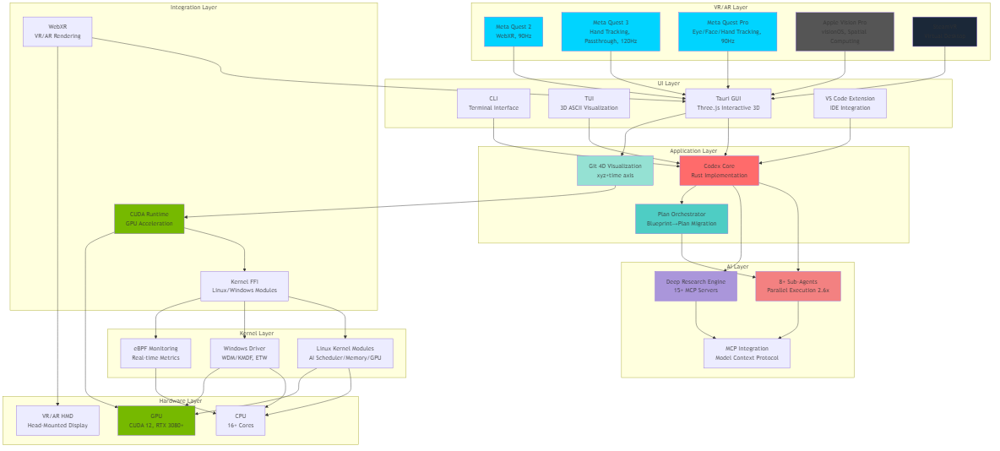

# Codex CLI - zapabob Extended Edition

<p align="center"><code>npm i -g @openai/codex</code><br />or <code>brew install --cask codex</code></p>

<p align="center"><strong>Codex CLI</strong> is a coding agent from OpenAI that runs locally on your computer, extended with zapabob's unique features.</p>
<p align="center"><strong>Codex CLI</strong>は、OpenAIが開発したローカルで動作するコーディングエージェントで、zapabob独自機能を拡張したバージョンです。</p>

</br>
</br>If you want Codex in your code editor (VS Code, Cursor, Windsurf), <a href="https://developers.openai.com/codex/ide">install in your IDE</a>
</br>If you are looking for the <em>cloud-based agent</em> from OpenAI, <strong>Codex Web</strong>, go to <a href="https://chatgpt.com/codex">chatgpt.com/codex</a>

<p align="center">
  
</p>

---

## 🚀 zapabob Extended Features / zapabob拡張機能

### ⭐ Priority: zapabob Repository First / 優先: zapabobリポジトリ優先

**This repository prioritizes zapabob/codex as the primary remote for commits.**  
**このリポジトリは、コミットのプライマリリモートとしてzapabob/codexを優先します。**

```bash
# Primary remote (優先リモート)
origin: https://github.com/zapabob/codex.git

# Upstream (公式リポジトリ)
upstream: https://github.com/openai/codex.git
```

**Commit Strategy / コミット戦略:**
- ✅ **zapabob/codex (origin)** - Primary development and feature commits
- ✅ **zapabob/codex (origin)** - 主要な開発と機能コミット
- 📥 **openai/codex (upstream)** - Upstream synchronization (when needed)
- 📥 **openai/codex (upstream)** - 上流同期（必要に応じて）

### 🔧 Extended Features / 拡張機能

#### 1. Git History Cleanup Script / Git履歴クリーンアップスクリプト

**English:**
A powerful script to remove invalid path names and large files from Git history, resolving GitHub's 100MB file size limit issues.

**日本語:**
Git履歴から無効なパス名と大きなファイルを削除する強力なスクリプト。GitHubの100MBファイルサイズ制限の問題を解決します。

**Location / 場所:** `scripts/fix-invalid-paths-fast-export-streaming.py`

**Features / 機能:**
- Streaming processing for large repositories / 大きなリポジトリ向けストリーミング処理
- Binary data handling / バイナリデータ処理
- Progress bars with tqdm / tqdmによる進捗表示
- Comprehensive logging / 詳細なログ記録
- Windows encoding support / Windowsエンコーディング対応
- Automatic backup branch creation / 自動バックアップブランチ作成

**Usage / 使用方法:**
```bash
python scripts/fix-invalid-paths-fast-export-streaming.py
```

---

## Quickstart / クイックスタート

### Installing and running Codex CLI / Codex CLIのインストールと実行

Install globally with your preferred package manager. If you use npm:  
お好みのパッケージマネージャーでグローバルにインストールします。npmを使用する場合：

```shell
npm install -g @openai/codex
```

Alternatively, if you use Homebrew:  
または、Homebrewを使用する場合：

```shell
brew install --cask codex
```

Then simply run `codex` to get started:  
その後、`codex`を実行して開始します：

```shell
codex
```

If you're running into upgrade issues with Homebrew, see the [FAQ entry on brew upgrade codex](./docs/faq.md#brew-upgrade-codex-isnt-upgrading-me).

<details>
<summary>You can also go to the <a href="https://github.com/openai/codex/releases/latest">latest GitHub Release</a> and download the appropriate binary for your platform.</summary>

Each GitHub Release contains many executables, but in practice, you likely want one of these:

- macOS
  - Apple Silicon/arm64: `codex-aarch64-apple-darwin.tar.gz`
  - x86_64 (older Mac hardware): `codex-x86_64-apple-darwin.tar.gz`
- Linux
  - x86_64: `codex-x86_64-unknown-linux-musl.tar.gz`
  - arm64: `codex-aarch64-unknown-linux-musl.tar.gz`

Each archive contains a single entry with the platform baked into the name (e.g., `codex-x86_64-unknown-linux-musl`), so you likely want to rename it to `codex` after extracting it.

</details>

### Using Codex with your ChatGPT plan / ChatGPTプランでCodexを使用する

<p align="center">
  
</p>

Run `codex` and select **Sign in with ChatGPT**. We recommend signing into your ChatGPT account to use Codex as part of your Plus, Pro, Team, Edu, or Enterprise plan. [Learn more about what's included in your ChatGPT plan](https://help.openai.com/en/articles/11369540-codex-in-chatgpt).

`codex`を実行し、**Sign in with ChatGPT**を選択します。Plus、Pro、Team、Edu、またはEnterpriseプランの一部としてCodexを使用するには、ChatGPTアカウントにサインインすることをお勧めします。[ChatGPTプランに含まれる内容の詳細](https://help.openai.com/en/articles/11369540-codex-in-chatgpt)

You can also use Codex with an API key, but this requires [additional setup](./docs/authentication.md#usage-based-billing-alternative-use-an-openai-api-key). If you previously used an API key for usage-based billing, see the [migration steps](./docs/authentication.md#migrating-from-usage-based-billing-api-key). If you're having trouble with login, please comment on [this issue](https://github.com/openai/codex/issues/1243).

APIキーでCodexを使用することもできますが、[追加の設定](./docs/authentication.md#usage-based-billing-alternative-use-an-openai-api-key)が必要です。以前に使用量ベースの課金でAPIキーを使用していた場合は、[移行手順](./docs/authentication.md#migrating-from-usage-based-billing-api-key)を参照してください。ログインに問題がある場合は、[このissue](https://github.com/openai/codex/issues/1243)にコメントしてください。

### Model Context Protocol (MCP) / モデルコンテキストプロトコル (MCP)

Codex can access MCP servers. To configure them, refer to the [config docs](./docs/config.md#mcp_servers).

CodexはMCPサーバーにアクセスできます。設定するには、[設定ドキュメント](./docs/config.md#mcp_servers)を参照してください。

### Configuration / 設定

Codex CLI supports a rich set of configuration options, with preferences stored in `~/.codex/config.toml`. For full configuration options, see [Configuration](./docs/config.md).

Codex CLIは豊富な設定オプションをサポートしており、設定は`~/.codex/config.toml`に保存されます。すべての設定オプションについては、[設定](./docs/config.md)を参照してください。

---

## Architecture Overview / アーキテクチャ概要

### System Architecture Diagram / システムアーキテクチャ図

<div align="center">



**SVG Version (for web/docs)** / **SVG版（Web/ドキュメント用）**

</div>

<div align="center">



**PNG Version for Twitter/X (1200x630)** / **Twitter/X用PNG版 (1200x630)**

</div>

<div align="center">


**PNG Version for LinkedIn (1200x627)** / **LinkedIn用PNG版 (1200x627)**

</div>

### Architecture Layers / アーキテクチャレイヤー

```
┌─────────────────────────────────────────────────────────────┐
│ VR/AR Layer: Quest 2/3/Pro, Vision Pro, SteamVR            │
└─────────────────────────────────────────────────────────────┘
┌─────────────────────────────────────────────────────────────┐
│ UI Layer: CLI, TUI, Tauri GUI, VSCode Extension           │
└─────────────────────────────────────────────────────────────┘
┌─────────────────────────────────────────────────────────────┐
│ Application: Codex Core (Rust), Plan Orchestrator         │
└─────────────────────────────────────────────────────────────┘
┌─────────────────────────────────────────────────────────────┐
│ AI Layer: 8+ Sub-Agents, Deep Research, MCP (15+)         │
└─────────────────────────────────────────────────────────────┘
┌─────────────────────────────────────────────────────────────┐
│ Integration: Kernel FFI, CUDA Runtime, WebXR              │
└─────────────────────────────────────────────────────────────┘
┌─────────────────────────────────────────────────────────────┐
│ Kernel: Linux modules, Windows driver, eBPF                │
└─────────────────────────────────────────────────────────────┘
┌─────────────────────────────────────────────────────────────┐
│ Hardware: CPU (16+ cores), GPU (CUDA 12), VR/AR HMD        │
└─────────────────────────────────────────────────────────────┘
```

---

### Docs & FAQ / ドキュメントとFAQ

- [**Getting started**](./docs/getting-started.md) / [**はじめに**](./docs/getting-started.md)
  - [CLI usage](./docs/getting-started.md#cli-usage) / [CLIの使用方法](./docs/getting-started.md#cli-usage)
  - [Slash Commands](./docs/slash_commands.md) / [スラッシュコマンド](./docs/slash_commands.md)
  - [Running with a prompt as input](./docs/getting-started.md#running-with-a-prompt-as-input) / [プロンプトを入力として実行](./docs/getting-started.md#running-with-a-prompt-as-input)
  - [Example prompts](./docs/getting-started.md#example-prompts) / [プロンプトの例](./docs/getting-started.md#example-prompts)
  - [Custom prompts](./docs/prompts.md) / [カスタムプロンプト](./docs/prompts.md)
  - [Memory with AGENTS.md](./docs/getting-started.md#memory-with-agentsmd) / [AGENTS.mdによるメモリ](./docs/getting-started.md#memory-with-agentsmd)
- [**Configuration**](./docs/config.md) / [**設定**](./docs/config.md)
  - [Example config](./docs/example-config.md) / [設定例](./docs/example-config.md)
- [**Sandbox & approvals**](./docs/sandbox.md) / [**サンドボックスと承認**](./docs/sandbox.md)
- [**Authentication**](./docs/authentication.md) / [**認証**](./docs/authentication.md)
  - [Auth methods](./docs/authentication.md#forcing-a-specific-auth-method-advanced) / [認証方法](./docs/authentication.md#forcing-a-specific-auth-method-advanced)
  - [Login on a "Headless" machine](./docs/authentication.md#connecting-on-a-headless-machine) / [「ヘッドレス」マシンでのログイン](./docs/authentication.md#connecting-on-a-headless-machine)
- **Automating Codex** / **Codexの自動化**
  - [GitHub Action](https://github.com/openai/codex-action)
  - [TypeScript SDK](./sdk/typescript/README.md)
  - [Non-interactive mode (`codex exec`)](./docs/exec.md) / [非対話モード (`codex exec`)](./docs/exec.md)
- [**Advanced**](./docs/advanced.md) / [**高度な機能**](./docs/advanced.md)
  - [Tracing / verbose logging](./docs/advanced.md#tracing--verbose-logging) / [トレーシング / 詳細ログ](./docs/advanced.md#tracing--verbose-logging)
  - [Model Context Protocol (MCP)](./docs/advanced.md#model-context-protocol-mcp) / [モデルコンテキストプロトコル (MCP)](./docs/advanced.md#model-context-protocol-mcp)
- [**Zero data retention (ZDR)**](./docs/zdr.md) / [**ゼロデータ保持 (ZDR)**](./docs/zdr.md)
- [**Contributing**](./docs/contributing.md) / [**貢献**](./docs/contributing.md)
- [**Install & build**](./docs/install.md) / [**インストールとビルド**](./docs/install.md)
  - [System Requirements](./docs/install.md#system-requirements) / [システム要件](./docs/install.md#system-requirements)
  - [DotSlash](./docs/install.md#dotslash)
  - [Build from source](./docs/install.md#build-from-source) / [ソースからビルド](./docs/install.md#build-from-source)
- [**FAQ**](./docs/faq.md)
- [**Open source fund**](./docs/open-source-fund.md) / [**オープンソース基金**](./docs/open-source-fund.md)

---

## Repository Information / リポジトリ情報

### Remote Configuration / リモート設定

**Primary Remote (優先リモート):**
- `origin`: https://github.com/zapabob/codex.git
  - **Purpose / 目的**: Primary development repository / 主要な開発リポジトリ
  - **Priority / 優先度**: ⭐ **HIGHEST** / **最高**

**Upstream Remote (上流リモート):**
- `upstream`: https://github.com/openai/codex.git
  - **Purpose / 目的**: Official OpenAI repository for synchronization / 同期用の公式OpenAIリポジトリ
  - **Priority / 優先度**: 📥 Sync only / 同期のみ

### Commit Strategy / コミット戦略

**All feature development and commits should be pushed to `origin` (zapabob/codex) first.**  
**すべての機能開発とコミットは、まず`origin` (zapabob/codex)にプッシュする必要があります。**

```bash
# Primary commit target / 主要なコミット先
git push origin <branch-name>

# Upstream sync (when needed) / 上流同期（必要に応じて）
git fetch upstream
git merge upstream/main  # Only when syncing / 同期時のみ
```

---

## License / ライセンス

This repository is licensed under the [Apache-2.0 License](LICENSE).

このリポジトリは[Apache-2.0ライセンス](LICENSE)の下でライセンスされています。

---

## Acknowledgments / 謝辞

**Base Repository / ベースリポジトリ:**
- [OpenAI Codex](https://github.com/openai/codex) - Original Codex CLI implementation

**Extended Features / 拡張機能:**
- zapabob/codex - Extended features and improvements
  - Git History Cleanup Script
  - Enhanced architecture documentation
  - Repository priority management

---

**Last Updated / 最終更新**: 2025-11-13  
**Maintainer / メンテナー**: zapabob
