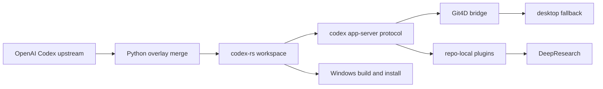

# Codex

Codex is an upstream-first fork of [openai/codex](https://github.com/openai/codex). It keeps the official CLI, TUI, desktop app, app-server, SDK, and plugin surfaces as the baseline, while preserving zapabob-specific value as optional extensions instead of permanent product divergence.

> Current release line: `v3.3.0` (2026-06-25)
> Stable branch: `release/3.3.0-stable`
> Stable tag: `v3.3.0-stable.0`
> Main tag: `v3.3.0`
> Official base: `rust-v0.142.2` plus upstream main `f2f80ef442ff84612004bad064991283eb17cdb5`
> GitHub Pages: <https://zapabob.github.io/codex/>

## What This Release Does

- Imports the official Codex Rust, SDK, app-server, Windows sandbox, packaging, CI, and plugin protocol changes through `rust-v0.142.2`, while also recording the current `upstream/main` head observed on 2026-06-25.
- Preserves zapabob Git4D, VR/AR, DeepResearch, Windows-first release operations, and repo-local plugin value without replacing official APIs.
- Moves Git4D into the official app-server protocol shape through `git4d/capabilities/read`, `git4d/session/start`, `git4d/session/list`, `git4d/session/watch`, and `git4d/session/unwatch`.
- Keeps AR/VR optional. When no XR runtime is available, Git4D falls back to desktop mode and returns that reason through the protocol.
- Bumps the fork semantic version to `3.3.0` because this line adds official upstream capabilities while keeping backward-compatible zapabob extension behavior.

## Official Upstream Pulled In

The sync target for this line is:

- latest official release: `rust-v0.142.2`
- release publication time: 2026-06-25T06:36:23Z
- latest observed upstream main commit: `f2f80ef442ff84612004bad064991283eb17cdb5`
- latest observed upstream main commit time: 2026-06-25T00:00:00Z

Important official changes now present in this fork include:

- AGENTS.md environment-change handling from current `upstream/main`
- run-agent-task authentication plumbing for inference
- Ultra reasoning effort support
- persisted world-state replay and rollout state snapshots
- remote plugin local-version population and plugin catalog polish
- MCP authentication enum handling and ChatGPT-hosted MCP session auth
- app-server descendant-thread listing and richer v2 protocol surfaces
- Windows sandbox, ConPTY, credential retry, Bazel, V8, packaging, CI, and release hardening updates
- dependency refreshes from the official workspace, SDKs, and lockfiles

Security and dependency intake for this line is handled by the official 0.142.2 release contents plus the fork's retained package overrides. Fork-only fixes are kept only when they still add behavior that the official API surface does not provide.

## Zapabob Extensions Kept

This fork keeps a narrow set of custom capabilities:

- DeepResearch as a plugin-facing research workflow layered onto official Codex app and app-server behavior
- Git4D as an optional visualization capability, exposed through app-server protocol methods rather than a separate product shell
- VR and AR capability checks with desktop fallback when runtime support is unavailable
- repo-local marketplace support for bundled zapabob plugin distribution
- Windows-first build, package, overwrite-install, and smoke-test flow

When upstream and fork behavior overlap, this repository chooses the official implementation and reinjects only the fork-specific advantage that still has operational value.

## Architecture



## Release Channels

### Stable

- branch: `release/3.3.0-stable`
- tag: `v3.3.0-stable.0`
- intent: validated Windows bundle and documentation for users who want a slower-moving install target

### Mainline

- branch: `main`
- tag: `v3.3.0`
- intent: latest upstream-first sync state plus the same verified zapabob extension set

### GitHub Pages

- site: <https://zapabob.github.io/codex/>
- source branch: `gh-pages`
- focus: Apple-site-inspired release guide generated from the gptimage2 visual direction, emphasizing Git4D, DeepResearch, repo-local plugins, and upstream-first safety

### Download And Extract

```powershell
gh release download v3.3.0 --pattern "codex-v3.3.0-windows-x86_64.tar.gz"
tar -xzf codex-v3.3.0-windows-x86_64.tar.gz
```

Each Windows `tar.gz` bundle contains the release executable, `README.md`, `LICENSE`, `VERSION`, release notes, and merge evidence.

Current Windows asset metadata is generated after the release build and package step.

## Build And Verification

From the repository root:

```powershell
python scripts\upstream_overlay_merge.py --baseline-ref rust-v0.133.0 --upstream-ref rust-v0.142.2 --allow-dirty
python scripts\upstream_overlay_merge.py --baseline-ref rust-v0.133.0 --upstream-ref rust-v0.142.2 --allow-dirty --apply
node scripts\sync-version.mjs
```

From `codex-rs/`:

```powershell
$env:CARGO_HOME='H:\cargo-home-codex-3.3.0'
$env:CARGO_TARGET_DIR='H:\codex-main-release-target-3.3.0'
cargo fmt --all
cargo check -p codex-core -j 4
cargo check -p codex-app-server -j 4
cargo check -p codex-tui -j 4
cargo test -p codex-app-server-protocol git4d -- --nocapture
cargo test -p codex-app-server git4d -- --nocapture
cargo build --release -p codex-cli -j 4
H:\codex-main-release-target-3.3.0\release\codex.exe --version
```

After dependency changes:

```powershell
just bazel-lock-update
just bazel-lock-check
just argument-comment-lint
```

The release binary is installed over `C:\Users\downl\.cargo\bin\codex.exe` by `scripts\install_with_kill.ps1`. That helper stops eligible standalone `codex`, `codex-tui`, `codex-gui`, and `opencode` processes while preserving Windows Store CodexApp processes under `C:\Program Files\WindowsApps\OpenAI.Codex_`.

The final release checklist is: `git diff --check`, `node scripts\sync-version.mjs --check`, targeted Cargo checks/tests for touched crates, a 4-core release build, overwrite install, and `codex --version` plus `codex app-server --help`.

## Plugin Workflow

The repo-local marketplace follows the same seams used by upstream:

- `plugin/list`
- `plugin/read`
- `plugin/install`
- mention-based invocation through `plugin://zapabob-legacy-suite@zapabob-repo-local`

For rich clients, start `codex app` or `codex app-server`, then discover the bundled plugin from the repo-local marketplace.

## Repository Highlights

- `codex-rs/`: Rust workspace for CLI, TUI, app-server, protocol, core, plugins, SDK support, and retained backend logic
- `scripts/`: upstream merge automation, conflict resolution, repo maintenance, and validation tooling
- `.agents/plugins/`: tracked repo-local plugin marketplace
- `plugins/`: bundled repo-local plugin implementations
- `_docs/`: implementation logs, merge reports, and release evidence
- `releases/`: release notes and generated package metadata

## Status

This repository is actively tracking official Codex. Legacy fork-only GUI surfaces remain only as compatibility paths while plugin and app-server parity is verified.

The current retained path for Git4D and VR/AR is:

- `codex app-server` as the canonical live bridge
- `codex-rs/gui` as a compatibility adapter for legacy HTTP route names
- `plugins/zapabob-legacy-suite` as the user-facing entrypoint and fallback policy carrier
