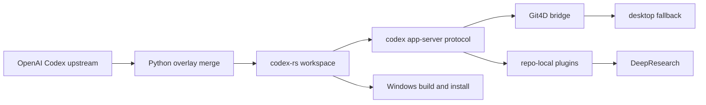

# Codex

Codex is an upstream-first fork of [openai/codex](https://github.com/openai/codex). It keeps the official CLI, TUI, desktop app, app-server, SDK, and plugin surfaces as the baseline, while preserving zapabob-specific value as optional extensions instead of permanent product divergence.

> Current release line: `v3.2.0` (2026-05-22)
> Stable branch: `release/3.2.0-stable`
> Stable tag: `v3.2.0-stable.0`
> Main tag: `v3.2.0`
> Official base: `rust-v0.133.0` plus upstream main `b14f11d3d2ca048bdae1872ef66087a2ce3f6b0c`
> GitHub Pages: <https://zapabob.github.io/codex/>

## What This Release Does

- Imports the latest official Codex Rust, SDK, app-server, Windows sandbox, packaging, CI, and plugin protocol changes observed on 2026-05-22.
- Preserves zapabob Git4D, VR/AR, DeepResearch, Windows-first release operations, and repo-local plugin value without replacing official APIs.
- Moves Git4D into the official app-server protocol shape through `git4d/capabilities/read`, `git4d/session/start`, `git4d/session/list`, `git4d/session/watch`, and `git4d/session/unwatch`.
- Keeps AR/VR optional. When no XR runtime is available, Git4D falls back to desktop mode and returns that reason through the protocol.
- Bumps the fork semantic version to `3.2.0` because this line adds official upstream capabilities while keeping backward-compatible zapabob extension behavior.

## Official Upstream Pulled In

The sync target for this line is:

- latest official release: `rust-v0.133.0`
- release publication time: 2026-05-21T16:48:03Z
- latest observed upstream main commit: `b14f11d3d2ca048bdae1872ef66087a2ce3f6b0c`
- latest observed upstream main commit time: 2026-05-22T05:27:25Z

Important official changes now present in this fork include:

- Python SDK login, account, turn lifecycle, retry, and richer streaming examples
- `codex exec resume --output-schema`
- goals enabled by default with dedicated storage and active turn progress accounting
- `thread/search` app-server protocol support backed by rollout and thread-store search
- case-insensitive thread search and latest thread-search fixes
- plugin hooks as normal plugin behavior, without the older separate feature flag
- parallel read-only MCP tool calls, compacted large tool schemas, local `$ref`/`$defs` schema support, and extension-tool conversation history
- managed network proxy environment propagation for Node-based execution paths
- faster TUI startup probes and updated session picker behavior
- auth-backed remote executor registration
- richer app-server inputs, image detail preservation, plugin sharing, marketplace, hooks, model provider capability, thread goal, and process notification protocol surfaces
- Windows sandbox, Bazel, V8, packaging, CI, and release hardening updates
- dependency refreshes from the official workspace and SDK locks

Security review included the published official advisory `GHSA-w5fx-fh39-j5rw` and the current default-branch dependency-alert surface before this merge was closed.

## Zapabob Extensions Kept

This fork keeps a narrow set of custom capabilities:

- DeepResearch as a plugin-facing research workflow layered onto official Codex app and app-server behavior
- Git4D as an optional visualization capability, exposed through app-server protocol methods rather than a separate product shell
- VR and AR capability checks with desktop fallback when runtime support is unavailable
- repo-local marketplace support for bundled zapabob plugin distribution
- Windows-first build, package, overwrite-install, and smoke-test flow

When upstream and fork behavior overlap, this repository chooses the official implementation and reinjects only the fork-specific advantage that still has operational value.

## Architecture



## Release Channels

### Stable

- branch: `release/3.2.0-stable`
- tag: `v3.2.0-stable.0`
- intent: validated Windows bundle and documentation for users who want a slower-moving install target

### Mainline

- branch: `main`
- tag: `v3.2.0`
- intent: latest upstream-first sync state plus the same verified zapabob extension set

### GitHub Pages

- site: <https://zapabob.github.io/codex/>
- source branch: `gh-pages`
- focus: Apple-site-inspired release guide generated from the gptimage2 visual direction, emphasizing Git4D, DeepResearch, repo-local plugins, and upstream-first safety

### Download And Extract

```powershell
gh release download v3.2.0 --pattern "codex-v3.2.0-windows-x86_64.tar.gz"
tar -xzf codex-v3.2.0-windows-x86_64.tar.gz
```

Each Windows `tar.gz` bundle contains the release executable, `README.md`, `LICENSE`, `VERSION`, release notes, and merge evidence.

Current Windows asset:

- file: `releases/codex-v3.2.0-windows-x86_64.tar.gz`
- size: 85,263,562 bytes
- SHA256: `E2508EC70DC888A0DA4AC1813124F7F9C3D5F65FF6F73067CFBFF5630207FF59`

## Build And Verification

From the repository root:

```powershell
python scripts\upstream_overlay_merge.py --baseline-ref 24faf49b2a70f8813e522afb0e701add9b15b0bd --upstream-ref upstream/main --allow-dirty
python scripts\upstream_overlay_merge.py --baseline-ref 24faf49b2a70f8813e522afb0e701add9b15b0bd --upstream-ref upstream/main --allow-dirty --apply
```

From `codex-rs/`:

```powershell
$env:CARGO_HOME='H:\cargo-home-codex-3.2.0'
$env:CARGO_TARGET_DIR='H:\codex-main-release-target-3.2.0'
cargo fmt --all
cargo check -p codex-core -j 6
cargo check -p codex-app-server -j 6
cargo check -p codex-tui -j 6
cargo test -p codex-app-server-protocol git4d -- --nocapture
cargo test -p codex-app-server git4d -- --nocapture
cargo build --release -p codex-cli -j 6
H:\codex-main-release-target-3.2.0\release\codex.exe --version
```

After dependency changes:

```powershell
just bazel-lock-update
just bazel-lock-check
just argument-comment-lint
```

The release binary was installed over `C:\Users\downl\.cargo\bin\codex.exe` after backing up the previous `3.1.0` executable. The installed command reports `codex-cli 3.2.0`.

The full `just argument-comment-lint` invocation currently reaches a Bazel Windows test-toolchain resolution failure in this checkout. The changed crates were checked with the prebuilt argument-comment linter instead, and `just bazel-lock-update` plus `just bazel-lock-check` both passed.

## Plugin Workflow

The repo-local marketplace follows the same seams used by upstream:

- `plugin/list`
- `plugin/read`
- `plugin/install`
- mention-based invocation through `plugin://zapabob-legacy-suite@zapabob-repo-local`

For rich clients, start `codex app` or `codex app-server`, then discover the bundled plugin from the repo-local marketplace.

## Repository Highlights

- `codex-rs/`: Rust workspace for CLI, TUI, app-server, protocol, core, plugins, SDK support, and retained backend logic
- `scripts/`: upstream merge automation, conflict resolution, repo maintenance, and validation tooling
- `.agents/plugins/`: tracked repo-local plugin marketplace
- `plugins/`: bundled repo-local plugin implementations
- `_docs/`: implementation logs, merge reports, and release evidence
- `releases/`: release notes and generated package metadata

## Status

This repository is actively tracking official Codex. Legacy fork-only GUI surfaces remain only as compatibility paths while plugin and app-server parity is verified.

The current retained path for Git4D and VR/AR is:

- `codex app-server` as the canonical live bridge
- `codex-rs/gui` as a compatibility adapter for legacy HTTP route names
- `plugins/zapabob-legacy-suite` as the user-facing entrypoint and fallback policy carrier
