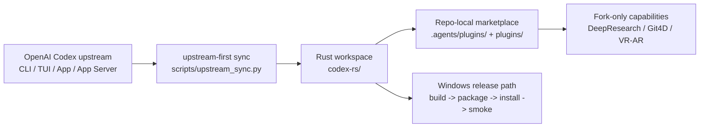

# Codex

Codex is an upstream-first fork of [openai/codex](https://github.com/openai/codex) that keeps the official CLI, TUI, desktop app, and app-server surfaces as the baseline while moving zapabob-specific value into plugins, sync automation, and Windows-first release operations.

> Current release line: `v3.1.0` (2026-04-18)  
> Stable branch: `release/3.1.0-stable`  
> Stable tag: `v3.1.0-stable.0`  
> Main tag: `v3.1.0`

## TL;DR

- Stay close to upstream Codex instead of carrying a permanently divergent core fork.
- Keep fork-only capabilities in repo-local plugins and marketplace entries.
- Make Windows-native build, packaging, install, and smoke verification first-class.
- Use [`scripts/upstream_sync.py`](/C:/Users/downl/Desktop/codex-main/scripts/upstream_sync.py) as the authoritative sync and release-closeout driver.

## Unique Extensions

These are the pieces this fork still wants to be known for:

- DeepResearch as a plugin-facing research workflow layered onto the official Codex app and app-server model
- Git4D as an optional visualization path instead of a mandatory forked core experience
- VR and AR capability as opt-in plugin surfaces with no-device and no-WebXR fallback
- Repo-local plugin marketplace support for shipping fork-only value without permanently diverging the main product surface
- A lightweight Git4D bridge that exposes launch, session, SSE, and capability routes for plugin-driven clients when the optional GUI service is running
- Windows-first release operations, where packaging, overwrite install, and smoke verification are treated as product features instead of afterthoughts

Current sync target:

- baseline: `rust-v0.121.0` released on April 15, 2026
- hardening watch: `upstream/main` through April 17, 2026
- required security checkpoint: the writable-root hardening that landed as `fix: reduce writable root (#17947)`

## Release Channels

### Stable

- branch: `release/3.1.0-stable`
- tag: `v3.1.0-stable.0`
- intent: slower-moving install target for users who want the validated Windows bundle without tracking day-to-day mainline churn

### Mainline

- branch: `main`
- tag: `v3.1.0`
- intent: latest upstream-first sync state, plugin migration status, and release packaging changes

### Download And Extract

```powershell
gh release download v3.1.0 --pattern "codex-v3.1.0-windows-x86_64.tar.gz"
tar -xzf codex-v3.1.0-windows-x86_64.tar.gz
```

Each Windows `tar.gz` bundle contains `codex.exe`, `README.md`, `LICENSE`, and `VERSION`.

## Why This Fork Exists

The product direction is intentionally narrow:

- `codex` remains the CLI and TUI entrypoint
- `codex app` remains the desktop GUI baseline
- `codex app-server` remains the integration surface for rich clients
- plugin marketplaces and plugin mentions carry fork-only extension value

When upstream and fork behavior overlap, this repository adopts the upstream implementation and reinjects only the fork-specific advantage that still matters operationally.

That means this repository is not trying to out-fork upstream on every surface. It is trying to keep the official Codex experience intact while making a few distinctive workflows genuinely stronger.

## Architecture Snapshot



## GUI To Plugin Migration

Legacy GUI trees are no longer the primary interface:

- `gui/`
- `codex-gui-x/`
- `codex-rs/gui`
- `codex-rs/tauri-gui`

Those paths are in migration mode and should not receive new feature work. Their replacement path is the repo-local marketplace at [.agents/plugins/marketplace.json](/C:/Users/downl/Desktop/codex-main/.agents/plugins/marketplace.json) and the bundled plugin at [plugins/zapabob-legacy-suite/.codex-plugin/plugin.json](/C:/Users/downl/Desktop/codex-main/plugins/zapabob-legacy-suite/.codex-plugin/plugin.json).

That plugin carries forward:

- DeepResearch as a plugin-facing research workflow on top of the official app and app-server model
- Git4D as an optional plugin capability that can bridge into live launch, session, SSE, and capability routes, with non-visual fallback when that bridge is absent
- VR and AR as optional plugin capabilities with graceful no-device and no-WebXR fallback

This repository intentionally does not preserve fork-only virtual OS, custom computer-operation, or OS-control surfaces. Those are deprecated in favor of future official Codex App platform work, especially on Windows.

## Upstream Sync Workflow

Use [`scripts/upstream_sync.py`](/C:/Users/downl/Desktop/codex-main/scripts/upstream_sync.py) as the authoritative sync driver.

It can:

- fetch upstream refs and tags
- classify upstream delta paths against `rust-v0.121.0`
- create or refresh an integration branch ref
- run `git merge --no-commit --no-ff`
- apply rule-based conflict resolution through [`scripts/resolve_merge_conflicts.py`](/C:/Users/downl/Desktop/codex-main/scripts/resolve_merge_conflicts.py)
- emit Markdown and JSON reports of adopted, reinjected, migrated, retired, and manual-review paths

Examples:

```powershell
python scripts/upstream_sync.py
python scripts/upstream_sync.py --merge
python scripts/upstream_sync.py --repair-workspace --validate
python scripts/upstream_sync.py --repair-workspace --validate --build-release --windows-install
```

On native Windows, the authoritative closeout signal is the report emitted by `scripts/upstream_sync.py`.

- `codex.exe` overwrite install and runtime smoke can complete without elevated privileges
- full `cargo test --workspace` requires Developer Mode or equivalent symlink privilege because the `v8` build script creates symlinks
- when that prerequisite is missing, the report should treat the failure as an environment blocker rather than a repo regression

## Plugin Workflow

The repo-local marketplace follows the same seams used by upstream:

- `plugin/list`
- `plugin/read`
- `plugin/install`
- mention-based invocation via `plugin://zapabob-legacy-suite@zapabob-repo-local`

For rich clients, start `codex app` or `codex app-server` and then discover the plugin from the repo-local marketplace.

## Repository Highlights

- `codex-rs/`: Rust workspace for CLI, TUI, app-server, protocol, core, plugins, and retained backend logic
- `scripts/`: sync automation, repo maintenance, and validation tooling
- `.agents/plugins/`: tracked repo-local plugin marketplace
- `plugins/`: bundled repo-local plugin implementations
- `_docs/`: implementation logs and migration rationale

## Status

This repository is actively being reorganized toward official Codex layout and APIs. Cleanup and deletion of legacy GUI trees is deferred until plugin parity is verified.

The current migration path for Git4D and VR/AR is:

- `codex app-server` as the canonical live bridge
- `codex-rs/gui` as a compatibility adapter that preserves legacy HTTP route names
- `plugins/zapabob-legacy-suite` as the user-facing entrypoint and fallback policy carrier

Phase 2 closeout status:

- Windows install and runtime smoke are complete on native Windows
- the remaining full-workspace validation gate is a native Windows `v8` symlink privilege prerequisite, not a known code regression
