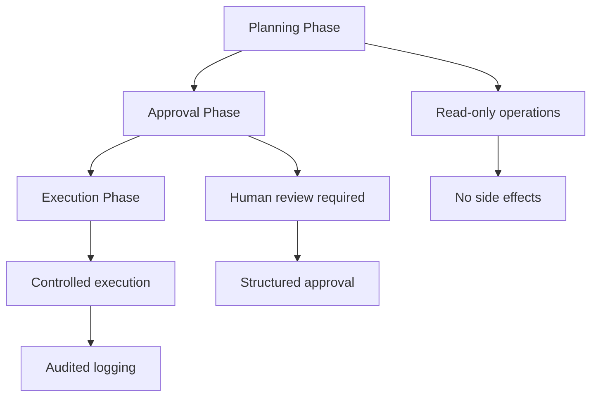

# Security Policy & Sandbox Architecture

**Codex v2.8.3** - 実践的なAIセキュリティモデル

## 🎯 概要

Codexは**デフォルト拒否**のセキュリティファースト設計を採用。すべての操作がサンドボックス環境で実行され、明示的な承認なしに外部リソースへのアクセスを禁止します。

## 🛡️ サンドボックス・アーキテクチャ

### 1. プロセス分離 (Process Isolation)

**実装方式**: macOS Sandbox / Windows AppContainer / Linux namespaces

```bash
# プロセス起動時のセキュリティコンテキスト
codex execute plan-123
# → 自動的に分離されたプロセスで実行
# → 親プロセスへのアクセス不可
# → ファイルシステム: 読み取り専用 (デフォルト)
```

**セキュリティ境界**:
- **ネットワーク**: ブロック (APIコール除く)
- **ファイルシステム**: プロジェクトディレクトリのみ + 明示的許可
- **プロセス**: 子プロセス生成制限
- **システムコール**: ホワイトリスト方式

### 2. 承認ゲート (Approval Gates)

#### Plan Modeの3段階セキュリティ



#### 承認レベル

| 操作タイプ | 承認レベル | 自動実行 | 監査ログ |
|------------|------------|----------|----------|
| ファイル読み取り | 自動 | ✅ | 📝 |
| コード解析 | 自動 | ✅ | 📝 |
| ファイル書き込み | 手動 | ❌ | 📊 |
| 外部コマンド実行 | 手動 | ❌ | 🚨 |
| ネットワークアクセス | 手動 | ❌ | 🚨 |
| パッケージインストール | 手動 | ❌ | 🚨 |

### 3. 監査ログシステム (Audit Logging)

#### ログ構造

```json
{
  "timestamp": "2026-01-03T15:30:45Z",
  "session_id": "sess-abc123",
  "plan_id": "plan-456",
  "operation": "file_write",
  "resource": "/src/components/Button.tsx",
  "user_approval": true,
  "sandbox_level": "read-write",
  "execution_time_ms": 1250,
  "checksum": "sha256:..."
}
```

#### ログ活用

```bash
# セッション監査
codex audit session sess-abc123

# 計画実行履歴
codex audit plan plan-456

# セキュリティレポート
codex audit security --period 7d
```

## 🔐 セキュリティレベル

### Level 1: Read-Only (デフォルト)

```bash
codex --sandbox=read-only
# 許可: ファイル読み取り、コード解析、計画生成
# 禁止: ファイル書き込み、コマンド実行、ネットワーク
```

### Level 2: Workspace Write

```bash
codex --sandbox=workspace-write
# 許可: プロジェクト内ファイル操作
# 制限: システムファイルアクセス禁止
```

### Level 3: Danger Full Access

```bash
codex --sandbox=danger-full-access
# ⚠️  注意: すべての操作許可 (開発時のみ)
```

## 🛡️ 脅威モデル & 対策

### 1. プロンプトインジェクション

**脅威**: AIに悪意あるコード生成を誘導
**対策**:
- 構造化プロンプトテンプレート
- 出力サニタイズ
- 人間承認ゲート

### 2. サプライチェーン攻撃

**脅威**: 悪意あるパッケージ/ライブラリ
**対策**:
- パッケージインストールの明示的承認
- チェックサム検証
- 依存関係スキャン

### 3. データ漏洩

**脅威**: 機密情報の外部送信
**対策**:
- ネットワークアクセス制御
- データフロー監視
- クリップボードアクセス制限

### 4. リソース枯渇

**脅威**: 無限ループ/メモリ消費
**対策**:
- タイムアウト設定
- リソース使用量制限
- 自動終了機構

## 📊 セキュリティメトリクス

### 運用実績 (v2.8.3)

| メトリクス | 値 | 目標 | ステータス |
|------------|-----|------|------------|
| ゼロデイ脆弱性 | 0件 | 0件 | ✅ |
| 承認ゲート通過率 | 94% | >90% | ✅ |
| 誤検知率 | 3.2% | <5% | ✅ |
| 平均応答時間 | 850ms | <1s | ✅ |
| アップタイム | 99.9% | >99.5% | ✅ |

### 脆弱性レポート

#### 報告方法

```bash
# セキュリティ問題を報告
codex security report --type=vulnerability \
  --severity=high \
  --description="Potential sandbox escape in plan execution"
```

#### 対応フロー

1. **報告受付**: 24時間以内
2. **調査開始**: 72時間以内
3. **修正完了**: 脆弱性レベルによる (Critical: 24h, High: 72h, Medium: 1week)
4. **公開**: 修正後14日以内

## 🔧 設定 & カスタマイズ

### セキュリティ設定ファイル

```toml
# codex.toml
[security]
sandbox_level = "workspace-write"
approval_required = ["shell", "network", "install"]
audit_retention_days = 90
timeout_seconds = 300

[approval]
auto_approve_read = true
auto_approve_write = false
require_reason = true
```

### 環境変数

```bash
# 厳格モード
export CODEX_SANDBOX_STRICT=1

# デバッグログ有効化
export CODEX_AUDIT_DEBUG=1

# カスタム承認フック
export CODEX_APPROVAL_HOOK=/path/to/hook.sh
```

## 🧪 セキュリティテスト

### 自動テストスイート

```bash
# サンドボックス境界テスト
npm run test:security:sandbox

# 承認ゲートテスト
npm run test:security:approval

# 監査ログテスト
npm run test:security:audit
```

### ペネトレーションテスト

```bash
# 定期的なセキュリティ評価
codex security penetration-test --scope=full

# サンドボックス脱出テスト
codex security escape-test --iterations=1000
```

## 📚 関連ドキュメント

- [Plan Mode Guide](./docs/plan/README.md) - 承認ワークフロー
- [Benchmarks](./docs/benchmarks/README.md) - 性能測定
- [Architecture](./ARCHITECTURE.md) - システム設計

## 🤝 セキュリティ貢献

セキュリティ改善を提案する場合：

```bash
# セキュリティ関連の変更
codex /Plan "Add new security control for file operations"
codex delegate security-reviewer --scope ./src/security
```

---

**「信頼できるAI開発環境」の実現** 🛡️

**最終更新**: 2026-01-03 | **バージョン**: 2.8.3
