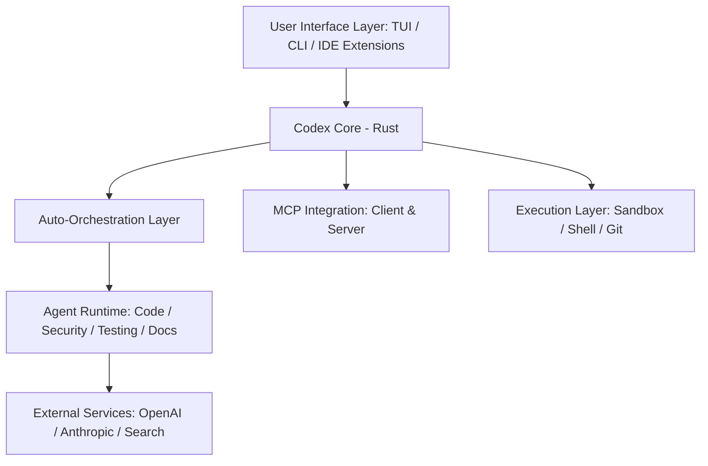

# Codex CLI (Rust Implementation) v2.13.0

Codex CLI is a high-performance, native executable designed to provide a seamless AI-assisted development experience with zero dependencies.  
Codex CLIは、依存関係ゼロでシームレスなAI開発体験を提供する、ハイパフォーマンスなネイティブ実行バイナリです。

---

## 🏗️ Architecture | アーキテクチャ

### System Overview | システム概要



### Key Features (v2.13.0) | 主要機能

#### 1. Auto-Orchestration | 自律オーケストレーション

- **English**: Automatically analyzes task complexity using a 5-factor scoring model. Orchestrates multiple specialized sub-agents (Code, Security, Test, Docs) in parallel, achieving up to 2.6x speedup.
- **日本語**: 5要素スコアリングモデルによりタスクの複雑性を自動分析。専門特化したサブエージェント（開発・セキュリティ・テスト・ドキュメント）を並列に指揮し、最大2.6倍の高速化を実現します。

#### 2. Model Context Protocol (MCP) Support | MCPサポート

- **English**: Full bi-directional support. Acts as an **MCP Client** to use external tools and as an **MCP Server** to expose Codex capabilities to other agents.
- **日本語**: 完全な双方向サポート。外部ツールを利用するための**MCPクライアント**機能、およびCodexの機能を他エージェントへ提供する**MCPサーバー**機能を搭載。

#### 3. Deep Research | ディープリサーチ

- **English**: Advanced multi-source research with automatic citation tracking and contradiction detection.
- **日本語**: 自動引用トラッキングと矛盾検出機能を備えた、高度な複数ソース調査機能。

#### 4. Secure Sandbox | セキュアサンドボックス

- **English**: Multi-platform isolation (Seatbelt/Landlock/Windows Sandbox) for safe code execution with fine-grained approval policies.
- **日本語**: マルチプラットフォーム対応の隔離環境（Seatbelt/Landlock/Windows Sandbox）により、詳細な承認ポリシーに基づいた安全なコード実行を保証。

---

## 🚀 Quick Start | クイックスタート

### Installation | インストール

```powershell
# Fast Build & Install (Windows)
.\fast-build-install-all.ps1
```

### Usage Examples | 使用例

| Command                        | Description (EN)       | 説明 (JA)                      |
| ------------------------------ | ---------------------- | ------------------------------ |
| `codex`                        | Launch Interactive TUI | インタラクティブTUIを起動      |
| `codex exec "prompt"`          | Run non-interactively  | 非対面モードで実行             |
| `codex mcp-server`             | Start MCP Server mode  | MCPサーバーモードで起動        |
| `codex sandbox windows -- cmd` | Run command in sandbox | サンドボックス内でコマンド実行 |

---

## 🛠️ Technology Stack | 技術スタック

| Layer       | Technology                                    |
| ----------- | --------------------------------------------- |
| **Runtime** | Rust (Tokio) - Async performance              |
| **TUI**     | Ratatui - Interactive terminal experience     |
| **GUI**     | Vite + React / Tauri - Native desktop control |
| **Safety**  | Windows Sandbox / Landlock / Seatbelt         |
| **Sync**    | DashMap - Thread-safe state management        |

## 📂 Code Organization | コード構成

- [`core/`](./core): Business logic and AI agent engine.
- [`tui/`](./tui): Fullscreen terminal interface using Ratatui.
- [`cli/`](./cli): Unified entry point for all subcommands.
- [`tauri-gui/`](./tauri-gui): Modern desktop interface.

---

© 2026 Codex Team. High-fidelity Agentic Coding.
